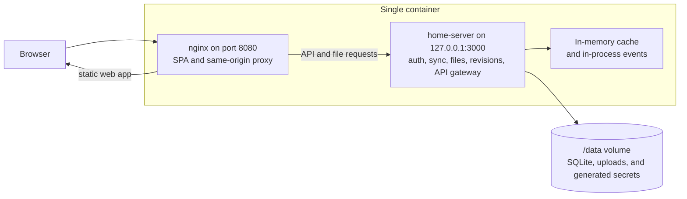

# Deploying Standard Red Notes

There are **three** ways to run Standard Red Notes. All three self-host to
_themselves_ (the web app syncs to its own origin — never `api.standardnotes.com`)
and keep your notes end-to-end encrypted.

| Mode                                  | Containers / services                                                            | Datastore                                 | Best for                                                       |
| ------------------------------------- | -------------------------------------------------------------------------------- | ----------------------------------------- | -------------------------------------------------------------- |
| **A. Full multi-container** (default) | app, server (6 node services under supervisord), MariaDB, Redis, floci (SNS/SQS) | MySQL + Redis                             | Production, many users, horizontal scaling, realtime push      |
| **B. All-in-one single container**    | 1 container (home-server + nginx under supervisord)                              | embedded **sqlite** + **in-memory** cache | Local use, a household/small team, the simplest Docker deploy  |
| **C. LXC / systemd**                  | native systemd service + nginx (no Docker)                                       | embedded **sqlite** + **in-memory** cache | Proxmox / lxd system containers, bare VMs, Docker-averse hosts |

Modes B and C run the **home-server**: a single Node process that mounts auth,
syncing, files, revisions and the api-gateway together, with **in-process domain
events** (no SNS/SQS) — so they need **no MySQL, no Redis, and no floci**. The
trade-off vs. Mode A: no horizontal scaling, and live realtime _push_ (the
websocket bridge) is disabled without Redis, so clients fall back to normal
periodic sync. Everything else — accounts, notes, files, revisions, admin panel,
AI proxy, OCR, CalDAV — works the same.





## A. Full multi-container

The production-grade MariaDB/Redis stack keeps its existing application
topology. This revision also mounts `server-data` at the gateway data directory
so administrator settings and encrypted ChatGPT/Codex pairings survive a server
container replacement. Back up that volume with its matching pairing encryption
key; see [Backups and recovery](backups-and-recovery.md).

{% include safety-alert.html
  level="danger"
  title="Migrate releases that used the legacy MySQL volume"
  body="Older releases stored a MySQL 8.4 database in mysql-data; current releases use MariaDB and mariadb-data. Compose now stops before an empty MariaDB can mask an initialized legacy volume. Export from MySQL and restore logically into MariaDB. Never mount or copy the raw MySQL datadir into MariaDB."
  link_url="/self-hosting.html#upgrade-from-the-legacy-mysql-volume"
  link_text="Follow the legacy database migration"
%}

```sh
cp .env.example .env          # set real secrets for any non-local deploy
docker compose up -d
# open http://localhost:3001
```

The `scripts/setup.sh` and `scripts/setup.ps1` helpers validate and reuse an
existing `.env` on every normal rerun without rotating configured secrets. An
older keyless environment receives a one-time assistant subscription encryption
key only after setup proves that no encrypted pairing file exists. Silently
rotating database, session, encryption, and WebSocket
credentials can disconnect an initialized MariaDB volume and invalidate live
sessions. Use `--force-overwrite` or `-ForceOverwrite` only for an intentional
rotation. If setup was overwritten accidentally, recover the complete prior
environment with `npm run recover:database`; do not delete the database volume.

When setup starts the stack (`--up` / `-Up`), it also refuses a dirty Git
checkout, stamps both app and server images with the exact checked-out commit,
and waits until the live same-origin app proves that both tiers are that same
release. The immutable root-owned marker is public at
`/.well-known/srn-deployment.json`; the server exposes its independently read
copy as `deployment` in `/healthcheck/readiness`. Missing, malformed, writable,
runtime-redirected, or mismatched markers are never reported as release
identity. Empty markers remain supported for anonymous local builds.

This provenance contract covers the core app/server images, the all-in-one
image, and the LXC release. The optional MCP profile is a separate client/tool
release and is intentionally outside the app/server equality gate.

See the top of `docker-compose.yml` and `docs/self-hosting.md` for the full env
reference, reverse-proxy (Traefik) examples, and optional profiles (`mcp`,
`workflows`).

## B. All-in-one single container (new)

One image, zero external services. Ideal when you just want notes running on a
laptop, NAS, or a small VPS.

```sh
# Optional: copy the env template and set anything you want to customize
cp .env.single.example .env

# Build + run
docker compose -f docker-compose.single.yml up -d --build

# open http://localhost:3001  (change with APP_PORT)
```

**Secrets.** With none supplied, the container **generates strong per-instance
secrets on first boot and persists them** to the `single-data` volume
(`/data/secrets.env`), so sessions and encrypted MFA stay valid across restarts.
For a backup/restore-friendly deploy, pin them in `.env`
(`openssl rand -hex 32`; `ENCRYPTION_SERVER_KEY` must be 64 hex chars). There is
**no published-default-secret** to worry about — nothing insecure ships enabled.

**Persistence.** The named volume `single-data` holds the sqlite database,
uploaded files, generated secrets, admin overrides and feature stores (all under
`/data`). Back it up to back up the whole instance.

**Ports.** Only `8080` (nginx) is published, mapped to `APP_PORT` (default 3001).
The home-server binds `127.0.0.1:3000` inside the container, so nginx is its
only network edge; nginx reverse-proxies `/v1`, `/auth`, `/files`, `/sockets`
to it same-origin.

**Common env** (all optional; see `.env.single.example`):

| Var                                         | Purpose                                                                     |
| ------------------------------------------- | --------------------------------------------------------------------------- |
| `APP_PORT`                                  | Host port (default 3001)                                                    |
| `PUBLIC_FILES_SERVER_URL`                   | Public `/files` URL behind a domain, e.g. `https://notes.example.com/files` |
| `PUBLIC_URL`                                | Canonical app origin used for external-link hostname isolation              |
| `WORKFLOWS_ENABLED`, `WORKFLOWS_PUBLIC_URL` | Optional discovery link to a separately authenticated n8n origin            |
| `COOKIE_DOMAIN`, `COOKIE_SECURE`            | Set `COOKIE_SECURE=true` + your domain behind HTTPS                         |
| `SYNC_SERVER`                               | Force the app's sync origin (default: its own origin)                       |
| `OCR_ENABLED`                               | Client-side PDF OCR toggle                                                  |
| `SHARED_SERVER_ACCESS_KEY`                  | Optional access gate (`X-Shared-Server-Key`)                                |
| `ASSISTANT_*`                               | AI assistant proxy (Anthropic / OpenAI-compatible / Ollama)                 |

After registering the intended administrator, persist the server-controlled role locally:

```sh
docker compose -f docker-compose.single.yml exec app srn-admin roles grant <user> ADMIN_USER
```

**Manage:**

```sh
docker compose -f docker-compose.single.yml logs -f
docker compose -f docker-compose.single.yml down          # keep data
docker compose -f docker-compose.single.yml down -v       # DELETE data volume
```

**Behind a reverse proxy / HTTPS.** Front the container with Caddy/nginx/Traefik
and set `COOKIE_SECURE=true`, `COOKIE_DOMAIN=…`,
`PUBLIC_URL=https://notes.example.com`, and
`PUBLIC_FILES_SERVER_URL=https://notes.example.com/files`. If n8n is enabled,
route its distinct TLS hostname directly to n8n; see
[Workflows with n8n](workflows.md).

#### Forwarded client IP (`TRUST_PROXY` / `CLIENT_IP_HEADER`)

The server resolves each request's **real client IP** in one canonical place and
uses it for rate limiting, the admin IP allow/block lists, and the IP recorded on
sessions / forwarded to the auth server (`x-origin-ip`). Getting this right matters
for security: if the app trusts forwarded headers it should not, a remote attacker
can spoof any IP (dodging rate limits/blocks and poisoning session audit records).

**Security model — only trust forwarded headers when you are actually behind a
proxy that sets them and strips inbound copies.**

- **`TRUST_PROXY`** — controls Express's `trust proxy`, i.e. which upstream hops
  may set `X-Forwarded-For` / `X-Forwarded-Proto`. `req.ip` (and therefore the
  resolved client IP) only reflects `X-Forwarded-For` for hops you trust here.
  Accepted forms:
  - **unset / empty** → the safe default `loopback, linklocal, uniquelocal`. This
    trusts a proxy on loopback or a private/Docker network but **not** arbitrary
    public clients — so direct access keeps working and a remote client **cannot**
    spoof `X-Forwarded-For`.
  - **`true` / `false`** → trust all hops / trust none. Use `true` only when the
    proxy is the sole ingress (it appends the real client and clients cannot reach
    the app directly).
  - **a number** (e.g. `1`) → trust exactly N proxy hops closest to the app.
  - **a CSV of IPs/subnets and/or preset names** (e.g.
    `127.0.0.1, 172.16.0.0/12`, or `loopback`, `linklocal`, `uniquelocal`) → trust
    exactly those. Recommended when you know your proxy's address.

- **`CLIENT_IP_HEADER`** _(optional, default empty = OFF)_ — when set (e.g.
  `X-Real-IP`, or Cloudflare's `CF-Connecting-IP`), the client IP is taken from
  that single named header (leftmost value) and it **takes precedence** over
  `req.ip`. When empty, behavior is exactly today's `req.ip`.
  ⚠️ **This header is spoofable unless your deployment is genuinely behind a proxy
  that sets it AND strips any inbound copy the client sent.** Do not enable it on a
  directly-reachable instance. It composes with (does not replace) `TRUST_PROXY`.

**Default = can't spoof.** With neither variable set beyond the built-in default, a
direct client's forged `X-Forwarded-For` / `X-Real-IP` is ignored and the resolved
IP is its real socket address — unchanged from prior behavior. Both settings are
boot-time only; the admin panel's **Server** tab shows their current values
read-only (changing them requires editing the environment and redeploying).

### Architecture



Why nginx + home-server (not home-server serving static itself): it reuses the
app image's **CSP inline-script self-heal** (`app/docker/docker-entrypoint.sh`)
verbatim, so the served Content-Security-Policy hash always matches the served
inline bootstrap script across OCR/SYNC templating — the exact behavior the
multi-container app image already ships.

> **Note — sqlite migration compatibility shim.** Several of the server's sqlite
> migrations were authored MySQL-first (double-quoted SQL string literals), which
> the fork's `better-sqlite3` 12.x (SQLite with DQS off) rejects on first boot.
> Modes B and C therefore run `server/docker/single/fix-sqlite-migrations.js` at
> start/install: it rewrites those literals to single quotes in the **compiled**
> `dist/migrations/sqlite/*.js` only (never repo source), is idempotent, and
> becomes a no-op once the migrations are corrected upstream. Mode A (MySQL) is
> unaffected — it never executes the sqlite migrations.

## C. LXC / systemd (new)

Run natively (no Docker) inside a Debian/Ubuntu LXC system container or VM. Same
single-process backend as Mode B, installed as a systemd service with nginx in
front.

```sh
# inside a fresh Debian 12+/Ubuntu 22.04+ container, as root:
git clone https://github.com/<owner>/standard-red-notes.git /opt/standard-red-notes
cd /opt/standard-red-notes/deploy/lxc
REPO_URL=https://github.com/<owner>/standard-red-notes.git ./install.sh
```

Full copy-paste steps (Proxmox `pct` / `incus` container creation, upgrade,
backup, HTTPS) are in **`deploy/lxc/README.md`**. The installer is idempotent,
persists secrets under `/var/lib/standard-red-notes`, and installs
`standard-red-notes.service` (`journalctl -u standard-red-notes -f`). The Node
backend binds only `127.0.0.1:3000`; nginx is the public listener.

## Opt-in container restart (Redis / MariaDB)

The admin panel (Preferences → Admin → Server) can restart the sibling **server**
processes out of the box — they run under supervisord inside the server container,
so the gateway drives them with allow-listed `supervisorctl` calls (no extra
setup). The **WebSocket gateway** control lives here too; because the realtime
gateway runs _in-process_ inside the API gateway, that button restarts the
`api-gateway` program under the hood (it will briefly drop your admin connection).

The **Redis `cache`** and **MariaDB `db`** containers, however, run _outside_ that
supervisord. Restarting them requires talking to the Docker daemon, which the
server container deliberately cannot do (the raw docker socket is never mounted
into it). This capability is therefore **OFF by default** and gated behind an
opt-in, least-privilege `docker-socket-proxy` sidecar.

**Security model**

- The raw `/var/run/docker.sock` is mounted **only** into the `docker-socket-proxy`
  container (read-only), **never** into the server container.
- The proxy denies everything by default; only `ALLOW_RESTARTS=1` is enabled, so
  the sole reachable Docker operation is _restart a container_. No image pull, no
  container create/exec, no volume/network access.
- The gateway restarts only an **allowlist** of container names (`cache`, `db`);
  any other name is rejected before any HTTP call.
- When the flag is off or the proxy is unreachable, the endpoint returns 503 and
  the UI shows the controls as unavailable — never an error.

**Enable it**

1. Start the proxy with the `ops` compose profile (additive — the base
   `docker compose up` is unchanged):

   ```sh
   docker compose --profile ops up -d docker-socket-proxy
   ```

2. Turn the capability on for the server and point it at the proxy, then recreate
   the server so it picks up the env:

   ```sh
   # in your .env (or the shell environment used for compose)
   SERVICE_CONTROL_DOCKER_ENABLED=true
   SERVICE_CONTROL_DOCKER_PROXY_URL=http://docker-socket-proxy:2375

   docker compose --profile ops up -d
   ```

   Container names default to `<project>-<service>-1` (e.g.
   `standard-red-notes-cache-1`), matching the compose project `name:`. Override
   the project prefix with `SERVICE_CONTROL_DOCKER_PROJECT`, or map names
   explicitly with `SERVICE_CONTROL_DOCKER_CONTAINERS=cache=my-redis,db=my-mariadb`.

Once enabled and reachable, an "Infrastructure containers" section appears under
**Server health** with a danger-confirmed **Restart** for Redis and MariaDB. Every
restart is admin-gated and audit-logged (`admin.container-control`). To turn the
feature back off, unset `SERVICE_CONTROL_DOCKER_ENABLED` and stop the proxy
(`docker compose --profile ops stop docker-socket-proxy`).

## Verifying the CSP self-heal

All three modes serve the SPA with a Content-Security-Policy that pins the single
inline bootstrap `<script>` by its sha256. The served hash is recomputed from the
_actual served_ script at start/install, so it always matches. To verify:

```sh
BASE=http://localhost:3001        # or your host

# 1. Extract the sha256 the served CSP pins:
curl -fsSI "$BASE/" | tr ';' '\n' | grep -o "sha256-[A-Za-z0-9+/=]*"

# 2. Hash the served inline script body and compare (Linux/macOS shell):
curl -fsS "$BASE/" \
  | awk 'BEGIN{RS="</script>"} /<script>/{ sub(/.*<script[^>]*>/,""); print; exit }' \
  | tr -d '\n' > /tmp/inline.js
printf 'sha256-%s\n' "$(openssl dgst -binary -sha256 /tmp/inline.js | openssl base64)"
```

The token from step 1 and step 2 must match. If runtime templating or hash
installation fails, Mode A stops before nginx, Mode B stops before supervisord
can launch nginx, and the Mode C installer stops before switching the live
release. None substitutes `unsafe-inline` to serve an unpinned app shell. The
container's own build/curl verification is captured in the PR description.
