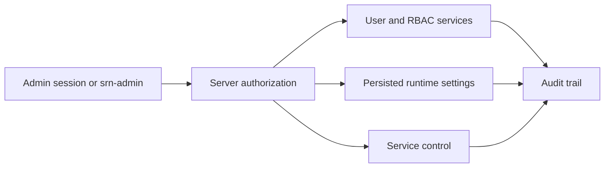

# Administration

Standard Red Notes provides two administration surfaces:

- **Settings → Admin** in the web client; and
- **`srn-admin`** inside the server container.

Both call server-authorized operations. The client hiding a tab is not the
security boundary.





## Access model

The built-in administrator role is `ADMIN_USER`. After a role change, sign out
and back in if the current session does not yet carry the new claims. The web
console surfaces a specific warning when the client expects admin access but
the server returns `403`.

Protect admin accounts with MFA, narrow network access, short session lifetime,
and independent recovery material. Do not use a daily note-taking account for
unattended administration.

## Web console tabs

| Tab                | Main capabilities                                                                                                                                                                                                          |
| ------------------ | -------------------------------------------------------------------------------------------------------------------------------------------------------------------------------------------------------------------------- |
| **Users**          | Paginated/filterable users; bulk ban/unban and admin role actions; per-user feature flags, AI limits, realtime, collaboration, OCR, workflows, backups, CalDAV, storage, suspension, MFA reset, quota repair, and deletion |
| **Groups & roles** | Roles, permission catalog, editable role permissions, groups, group membership, and an effective-permissions simulator                                                                                                     |
| **Server**         | Health and service lifecycle, feature master switches, proxy/IP behavior, registration and approval, account limits, OCR/workflows settings, and log level                                                                 |
| **AI**             | Anthropic/OpenAI/Ollama settings, provider endpoints, API-key status, and request/token limits                                                                                                                             |
| **Logs**           | Service logs and the administrative/security audit log                                                                                                                                                                     |
| **Security**       | Security overview, rate-limit tiers, adaptive escalation, IP lists, locked accounts, and links to related user/server controls                                                                                             |

Some controls depend on the deployed server profile. The UI should show a
feature as unavailable when the backing endpoint or lifecycle mechanism is not
present.

## User operations

Start with lookup and effective-state review:

```bash
docker compose exec server srn-admin user person@example.test
docker compose exec server srn-admin audit --user person@example.test --limit 50
```

Administrative states are distinct:

- **Ban** is an abuse response and can be permanent, temporary, or shadow.
- **Suspend** is a reversible administrative hold that signs the user out and
  blocks sign-in.
- **Delete** permanently removes the user across services.
- **Feature flags** change one capability without disabling the account.

Use the least disruptive state that meets the requirement.

> ⚠️ User deletion is irreversible and can affect shared vault ownership.
> Export required data, designate and verify a survivor for every shared vault
> the account owns, confirm the exact email, and verify backups before
> proceeding. The ownership change occurs when the owner account is deleted;
> deleting a vault does not transfer it.

The CLI requires `delete-user <user> --confirm <email>` and protects the last
administrator unless `--force` is supplied.

## Roles, permissions, and groups

A user’s effective authority is the union of direct roles and roles conferred
by groups. Before changing a role:

1. inspect the permission catalog;
2. use the effective-permissions simulator or user lookup;
3. make the smallest direct or group change;
4. refresh the user session if necessary;
5. verify effective permissions again; and
6. inspect the audit event.

Prefer groups for stable job functions and direct roles for exceptional,
time-bounded access. Review groups when a person changes responsibility.

## Registration

Registration has more than an on/off switch. The server supports:

- a persisted runtime registration gate layered over environment defaults;
- a default role for new users;
- allowed or blocked email-domain policy;
- email-confirmation requirements and sign-in gating;
- invite-only links with role and expiry/use limits;
- an approval queue;
- account caps; and
- a UTC signup window.

Test policy changes with a non-admin account. Keep at least one known-good admin
session open until the new registration and sign-in behavior is confirmed.

## Feature gates

Privacy-sensitive or resource-intensive features often have two gates:

1. an operator master switch; and
2. a per-user setting.

This applies to server OCR, workflows, scheduled backups, and CalDAV. A visible
client setting does not override a disabled server master switch.

Persisted admin overrides can take precedence over environment baselines. The
Admin Server tab and `srn-admin config`, `ocr`, and `workflows` commands show
effective values and their source. Note whether a change is live, requires a
page load, or requires a gateway restart.

The Workflows gates control discovery of a separately authenticated n8n link.
They do not provision, disable, or sign a user out of n8n. Manage actual n8n
access in n8n; see [Workflows with n8n](workflows.md).

## Service health and lifecycle

The Server tab reports per-service health and response time. Depending on the
deployment, it can start, stop, or restart allowlisted services or Compose
containers.

The API gateway is special because restarting it interrupts the request that
issued the action. Self-interrupting actions require explicit confirmation, and
stopping the gateway is forbidden through the control service.

After any lifecycle action:

1. wait for readiness, not merely process startup;
2. verify authentication, sync, files, revisions, and WebSockets;
3. inspect bounded logs; and
4. confirm background workers are processing events.

## Runtime log level

The Server tab's **Log level** control is live. A persisted
`logging.level` wins over that process's `LOG_LEVEL` environment baseline; if
neither is valid, the safe baseline is `info`. Changes are polled and reach all
deployed loggers within about 30 seconds without restarting the stack.

In the standard multi-service image this includes the API gateway, auth server
and worker, syncing server and worker, files server and worker, and revisions
server and worker. The realtime gateway runs inside the API gateway, so it uses
the gateway logger. In the all-in-one image one poll updates the named auth,
syncing, files, revisions, API gateway, and home-server loggers.

Every process must read the same `SERVER_SETTINGS_PATH`. The supplied Compose
files default that file inside the persistent `server-data` or `single-data`
volume and the entrypoints propagate the exact path to every package. If you
override the path, use an in-container path and mount it persistently yourself.
Removing, corrupting, or setting an unknown level in the overlay makes the
reader fall back to the environment baseline; it never disables logging or
crashes a service.



## Security and anti-abuse

IP allow entries bypass rate limits. Use an exact address or the smallest
possible CIDR, record the reason and expiry, and remove it when no longer
needed. Ensure `TRUST_PROXY` and any dedicated client-IP header are configured
only for a trusted reverse proxy; otherwise audit and rate-limit decisions can
use attacker-controlled headers.

Unlocking an account addresses rate-limit lockout. It does not lift a ban or
suspension, and it does not reset MFA.

## Audit practice

Query audit events after changes to:

- users, roles, groups, and permissions;
- registration and invite policy;
- bans, suspensions, IP lists, and lockouts;
- feature flags, limits, and provider configuration; and
- services and runtime settings.

Changing the Workflows master switch or per-user flag is an SRN administration
event. n8n logins, role changes, credentials, and executions belong to n8n's
independent audit and retention controls.

For command details, see [Command-Line Tools](command-line-tools.md). For
incident procedures, see [Monitoring and
Troubleshooting](monitoring-and-troubleshooting.md).
