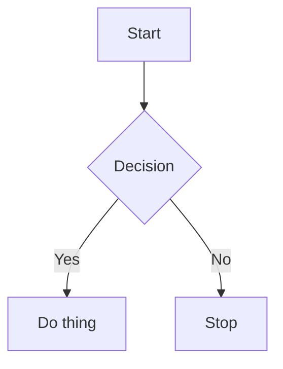

<!-- This file is generated by scripts/export-app-docs-to-pages.mjs from app/packages/web/src/javascripts/Components/Preferences/Panes/Documentation/content.ts, plus online-only visual supplements declared in the exporter. -->

# In-app guide

The written guidance on this page mirrors the documentation bundled inside Standard Red Notes under Preferences -> Documentation. It is generated from the same source data so the online docs stay aligned with the offline, searchable in-app guide. Annotated source-capture snippets are added only to this online rendering.

## Contents

- [Getting started](#getting-started)
  - [Welcome to Standard Red Notes](#getting-started-welcome)
  - [Creating your first note](#getting-started-create-first-note)
  - [The interface](#getting-started-interface-tour)
  - [Using the app without an account](#getting-started-no-account)
  - [Creating an account & signing in](#getting-started-account-setup)
- [Privacy & encryption](#encryption)
  - [How end-to-end encryption works](#encryption-how-it-works)
  - [Your password & key](#encryption-your-password)
  - [What the server can and cannot see](#encryption-what-server-sees)
  - [Encrypted vs decrypted data](#encryption-encrypted-vs-decrypted)
- [Account & security](#security)
  - [Two-factor authentication (authenticator app)](#security-two-factor)
  - [Email magic-link 2FA](#security-magic-link)
  - [Managing sessions & devices](#security-sessions)
  - [Changing your password](#security-change-password)
  - [Optional account recovery](#security-account-recovery)
  - [Protected notes & app lock](#security-protected-notes)
- [Notes & editors](#editors)
  - [Note types overview](#editors-note-types)
  - [The Super (block) editor](#editors-super)
  - [Markdown editors](#editors-markdown)
  - [Code editor](#editors-code)
  - [Spreadsheet](#editors-spreadsheet)
  - [Diagrams with Mermaid](#editors-mermaid)
  - [Checklists & to-dos](#editors-checklists)
- [Organizing notes](#organization)
  - [Tags & nested folders](#organization-tags)
  - [Smart views](#organization-smart-views)
  - [Pinning, starring, archiving & trash](#organization-pinning)
  - [Searching notes](#organization-search)
  - [Note options](#organization-note-options)
- [Files & attachments](#files)
  - [Uploading & attaching files](#files-uploading)
  - [File encryption & limits](#files-encryption)
- [Sync & devices](#sync)
  - [How sync works](#sync-how-it-works)
  - [Using multiple devices](#sync-multi-device)
  - [Sync conflicts & resolution](#sync-conflicts)
  - [Offline use](#sync-offline)
- [Backups & export](#backups)
  - [Why backups matter](#backups-why-backups)
  - [Exporting & importing data](#backups-export-import)
  - [Automatic backups](#backups-automatic)
  - [Restoring from a backup](#backups-restore)
- [Self-hosting](#self-hosting)
  - [Self-hosting overview](#self-hosting-overview)
  - [Architecture](#self-hosting-architecture)
  - [How authentication works (cookies)](#self-hosting-cookies-auth)
  - [Email delivery / SMTP](#self-hosting-smtp)
  - [Updating your server](#self-hosting-updating)
- [AI assistant](#assistant)
  - [What the assistant can do](#assistant-overview)
  - [Configuring providers](#assistant-providers)
  - [Connection modes: Direct vs Server proxy](#assistant-connection)
  - [Steering, queueing, delegating, and planning](#assistant-capabilities)
  - [Finding notes: assistant retrieval and AI-powered search](#assistant-retrieval-search)
  - [Assistant & privacy](#assistant-privacy)
- [Collaboration](#collaboration)
  - [Shared vaults](#collaboration-vaults)
  - [Contacts & trust](#collaboration-contacts)
  - [Realtime collaboration](#collaboration-realtime)
- [Automation (MCP)](#automation)
  - [The MCP bridge](#automation-mcp-overview)
  - [Connecting an agent](#automation-mcp-setup)
  - [What an agent can do](#automation-capabilities)
  - [The HTTP API](#automation-http-api)
- [Keyboard shortcuts](#shortcuts)
  - [Common shortcuts](#shortcuts-common)
- [Troubleshooting](#troubleshooting)
  - [Can’t sign in / 401 errors](#troubleshooting-cant-sign-in)
  - [Notes not syncing](#troubleshooting-not-syncing)
  - [Lost two-factor access](#troubleshooting-lost-2fa)
  - [Clearing local data](#troubleshooting-reset)

<a id="getting-started"></a>
## Getting started

Your first notes, the interface, and how accounts work.

<a id="getting-started-welcome"></a>
### Welcome to Standard Red Notes

A private, end-to-end encrypted notes app where every feature is unlocked for free.

Standard Red Notes is a private notes app built on end-to-end encryption. Your notes are encrypted on your device before they ever reach a server, so only you can read them. It is a single-tier, fully-free, self-hostable app — there are no paid plans and no locked features.

Standard Red Notes is an independent fork of the original Standard Notes, keeping its end-to-end encryption and self-hosting foundations while adding AI-aware features (an in-app assistant and selection actions like refine, summarize, and expand) and collaboration features (shared vaults, realtime co-editing, and a graph view of your linked notes).

#### What you get

- Every editor and note type: rich text, the Super block editor, Markdown, code, spreadsheet, checklists, and diagrams.
- Unlimited notes, tags, nested folders, and smart views.
- End-to-end encrypted file attachments.
- Two-factor authentication via an authenticator app or an email magic link.
- Encrypted backups and import/export in native and Markdown formats.
- Optional AI assistant that can run entirely against a local model.
- Self-hosting, multi-device sync, shared vaults, and realtime collaboration.

> **Info.** Because your notes are end-to-end encrypted, the privacy guarantees and the responsibility for your password are both stronger than in a typical app. Read "How encryption works" and "Your password and key" before you store anything important.

Related: [encryption/how-it-works](#encryption-how-it-works), [getting-started/create-first-note](#getting-started-create-first-note), [getting-started/no-account](#getting-started-no-account)

<a id="getting-started-create-first-note"></a>
### Creating your first note

Make a note, give it a title, and pick the editor that fits.



1. Click the “+” (Create new note) button at the top of the notes list.
2. Type a title, then press Tab or click into the body to start writing.
3. Open the note options menu (the “…” / info icon) to change the note type, pin, star, or protect the note.

A new note uses your default editor. You can change the editor for any individual note at any time, and you can set a different default under Preferences → General.

> **Tip.** Changing a note’s type converts its content where possible. Converting between very different formats (for example a spreadsheet to plain text) can lose formatting, so duplicate the note first if you want to keep the original.

Related: [editors/note-types](#editors-note-types), [editors/super](#editors-super), [organization/note-options](#organization-note-options)

<a id="getting-started-interface-tour"></a>
### The interface

How the navigation, notes list, and editor panels fit together.



The app has three main panels, left to right:

- Navigation — your views (All notes, Starred, Files, Trash), tags, and smart views.
- Notes list — the notes inside the selected view, with sorting and search.
- Editor — the open note and its options.

On narrow screens the panels stack and you move between them with back gestures. You can collapse panels and toggle focus mode to write distraction-free.

Related: [organization/tags](#organization-tags), [organization/smart-views](#organization-smart-views), [organization/search](#organization-search)

<a id="getting-started-no-account"></a>
### Using the app without an account

Everything works offline and locally, with no sign-up required.

You can use Standard Red Notes with no account at all. Your notes are stored in a local encrypted database on your device and never leave it. This is great for trying the app or for a strictly offline workflow.

When you are ready to sync across devices or keep an off-device backup, create an account and sign in — your existing local notes are uploaded and encrypted to your server on first sync.



Related: [getting-started/account-setup](#getting-started-account-setup), [backups/export-import](#backups-export-import), [sync/how-it-works](#sync-how-it-works)

<a id="getting-started-account-setup"></a>
### Creating an account & signing in

Register, choose a strong password, and sign in on each device.

1. Open the account menu and choose Create account (or Sign in if you already have one).
2. Confirm the sync server address. For a self-hosted install this is your server’s URL.
3. Enter your email and a strong password, then create the account.



To use a second device, install the app, point it at the same sync server, and sign in with the same credentials. Your encrypted notes download and decrypt locally.

Related: [encryption/your-password](#encryption-your-password), [security/two-factor](#security-two-factor), [sync/multi-device](#sync-multi-device)

<a id="encryption"></a>
## Privacy & encryption

How end-to-end encryption protects your notes and what it means for you.

<a id="encryption-how-it-works"></a>
### How end-to-end encryption works

Notes are encrypted on your device; the server only ever stores ciphertext.

When you save a note, the app encrypts its contents on your device using keys derived from your account password. Only the encrypted result (ciphertext) is sent to and stored by the server. When you open the app on another device and sign in, the ciphertext is downloaded and decrypted locally with your key.

This is what “end-to-end” means: the data is readable only at the ends (your devices), never in the middle (the server or the network).

- Your password is run through a key-derivation function to produce your master key — locally, never on the server.
- Each item is encrypted with modern authenticated encryption, so tampering is detectable.
- The server authenticates you and stores/relays ciphertext, but cannot decrypt it.

> **Info.** Encryption protects the content of your notes and files. Some metadata (such as item creation/update timestamps and the fact that an item exists) is necessarily visible to the server so it can sync efficiently.

Related: [encryption/your-password](#encryption-your-password), [encryption/what-server-sees](#encryption-what-server-sees), [encryption/encrypted-vs-decrypted](#encryption-encrypted-vs-decrypted)

<a id="encryption-your-password"></a>
### Your password & key

Your password derives the account keys; optional recovery must be enabled in advance.

Your account password is used to derive your encryption key. The server stores only a value it can use to verify you can sign in; it never receives your actual password or your key.

#### Why an administrator cannot reset it

Because the server cannot decrypt your data, an administrator cannot choose a new password and re-encrypt your notes for you. A password change must be proven by the client using the current root key.

Standard Red Notes ships an optional logged-out account-recovery flow, but it must be enabled while you are still signed in. The client creates a separate high-entropy recovery code and uploads only root-key material encrypted by that code. If you lose both the password and the code, the server still cannot recover the account.

- Use a long, memorable passphrase, or store the password in a password manager.
- Export encrypted backups regularly — they can be restored on any device with the password.
- If you opt in to account recovery, store its one-time code separately from the account and the only backup.
- Changing your password re-wraps your keys; keep a recent backup before doing so.



Related: [security/account-recovery](#security-account-recovery), [security/change-password](#security-change-password), [backups/why-backups](#backups-why-backups), [encryption/how-it-works](#encryption-how-it-works)

<a id="encryption-what-server-sees"></a>
### What the server can and cannot see

The server stores ciphertext and sync metadata — never your note contents.

#### The server cannot see

- The text of your notes.
- The contents of your files.
- Your tags’ contents, note titles, or editor data — these are encrypted too.
- Your password or encryption keys.

#### The server does see

- Your email address (used to sign in and, optionally, to send magic-link codes).
- That items exist and when they were created or last updated, so it can sync changes.
- The size of encrypted items and files.
- Your IP address and session/device info for active sessions.

> **Tip.** Self-hosting puts even this metadata on infrastructure you control.

Related: [self-hosting/overview](#self-hosting-overview), [security/sessions](#security-sessions), [encryption/how-it-works](#encryption-how-it-works)

<a id="encryption-encrypted-vs-decrypted"></a>
### Encrypted vs decrypted data

The difference matters most when you export or move data around.

Inside the app, your notes are always shown decrypted — you just read and write normally. The distinction becomes important when data leaves the app, for example in a backup.

| Topic | Details |
| --- | --- |
| Encrypted backup | Ciphertext that still deserves protected storage. Requires the correct password or backup key to restore and can be copied for offline attack. |
| Decrypted backup | Plain, readable content. Convenient but unprotected — anyone with the file can read everything. |



Related: [backups/export-import](#backups-export-import), [backups/why-backups](#backups-why-backups)

<a id="security"></a>
## Account & security

Passwords, optional account recovery, two-factor authentication, sessions, and note protection.

<a id="security-two-factor"></a>
### Two-factor authentication (authenticator app)

Add a TOTP authenticator app as a second factor at sign-in.

1. Open Preferences → Security.
2. Enable two-factor authentication and scan the displayed QR code with any authenticator app (the TOTP standard is supported by all of them).
3. Save your secret/backup key somewhere safe in case you lose the authenticator.
4. Enter the current 6-digit code to confirm and finish enabling.

After enabling, signing in requires your password plus the current code from your authenticator app.



Related: [security/magic-link](#security-magic-link), [security/sessions](#security-sessions), [troubleshooting/lost-2fa](#troubleshooting-lost-2fa)

<a id="security-magic-link"></a>
### Email magic-link 2FA

Use a one-time emailed code as your second factor.

As an alternative to an authenticator app, Standard Red Notes supports an email magic-link second factor. At sign-in, a one-time code is delivered to your email address; entering it completes authentication.

- Your server must have working email (SMTP) delivery before magic-link 2FA can be enabled.
- The code is sent only by email and is never returned to or shown by the unauthenticated sign-in screen.
- If delivery fails, sign-in stops instead of falling back to an exposed on-screen code.

> **Info.** Magic-link 2FA ties your account security to your email account. Make sure that email account is itself well protected.

Related: [security/two-factor](#security-two-factor), [self-hosting/smtp](#self-hosting-smtp)

<a id="security-sessions"></a>
### Managing sessions & devices

See where you are signed in and revoke access remotely.

Each device you sign in on creates a session. Under Preferences → Security you can review your active sessions and revoke any you do not recognize.

1. Open Preferences → Security and find the active sessions list.
2. Review the device, app, and last-active details for each session.
3. Revoke any session you no longer trust — that device is immediately signed out.

> **Tip.** Revoke sessions for lost or sold devices right away. The data on those devices stays encrypted, but revoking prevents further sync.

Related: [security/change-password](#security-change-password), [encryption/what-server-sees](#encryption-what-server-sees)

<a id="security-change-password"></a>
### Changing your password

Rotate your password safely without losing access to your notes.

1. Export a current encrypted backup first, as a safety net.
2. Open Preferences → Account and choose to change your password.
3. Enter your current password and the new one; your keys are re-wrapped with the new password.
4. Sign in again on your other devices with the new password.



Related: [encryption/your-password](#encryption-your-password), [security/account-recovery](#security-account-recovery), [backups/why-backups](#backups-why-backups), [security/sessions](#security-sessions)

<a id="security-account-recovery"></a>
### Optional account recovery

Opt in before a password is lost, then protect the separately generated recovery code.

Account recovery is shipped, optional, and off by default. A signed-in user enables it under Preferences → Security by entering the current password. The client encrypts the account root-key material with a high-entropy recovery secret and uploads only that ciphertext escrow. The recovery code, which contains the lookup identifier and secret, is shown once and is never sent to the server.

#### Enable and store it safely

1. While signed in, open Preferences → Security → Account recovery.
2. Read the trust-boundary warning, enter the current account password, and choose Enable account recovery.
3. Copy the newly generated code to a protected password manager or offline recovery package that is separate from the notes account.
4. Confirm that the code is saved before dismissing the one-time display.



#### Recover from the signed-out screen

1. Use only a computer you trust, open Sign in, and choose Recover account with an account recovery code.
2. Enter the complete recovery code and a strong new password twice.
3. The client retrieves the bounded ciphertext escrow, decrypts it locally, signs in with the recovered root key, and changes the credentials through the normal authenticated rotation path.
4. Save the replacement recovery code shown after rotation. The old password and old recovery code no longer work.

Recovery does not bypass the credential-change contract or give an administrator a reset capability. If sign-in succeeds but password rotation or recovery re-enrollment fails, follow the on-screen status: you may be signed in while still needing to retry the password change or enable recovery again from Security preferences.

#### Rotate or disable

- Replace the code immediately if it may have been copied; replacement invalidates the previous code.
- Changing account credentials deletes the existing escrow, so opt in again only after the password change completes.
- Disabling recovery permanently deletes the server-side escrow and invalidates every issued account-recovery code.
- Older legacy escrow is not accepted by this flow and can only be deleted.
- Keep independent, tested backups even when recovery is enabled.

Related: [encryption/your-password](#encryption-your-password), [security/change-password](#security-change-password), [backups/why-backups](#backups-why-backups), [security/two-factor](#security-two-factor)

<a id="security-protected-notes"></a>
### Protected notes & app lock

Require authentication to view sensitive notes or to open the app.

Mark any note as protected from its options menu. Protected notes require you to re-authenticate (with your account password, or a device passcode/biometric where available) before they can be viewed or edited.

You can also set an app-level passcode or biometric lock so the whole app requires authentication when opened or after it has been idle.

On supported web and desktop clients, a local passkey can add another app-lock step. Set an app passcode first: the passcode remains the recovery method and can disable the passkey gate after it has been verified.

> **Tip.** Protection is a convenience guard against shoulder-surfing and casual access. The underlying notes are always encrypted regardless of protection state.

Related: [organization/note-options](#organization-note-options), [security/two-factor](#security-two-factor)

<a id="editors"></a>
## Notes & editors

Every note type and editor, and when to use each.

<a id="editors-note-types"></a>
### Note types overview

Switch any note between editors to match the content.

Each note has a type, set from the note options menu. All types are available to every account.

| Topic | Details |
| --- | --- |
| Super | A modern block editor with rich blocks, tables, checklists, and embedded diagrams. |
| Rich text | Classic formatted text (bold, lists, links, images). |
| Markdown | Plain Markdown with a live preview. |
| Code | Syntax-highlighted code with language selection. |
| Plain text | No formatting — fastest and most portable. |
| Spreadsheet | A grid for tabular data and simple calculations. |
| Checklist / tasks | Lists of items you can check off. |

> **Tip.** Set your most-used type as the default under Preferences → General so new notes start in the right editor.

Related: [editors/super](#editors-super), [editors/markdown](#editors-markdown), [editors/code](#editors-code), [editors/spreadsheet](#editors-spreadsheet)

<a id="editors-super"></a>
### The Super (block) editor

A flexible block editor with slash commands, tables, and diagrams.

Super is the most capable editor. Content is organized into blocks — paragraphs, headings, lists, checklists, tables, code blocks, dividers, and more. Type “/” to open the block menu and insert any block type.

- Slash commands to insert and transform blocks.
- Inline formatting, links, and embedded images/files.
- Collapsible sections, tables, and checklists in one document.
- Mermaid diagram blocks for flowcharts and diagrams from text.

> **Tip.** Super is the most robust place to use Mermaid diagrams. The legacy Markdown editors also render Mermaid in their preview on a best-effort basis.

Related: [editors/mermaid](#editors-mermaid), [editors/checklists](#editors-checklists), [editors/note-types](#editors-note-types)

<a id="editors-markdown"></a>
### Markdown editors

Write in Markdown with a side-by-side or toggled preview.

Several Markdown editors are bundled, from minimal to full-featured. They render standard Markdown — headings, emphasis, lists, links, images, tables, and fenced code blocks — with a live preview.

Fenced code blocks tagged as mermaid are rendered as diagrams in the preview where supported.

````

````

Related: [editors/super](#editors-super), [editors/mermaid](#editors-mermaid), [editors/code](#editors-code)

<a id="editors-code"></a>
### Code editor

Syntax highlighting for snippets and configuration.

The code editor provides syntax highlighting for many languages. Pick the language from the editor’s controls; the choice is saved with the note.

> **Tip.** Use the code editor for snippets, config files, and command references you want to keep readable and copy-pasteable.

Related: [editors/note-types](#editors-note-types), [editors/markdown](#editors-markdown)

<a id="editors-spreadsheet"></a>
### Spreadsheet

A grid editor for tabular data and light calculations.

The spreadsheet editor turns a note into a grid of cells for tabular data, simple budgets, and trackers. Data is encrypted like any other note.

> **Info.** For freeform tables inside a longer document, the Super editor’s table block is often more convenient than a full spreadsheet note.

Related: [editors/super](#editors-super), [editors/note-types](#editors-note-types)

<a id="editors-mermaid"></a>
### Diagrams with Mermaid

Describe flowcharts, sequence, and other diagrams as text.

Mermaid lets you write diagrams as text that render into flowcharts, sequence diagrams, Gantt charts, and more. The Super editor has a dedicated Mermaid block; the legacy Markdown editors render mermaid-tagged code blocks in their preview on a best-effort basis.

```
sequenceDiagram
  participant You
  participant App
  participant Server
  You->>App: Write a note
  App->>App: Encrypt locally
  App->>Server: Upload ciphertext
```

Related: [editors/super](#editors-super), [editors/markdown](#editors-markdown)

<a id="editors-checklists"></a>
### Checklists & to-dos

Track tasks with checkable items inside notes.

Use a checklist/tasks note, or a checklist block inside a Super note, to track to-dos. Check items off as you complete them; completed items can be grouped or hidden depending on the editor.

> **Tip.** Combine a daily note with checklist blocks to build a lightweight calendar-style to-do system.

Related: [editors/super](#editors-super), [organization/smart-views](#organization-smart-views)

<a id="organization"></a>
## Organizing notes

Tags, nested folders, smart views, pinning, and search.

<a id="organization-tags"></a>
### Tags & nested folders

Group notes with tags, and nest tags to build a folder hierarchy.

Tags group related notes. A note can have many tags. Tags can be nested to create a folder-like hierarchy — drag a tag onto another to nest it.

1. Create a tag from the navigation panel’s add button.
2. Drag a note onto a tag, or add tags from the note’s options.
3. Drag one tag into another to nest it as a sub-folder.

Related: [organization/smart-views](#organization-smart-views), [organization/search](#organization-search)

<a id="organization-smart-views"></a>
### Smart views

Saved filters that automatically collect matching notes.

Smart views are dynamic, saved filters. Instead of manually tagging, you define rules (for example notes with a certain tag, type, or that are starred) and the view always shows the matching notes.

> **Tip.** Use smart views for things like “Untagged”, “Starred”, “Files”, or “Recently updated” without maintaining them by hand.

Related: [organization/tags](#organization-tags), [organization/pinning](#organization-pinning)

<a id="organization-pinning"></a>
### Pinning, starring, archiving & trash

Keep important notes up top and tidy away the rest.

| Topic | Details |
| --- | --- |
| Pin | Keeps a note at the top of the list. |
| Star | Marks a note as important; collect them in the Starred view. |
| Archive | Removes a note from the main list without deleting it. |
| Trash | Moves a note to Trash; empty the Trash to delete permanently. |



Related: [organization/note-options](#organization-note-options), [backups/restore](#backups-restore)

<a id="organization-search"></a>
### Searching notes

Find notes fast across titles and contents.

Use the search box above the notes list to filter by title and content within the current view. Search runs locally against your decrypted data, so it is fast and private.

> **Tip.** Combine search with a smart view or tag to scope results to a subset of your notes.

Related: [organization/smart-views](#organization-smart-views), [organization/tags](#organization-tags)

<a id="organization-note-options"></a>
### Note options

Per-note actions: type, pin, protect, preview, and more.

The note options menu collects per-note actions in one place:

- Change the note type / editor.
- Pin, star, or archive the note.
- Protect the note (require authentication to open).
- Toggle list preview, spell-check, and editor width.
- Duplicate, export, or move the note to Trash.

Related: [editors/note-types](#editors-note-types), [security/protected-notes](#security-protected-notes), [organization/pinning](#organization-pinning)

<a id="files"></a>
## Files & attachments

Attach and manage end-to-end encrypted files.

<a id="files-uploading"></a>
### Uploading & attaching files

Attach files to notes or keep them in the Files view.

1. Drag a file into a note, or use the attach action in the editor toolbar / note options.
2. The file is encrypted on your device and uploaded to your server.
3. Find all uploads in the Files view; link them to one or more notes.

Files are downloaded and decrypted locally when you open them, the same way notes are.

> **Info.** A download is accepted only when every declared encrypted chunk arrives, authenticates successfully, and the authenticated final marker appears exactly at the end. Truncated, oversized, malformed, or tampered data is reported as an error instead of being treated as a complete file; an authenticated file with empty contents is still valid.

Related: [files/encryption](#files-encryption), [self-hosting/overview](#self-hosting-overview)

<a id="files-encryption"></a>
### File encryption & limits

Files are encrypted like notes; limits depend on your server.

File contents are end-to-end encrypted, so the server stores only ciphertext. Upload size and storage limits depend on your server’s configuration. On a self-hosted install you set these yourself.

> **Info.** This build issues unlimited file tokens for free accounts, so uploads are not gated behind a subscription. Practical limits come from your own server and storage.

Related: [files/uploading](#files-uploading), [self-hosting/architecture](#self-hosting-architecture)

<a id="sync"></a>
## Sync & devices

How sync works across devices, offline, and during conflicts.

<a id="sync-how-it-works"></a>
### How sync works

Encrypted changes upload and download automatically.

When you are signed in and online, the app continuously syncs encrypted changes with your server. Local edits are queued and uploaded; remote changes are downloaded and merged. Everything transits and rests as ciphertext.

> **Info.** The first sync after signing in on a new device downloads your whole encrypted dataset, then keeps up incrementally.

Related: [sync/multi-device](#sync-multi-device), [sync/offline](#sync-offline), [sync/conflicts](#sync-conflicts)

<a id="sync-multi-device"></a>
### Using multiple devices

Sign in on each device with the same account and server.

1. Install the app on the new device.
2. Point it at the same sync server.
3. Sign in with your email and password (and second factor, if enabled).

Edits made on any device appear on the others within seconds while both are online.

Related: [getting-started/account-setup](#getting-started-account-setup), [sync/conflicts](#sync-conflicts)

<a id="sync-conflicts"></a>
### Sync conflicts & resolution

When the same note changes in two places, both versions are kept.

If a note is edited on two devices before they sync (for example both were offline), the app keeps both versions rather than silently overwriting. You will see a conflicted copy alongside the original so you can merge and delete the extra.

> **Tip.** Conflicts are a safety feature. Resolve them by copying anything you need from the conflicted copy into the main note, then trash the copy.

Related: [sync/how-it-works](#sync-how-it-works), [backups/restore](#backups-restore)

<a id="sync-offline"></a>
### Offline use

Full functionality without a connection; sync resumes later.

The app is offline-first. You can read and write everything while disconnected; changes are stored locally and sync automatically when a connection returns.



Related: [getting-started/no-account](#getting-started-no-account), [sync/how-it-works](#sync-how-it-works)

<a id="backups"></a>
## Backups & export

Export, import, and protect yourself against data loss.

<a id="backups-why-backups"></a>
### Why backups matter

Recovery is opt-in and backups still cover device loss, deletion, and escrow failure.

The server has no administrator-readable reset that can decrypt your notes. Optional account recovery works only when you enabled it before losing the password and still have its separate recovery code. Backups remain essential for lost devices, accidental deletion, damaged accounts, unavailable escrow, and recovery-code loss.

- Export an encrypted backup regularly and store copies in more than one place.
- An encrypted backup can be restored on any device with your password.
- If you enable account recovery, store its high-entropy code separately from both the account and the only backup.
- For recovery without that code, retain an independently usable copy, such as a carefully protected decrypted export or an encrypted export whose password you still know.
- Verify occasionally that you can actually restore a backup.

Related: [backups/export-import](#backups-export-import), [backups/automatic](#backups-automatic), [encryption/your-password](#encryption-your-password)

<a id="backups-export-import"></a>
### Exporting & importing data

Export native (encrypted or decrypted) or Markdown; import native backups.

#### Export

From the account menu choose Export. You can export:

- Native encrypted — a full, encrypted archive. Best for backups.
- Native decrypted — a full archive in readable form. Convenient but unprotected.
- Markdown — your notes as plain .md files for use in other tools.

#### Import

Use Import to bring in a native Standard Notes / Standard Red Notes backup. Encrypted backups prompt for the password that protects them; decrypted backups import directly.

> **Tip.** Round-trip safely: export a native backup before importing, so you can roll back if an import does not look right.

Related: [encryption/encrypted-vs-decrypted](#encryption-encrypted-vs-decrypted), [backups/restore](#backups-restore), [backups/why-backups](#backups-why-backups)

<a id="backups-automatic"></a>
### Automatic backups

Schedule recurring local or emailed backups where supported.

Under Preferences → Backups you can enable automatic backups so a fresh copy is written on a schedule without you remembering to do it. Available destinations depend on your platform (desktop can write to a local folder).

> **Info.** Automatic backups complement, but do not replace, the occasional manual export you store off-device.

Related: [backups/export-import](#backups-export-import), [backups/why-backups](#backups-why-backups)

<a id="backups-restore"></a>
### Restoring from a backup

Bring data back after loss, or recover a deleted note.

1. Open Import from the account menu.
2. Choose your backup file (native encrypted or decrypted).
3. For an encrypted backup, enter the password that protected it.
4. Review the imported notes; resolve any duplicates.



Related: [backups/export-import](#backups-export-import), [sync/conflicts](#sync-conflicts)

<a id="self-hosting"></a>
## Self-hosting

Run your own server, gateway, and database with full control.

<a id="self-hosting-overview"></a>
### Self-hosting overview

Own the whole stack — even the sync metadata stays on your infrastructure.

Standard Red Notes is designed to be self-hosted. Running your own server means the encrypted data and the limited sync metadata both live on infrastructure you control, and you set your own limits with no subscriptions involved.

The bundled deployment uses containers orchestrated together: the app (static web UI), the server (sync, auth, files), a realtime gateway, a database, and a cache.

Related: [self-hosting/architecture](#self-hosting-architecture), [self-hosting/cookies-auth](#self-hosting-cookies-auth), [self-hosting/smtp](#self-hosting-smtp)

<a id="self-hosting-architecture"></a>
### Architecture

How the app, server, gateway, database, and cache fit together.

| Topic | Details |
| --- | --- |
| App | The static web client served over HTTP. Talks to the server’s API. |
| Server | Auth, syncing, and files services. Stores ciphertext and authenticates you. |
| Gateway | A WebSocket service for realtime push and collaboration relay. |
| Database | Stores encrypted items and account metadata. |
| Cache | Speeds up sessions and ephemeral state. |

> **Info.** The app and server run on separate ports/origins by default, so the client is configured to send credentials cross-origin and the server allows it. See "How authentication works".

Related: [self-hosting/cookies-auth](#self-hosting-cookies-auth), [collaboration/realtime](#collaboration-realtime), [automation/mcp-overview](#automation-mcp-overview)

<a id="self-hosting-cookies-auth"></a>
### How authentication works (cookies)

Browser sessions are authenticated with cookies — configure them for your host.

For browser sessions, the server authenticates requests using session cookies it sets at sign-in (an access-token and a refresh-token cookie). The client must send these cookies, and the server must accept them — both have to suit your deployment or every authenticated request will fail.

#### Key settings

| Topic | Details |
| --- | --- |
| COOKIE_DOMAIN | Leave empty for a host-only cookie that works on localhost, a bare hostname, or an IP. Set it only for an HTTPS deployment behind a real domain. |
| COOKIE_SECURE | false for plain HTTP self-hosting; true when serving over HTTPS. |
| COOKIE_SAME_SITE | Lax is appropriate for a same-site app+API; None requires Secure. |
| CORS | The server echoes your app’s origin and allows credentials so cookies flow across the app/API ports. |



Related: [self-hosting/architecture](#self-hosting-architecture), [troubleshooting/cant-sign-in](#troubleshooting-cant-sign-in), [troubleshooting/not-syncing](#troubleshooting-not-syncing)

<a id="self-hosting-smtp"></a>
### Email delivery / SMTP

Configure one protected SMTP connection for account mail, backups, and reminders.

An administrator can configure the shared SMTP connection under Preferences → Admin → Server → Email delivery. Saved fields override environment values and apply on the next send; clearing a field restores its environment/default fallback. The password is write-only and is preserved by partial saves unless explicitly replaced or cleared.

STARTTLS is required by default. Implicit TLS is available for providers that expect TLS from connection start (normally port 465). Insecure delivery is accepted only for an explicitly trusted loopback or private relay. Save first, then use the redacted Send test action.



Related: [security/magic-link](#security-magic-link), [self-hosting/overview](#self-hosting-overview)

<a id="self-hosting-updating"></a>
### Updating your server

Rebuild and recreate containers to pick up changes.

When you change configuration or pull new code, rebuild the affected image and recreate its container. Configuration-only changes usually need just a recreate; code changes need a rebuild first.

> **Tip.** Recreate one service at a time (for example just the server, or just the app) to minimize disruption, and keep a recent backup before bigger upgrades.

Related: [self-hosting/architecture](#self-hosting-architecture), [backups/why-backups](#backups-why-backups)

<a id="assistant"></a>
## AI assistant

Chat about and act on your notes, optionally fully local.

<a id="assistant-overview"></a>
### What the assistant can do

Search, summarize, create, edit, and organize your notes from chat.

Open the assistant from the toolbar to chat about your notes and take actions on them — search, summarize, draft new notes, edit existing ones, and help with organization.

> **Info.** The assistant operates within your account and acts on your decrypted notes locally in the browser session.

Related: [assistant/providers](#assistant-providers), [assistant/connection](#assistant-connection), [assistant/capabilities](#assistant-capabilities), [assistant/retrieval-search](#assistant-retrieval-search), [assistant/privacy](#assistant-privacy)

<a id="assistant-providers"></a>
### Configuring providers

Use a local model or any OpenAI-compatible endpoint.

Under Preferences → Assistant, choose a connection and model. Supported options include local servers (LM Studio, Ollama) and any OpenAI-compatible endpoint (OpenAI, OpenRouter, or a custom server).

1. Pick a provider/connection.
2. Set the base URL (for a local server this points at your machine).
3. Add an API key if the provider needs one (local servers usually do not).
4. Use “Fetch models” to load the endpoint’s available models, then select one.

> **Tip.** There are two ways to connect: talk to an endpoint directly from the app, or relay through the Standard Red Notes server. See “Connection modes” for the trade-offs.

Related: [assistant/connection](#assistant-connection), [assistant/overview](#assistant-overview), [assistant/privacy](#assistant-privacy)

<a id="assistant-connection"></a>
### Connection modes: Direct vs Server proxy

Talk to an endpoint directly, or relay through the server with a server-held key.

The assistant can reach a model in two ways. In Direct mode your browser talks straight to an OpenAI-compatible endpoint. In Server proxy mode the Standard Red Notes server relays the conversation using a key it holds, so your devices never store the key.

#### Direct mode

The app connects directly to an OpenAI-compatible endpoint — for example LM Studio (http://localhost:1234/v1), Ollama (http://localhost:11434/v1), OpenRouter, OpenAI, or any custom base URL. If the endpoint needs an API key, it is stored in your encrypted, synced preferences and sent only to that endpoint. Use the “Fetch models” button to query the endpoint’s /models list and pick a model.

#### Server proxy mode

In Server proxy mode the Standard Red Notes server relays one model turn at a time using a server-held credential, so client devices never hold it. An administrator configures assistant profiles and assigns them by user or role. The app shows your authenticated effective profile, provider, and model as read-only information; local Direct-mode provider/model preferences never override that assignment.

In proxy mode the server can enforce a per-user daily request limit, and your current usage against that limit is shown in the app.

| Topic | Details |
| --- | --- |
| Mode | Where the key lives / Who pays & limits |
| Direct | Key (if any) is in your encrypted synced preferences and sent only to the endpoint; you connect to and pay the provider directly, with no app-enforced limits. |
| Server proxy | Key is held by the server, never on client devices; the server account pays the provider and can enforce per-user daily request limits, with usage shown in the app. |

Related: [assistant/providers](#assistant-providers), [assistant/overview](#assistant-overview), [assistant/privacy](#assistant-privacy)

<a id="assistant-capabilities"></a>
### Steering, queueing, delegating, and planning

Guide the assistant mid-task, line up messages, and watch it plan multi-step work.

While the assistant works on a task you stay in control. You can nudge it, stop it, line up follow-ups, and watch how it breaks larger work into steps.

- Steer: while the assistant is working, type a message and press Steer (or Enter) to inject guidance mid-task. It adjusts on its next step without restarting, and your steered message appears with a “↳ Steer” marker.
- Interrupt: the Stop button aborts the current run and clears any pending steers and queued messages.
- Queue: messages you enter while a run is active are lined up and run automatically, in order, when the current run finishes. Queued items are listed and can be removed.
- Delegate: for a large task the assistant can hand a focused subtask to a sub-agent that has the same tools, then continue using the sub-agent’s summary. Sub-agents cannot delegate further.
- Plan / todos: for multi-step tasks the assistant writes a short todo list, shown as a live “Plan” checklist (○ pending, ◐ in-progress, ✓ done), and updates it as it works.

> **Tip.** You do not have to wait for the assistant to finish. Steer it to correct course right away, or queue your next request so it runs automatically.

Related: [assistant/overview](#assistant-overview), [assistant/retrieval-search](#assistant-retrieval-search), [assistant/connection](#assistant-connection)

<a id="assistant-retrieval-search"></a>
### Finding notes: assistant retrieval and AI-powered search

Local relevance ranking helps the assistant answer questions and can reorder list search.

The assistant has a relevance retrieval tool that ranks passages across all of your notes and uses it to answer questions without reading every note. The ranking (BM25) runs fully locally in the browser, so nothing is sent to any server for retrieval and your end-to-end encryption is preserved.

#### AI-powered list search

Preferences → Assistant includes an off-by-default “AI-powered search” toggle. When you enable it, the note-list search reorders results using the same local relevance ranking instead of plain substring order. It is local and private; it is off by default so that search stays exact-match unless you opt in.

> **Info.** Both retrieval and AI-powered search run entirely on your device. No note content is sent anywhere for ranking, so end-to-end encryption is preserved.

Related: [assistant/overview](#assistant-overview), [assistant/capabilities](#assistant-capabilities), [assistant/privacy](#assistant-privacy)

<a id="assistant-privacy"></a>
### Assistant & privacy

With a local model, nothing leaves your machine.

The assistant talks to whichever provider you configure. With a local provider such as LM Studio or Ollama, your prompts and note content never leave your computer. With a hosted provider, the content you send is processed by that third party under their terms.



Related: [assistant/providers](#assistant-providers), [assistant/connection](#assistant-connection), [assistant/retrieval-search](#assistant-retrieval-search), [encryption/how-it-works](#encryption-how-it-works)

<a id="collaboration"></a>
## Collaboration

Shared vaults, contacts, and realtime co-editing.

<a id="collaboration-vaults"></a>
### Shared vaults

Share a set of notes with other people, end-to-end encrypted.

A shared vault is a collection of notes shared with other accounts. Membership and keys are managed so that only members can decrypt the vault’s contents — the server still never sees plaintext.

> **Info.** Add people to a vault via contacts, then place the notes you want to share inside it.

Related: [collaboration/contacts](#collaboration-contacts), [collaboration/realtime](#collaboration-realtime)

<a id="collaboration-contacts"></a>
### Contacts & trust

Exchange and verify identities before sharing.

Contacts represent the other people you collaborate with. Establishing a contact exchanges the public information needed to share encrypted content with them. Verify a contact through a trusted channel before sharing anything sensitive.

> **Tip.** Verification protects against impersonation. Confirm a contact’s identity out-of-band (in person or over another trusted channel).

Related: [collaboration/vaults](#collaboration-vaults), [collaboration/realtime](#collaboration-realtime)

<a id="collaboration-realtime"></a>
### Realtime collaboration

Co-edit notes live, with changes relayed end-to-end encrypted.

Realtime collaboration lets shared-vault members with current write or admin permission—including the note creator—edit the same note together, with presence, encrypted comments, and live updates. Changes are encrypted on each client and relayed through the self-hosted gateway, which forwards ciphertext without being able to read it.

> **Info.** Read-only vault members and read-only account or MCP sessions cannot join the live relay. They keep ordinary encrypted sync and can still view content their vault permission allows. If the relay is unavailable, editors fall back to ordinary encrypted note persistence and sync.

Related: [collaboration/vaults](#collaboration-vaults), [self-hosting/architecture](#self-hosting-architecture)

<a id="automation"></a>
## Automation (MCP)

Let an AI agent work with your account through the MCP bridge.

<a id="automation-mcp-overview"></a>
### The MCP bridge

A Model Context Protocol server that exposes your account to agents.

The MCP bridge is a Model Context Protocol server that connects an AI agent to your Standard Red Notes account. It runs headless, signs in to your server, and exposes tools an agent can call to work with your notes.

> **Info.** The bridge runs with the credentials you give it and is read-only by default; writing must be explicitly enabled.

Related: [automation/mcp-setup](#automation-mcp-setup), [automation/capabilities](#automation-capabilities)

<a id="automation-mcp-setup"></a>
### Connecting an agent

Point the bridge at your server and provide account credentials.

Configure the bridge with your server URL and account credentials (and a 2FA code if your account requires one). Enable writes only if you want the agent to make changes. Then connect your MCP-capable client to the bridge.



Related: [automation/mcp-overview](#automation-mcp-overview), [automation/capabilities](#automation-capabilities)

<a id="automation-capabilities"></a>
### What an agent can do

Read, search, create, edit, and organize within your account.

- Read and search notes and tags.
- Create new notes and edit existing ones (when writes are enabled).
- Organize: tag, pin, and move notes.
- Sync continuously so it sees collaborators’ changes.

> **Info.** The agent works through the same encrypted sync as any client — it decrypts locally using the credentials you provide.

Related: [automation/mcp-setup](#automation-mcp-setup), [automation/http-api](#automation-http-api), [assistant/overview](#assistant-overview)

<a id="automation-http-api"></a>
### The HTTP API

Your server exposes a documented HTTP API for sync, auth, and automation.

Your self-hosted server exposes the full Standard Notes HTTP API through its gateway: PKCE sign-in, sync, items and files, settings, sessions, two-factor, collaboration, and this fork’s additions (app passwords, revocable MCP tokens, public share links, and the AI assistant proxy).

The full reference — base URL and versioning, the authentication model, a curl walkthrough, and every endpoint grouped by area — lives in the project repository at docs/API.md (also linked from the README’s "API" section).

> **Info.** Because notes are end-to-end encrypted, item payloads are ciphertext. The easiest faithful client is the bundled srn-client CLI, which runs the real sign-in and items-key protocol so changes sync back encrypted exactly like the app.

Related: [automation/mcp-overview](#automation-mcp-overview), [automation/capabilities](#automation-capabilities), [self-hosting/overview](#self-hosting-overview)

<a id="shortcuts"></a>
## Keyboard shortcuts

Move faster with the keyboard.

<a id="shortcuts-common"></a>
### Common shortcuts

Frequently used keyboard shortcuts; see Preferences → Shortcuts for the full, platform-specific list.

The exact keys depend on your platform (the Ctrl key on Windows/Linux is usually Cmd on macOS). The most-used actions:

| Topic | Details |
| --- | --- |
| Create new note | Ctrl/Cmd + Alt + N |
| Search notes | Ctrl/Cmd + F (within the notes list) |
| Next / previous note | Arrow keys in the notes list |
| Toggle focus / no-distraction mode | See Preferences → Shortcuts |
| Pin / star / actions | Via the note options menu |

> **Tip.** Open Preferences → Shortcuts for the authoritative, customizable list for your platform.

Related: [organization/search](#organization-search), [organization/note-options](#organization-note-options)

<a id="troubleshooting"></a>
## Troubleshooting

Fix sign-in, sync, and recovery problems.

<a id="troubleshooting-cant-sign-in"></a>
### Can’t sign in / 401 errors

Repeated “Invalid login credentials” usually means a cookie or password issue.

#### Check your password

Make sure you are using the exact account password. If you enabled account recovery before losing it and retained the separate code, return to the sign-in screen and choose Recover account with an account recovery code. Otherwise there is no administrator reset that can decrypt the live account; restore an independently usable backup into a new account. An encrypted backup still requires its password.

#### Self-hosted: cookie problems

On a self-host, repeated 401s right after signing in — especially with browser console messages about cookies “rejected for invalid domain” — mean the session cookie is not being stored or sent. Set an empty cookie domain (host-only) for localhost/IP, disable Secure for plain HTTP, and make sure the client sends credentials cross-origin.

> **Tip.** After fixing cookie settings, fully reload the app and sign in again so a fresh, valid cookie is stored.

Related: [self-hosting/cookies-auth](#self-hosting-cookies-auth), [troubleshooting/not-syncing](#troubleshooting-not-syncing), [encryption/your-password](#encryption-your-password), [security/account-recovery](#security-account-recovery)

<a id="troubleshooting-not-syncing"></a>
### Notes not syncing

Work through connection, sign-in, and conflict causes.

1. Confirm you are online and signed in (not in an account-less/offline state).
2. Check that the app points at the correct sync server.
3. On a self-host, verify the server is healthy and authentication (cookies) is configured correctly.
4. Look for conflicted copies, which indicate sync did happen but diverged.



Related: [troubleshooting/cant-sign-in](#troubleshooting-cant-sign-in), [sync/conflicts](#sync-conflicts), [self-hosting/cookies-auth](#self-hosting-cookies-auth)

<a id="troubleshooting-lost-2fa"></a>
### Lost two-factor access

Use your saved secret/backup key, or a previously configured emailed factor.

If you lose your authenticator device, re-add the account in a new authenticator using the secret/backup key you saved when enabling 2FA. If you previously enabled email magic-link 2FA and the server can still deliver mail, you can complete sign-in with the emailed code instead.



Related: [security/two-factor](#security-two-factor), [security/magic-link](#security-magic-link)

<a id="troubleshooting-reset"></a>
### Clearing local data

A last resort that wipes the on-device database.

Clearing local data removes the app’s on-device encrypted database. For a synced account this is recoverable — sign in again and re-download from the server. For an account-less/offline setup, it is permanent.



Related: [troubleshooting/not-syncing](#troubleshooting-not-syncing), [backups/export-import](#backups-export-import), [sync/offline](#sync-offline)

