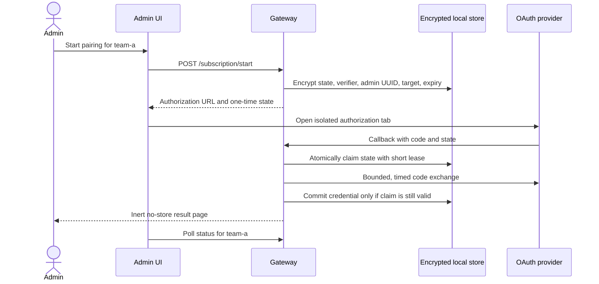



# ChatGPT and Codex subscription pairing

Standard Red Notes can pair one or more ChatGPT/Codex subscription credentials
to named assistant backend slots. Pairing is an implemented administrator
capability: the gateway creates PKCE material, exchanges the OAuth code, stores
the resulting credential encrypted, refreshes it when safe, and supplies it
only to the server-side assistant provider.

> ⚠️ **This integration uses an unstable provider contract.** OpenAI does not
> publish the observed Codex/ChatGPT subscription OAuth and backend interfaces
> as a stable API for this server use. Endpoint, client-id, redirect, scope, and
> response behavior can change. The shipped defaults are best-effort and the
> repository tests use a mock provider; they do not prove a live account login.

> 🔐 **Pairing gives the instance a renewable account credential.** Protect the
> gateway host, its backups, the encrypted pairing file, and
> `ASSISTANT_SUBSCRIPTION_ENCRYPTION_KEY`. Restrict the pairing UI to trusted
> administrators. If the host or key may be compromised, unpair the affected
> slot and revoke relevant provider sessions from the provider account.

## Configure the gateway

Generate a 32-byte key and provide it as exactly 64 hexadecimal characters:

```powershell
[Convert]::ToHexString([Security.Cryptography.RandomNumberGenerator]::GetBytes(32)).ToLower()
```

Set:

```dotenv
ASSISTANT_SUBSCRIPTION_ENCRYPTION_KEY=<64-hex-character key>
PUBLIC_URL=https://notes.example.com
```

The stock container paths are already wired to named persistent volumes:

| Deployment                  | Default pairing file                                                | Persistent volume           |
| --------------------------- | ------------------------------------------------------------------- | --------------------------- |
| `docker-compose.yml`        | `/opt/server/packages/api-gateway/data/assistant-subscription.json` | `server-data`               |
| `docker-compose.single.yml` | `/data/assistant-subscription.json`                                 | `single-data`               |
| Direct gateway process      | `./data/assistant-subscription.json`                                | Operator-managed filesystem |

> ⚠️ **First multi-container upgrade:** earlier Compose revisions did not mount
> the gateway `data` directory. Before recreating an older `server` container,
> inspect and copy `/opt/server/packages/api-gateway/data` if it contains
> pairings or administrator settings. The new `server-data` volume cannot import
> a discarded container writable layer automatically. Preserve the matching
> encryption key with the migration.

Override `ASSISTANT_SUBSCRIPTION_TOKEN_PATH` only with a path on durable,
gateway-writable storage. Container-layer or temporary paths lose pairing,
pending PKCE state, and exchange claims when the container is replaced.

`PUBLIC_URL` is mandatory before pairing is enabled and derives the default
callback `/v1/assistant/subscription/callback`. Raw Compose deliberately supplies
no localhost fallback; the setup scripts write the correct local or production
origin. This fails closed instead of accidentally deriving a callback from a
production server whose operator forgot its public origin. Operators can override the authorize
endpoint, token endpoint, OAuth client id, redirect URI, scopes, and account-id
claim with the `ASSISTANT_CHATGPT_OAUTH_*` variables documented in the gateway
environment sample.

Authorize, token, and redirect URLs must use HTTPS. Plain HTTP is accepted only
for `localhost`, `127.0.0.1`, or `::1`. Configured URLs containing credentials,
query parameters, or fragments are rejected so configuration secrets do not
enter navigation or request logs. The authorization request itself adds the
standard OAuth/PKCE query fields after validation.

OAuth token POSTs do not follow redirects. Any token-endpoint `3xx` response
fails with a generic pairing error, so the authorization code, refresh token,
client id, and PKCE verifier are never replayed to a redirect target.

If the encryption key is absent, pairing routes report that server-held pairing
is unavailable. An explicitly configured environment token remains a legacy
boot-time fallback only for the `default` slot in that unconfigured state; named
slots never alias to it. Once durable pairing is enabled, the paired `default`
slot is authoritative: missing, repair-required, or unreadable state fails
closed and never silently resumes upstream traffic with the environment token.

> ⚠️ **Do not paste a subscription token into an assistant profile API-key
> field.** New or updated `codex-subscription` profiles reject inline
> credentials. Older settings containing one remain readable for migration, but
> the server ignores that value, reports a non-secret warning in the Admin AI
> pane, and removes it when profiles are saved. The encrypted pairing store is
> authoritative. A legacy environment bearer is used only when encrypted pairing
> is not configured at boot.

## Pair a named slot

Open **Settings → Admin → AI → Guided ChatGPT / Codex subscription pairing**.

1. Enter `default` or a named id such as `team-a`.
2. Generate the authorization link.
3. Verify the sanitized provider origin shown in the warning.
4. Open the link in its isolated `noopener,noreferrer` tab and authorize.
5. Let the provider redirect to the public callback, or paste the returned
   authorization code into the authenticated manual-completion field.
6. Check the status for that exact id.
7. Reference the same id from a subscription assistant backend profile.

Ids are 1–128 ASCII letters, numbers, dots, underscores, or hyphens; they must
start and end with a letter or number. Starting a newer attempt for one id
invalidates older pending and in-flight attempts for that id. Other pairings
remain intact.

The full one-time authorization URL is not rendered or copied by the admin UI.
Only its origin is shown for verification. The OAuth `state` necessarily
travels in the upstream authorization URL, but the PKCE verifier never leaves
the gateway. Neither the access credential nor the refresh credential is
returned to the app.

## State, callback, and restart lifecycle



Pending state is encrypted in the same durable file as credentials, so a
gateway restart between link generation and callback does not lose it.

- Pending attempts expire after 10 minutes.
- A code exchange holds a 2-minute encrypted claim lease.
- State is single use across concurrent processes sharing the same store.
- Expired claims are pruned and cannot wedge a target.
- A newer attempt or targeted unpair invalidates an in-flight claim, so a late
  exchange cannot resurrect or overwrite the slot.
- The gateway bounds lifecycle entries to 256 total, 16 per administrator, and
  one pending or claimed attempt per target id.

Manual completion requires the same authenticated administrator UUID that
started the attempt. The public callback cannot have an application session, so
its authorization contract is possession of the unguessable, encrypted,
single-use OAuth state.

The callback returns inert HTML with no script or opener communication. It sets
`no-store`, `no-referrer`, `nosniff`, frame denial, same-origin opener isolation,
and a `default-src 'none'` content-security policy. The admin UI learns
completion by polling status for the exact target id.

The built-in multi- and single-container nginx front doors define an exact
callback location with `access_log off`, preventing the callback `code` and
`state` query from entering those nginx access logs. This does **not** configure
or protect logs at an outer reverse proxy, load balancer, CDN, or WAF. Disable
query logging or redact `code`, `state`, `error`, and `error_description` there
for this exact path:

```text
/v1/assistant/subscription/callback
```

The gateway's existing IP anti-abuse middleware gives the callback a dedicated
fixed-window bucket, using the configured login ceiling so normal provider
redirects are not coupled to registration attempts. That middleware is
Redis-backed and fails open during Redis failure; the single-container
in-memory deployment has no shared Redis limiter. Apply an outer-proxy limit as
defense in depth, allowing several redirects per minute per client rather than
a one-shot rule. Malformed state/code values are rejected before encrypted-store
work, and valid-looking unknown states fail before any token-endpoint request.

## Credential storage and refresh

The gateway AES-256-GCM encrypts access, refresh, and ID tokens plus non-secret
account metadata. The on-disk JSON contains only an authenticated versioned
envelope. File writes are bounded, atomic, and serialized across local gateway
processes that share the path.

Wrong-key, malformed, or tampered stores fail closed. Status reports
`storeUnreadable` and does not pretend a pairing exists; listing or targeted
removal refuses to proceed. A targeted removal can never respond to corruption
by deleting the whole file.

When an access token enters the 60-second safety window, the gateway refreshes
it before use:

- calls for one id share one in-process refresh;
- store-level compare-and-swap prevents another process's stale result from
  overwriting a rotated or newly paired credential;
- `invalid_grant`, `invalid_token`, missing refresh tokens, and credential
  rejection require re-pairing;
- network errors, rate limits, provider 5xx responses, and other transient
  failures schedule bounded exponential backoff and do **not** mark the pairing
  permanently broken; and
- a token inside the safety window is not reused after refresh failure.

Status returns only safe metadata: id, paired/readability state, account label
or id, expiry, repair reason, transient failure class, retry time, and backend
profile references. It never returns access, refresh, or ID tokens.

Token endpoint calls time out after 15 seconds. Responses are streamed under a
512 KiB ceiling. Token and account-id values must be bounded and safe for HTTP
headers; control characters and invalid or excessive expiry values are
rejected. Upstream response bodies, descriptions, fetch errors, authorization
codes, verifiers, and tokens are never reflected in pairing HTTP errors.

## Inspect and unpair safely

The admin usage card lists every paired id and locally metered assistant usage.
This is Standard Red Notes metering, not an official provider quota.

Targeted unpair requires an explicit `subscriptionId`. The server audits
assistant and backend profiles first:

- if none reference the id, removal affects only that id and its pending
  attempts;
- if profiles reference it, the UI names them and requires explicit
  confirmation; those profiles then fail closed until changed or the same id is
  paired again; and
- if settings or the profile resolver cannot be read, removal returns `503`
  instead of guessing that no references exist.

Omitting an id never means “clear everything.” The separately named
`POST /v1/assistant/subscription/unpair-all` operation requires the exact
confirmation string `UNPAIR ALL SUBSCRIPTIONS` and clears every credential and
pending attempt. The normal web UI does not use it.

Unpairing removes the local encrypted credential. It does not currently call a
verified upstream revocation endpoint. Use the provider's account/session
controls as well when revocation outside this instance matters.

## HTTP contract

All routes except the provider callback require an authenticated administrator
cross-service token. Every authenticated pairing/status/list/start/complete/
unpair/unpair-all/usage response, including errors, sends
`Cache-Control: private, no-store, max-age=0` and `Pragma: no-cache`.

| Method | Route                                                     | Contract                                               |
| ------ | --------------------------------------------------------- | ------------------------------------------------------ |
| `GET`  | `/v1/assistant/subscription/status?subscriptionId=team-a` | Non-secret status for exactly one id                   |
| `GET`  | `/v1/assistant/subscription/list`                         | Sorted non-secret status for all readable pairings     |
| `POST` | `/v1/assistant/subscription/start`                        | Start encrypted PKCE state for an explicit/default id  |
| `POST` | `/v1/assistant/subscription/complete`                     | Admin-bound manual code completion                     |
| `GET`  | `/v1/assistant/subscription/callback`                     | Public single-use OAuth-state callback                 |
| `POST` | `/v1/assistant/subscription/unpair`                       | Explicit targeted removal with profile-reference guard |
| `POST` | `/v1/assistant/subscription/unpair-all`                   | Exact-confirmation destructive cleanup                 |
| `GET`  | `/v1/assistant/subscription/usage?subscriptionId=team-a`  | Local token metering for one id                        |

## Backup, restore, and multi-instance limits

Back up the encrypted pairing file if preserving pairings is intentional, but
store its encryption key separately. Restoring the file without the exact key
is unrecoverable by design. Copying the key and file together into a less
protected backup removes much of the at-rest benefit.

The secure file lock coordinates processes on one host/filesystem. Gateways on
separate hosts with separate local files do not share credentials, pending
state, claims, or refresh CAS. A callback routed to a different host will fail
safely. Use one pairing gateway instance or a genuinely shared, correctly
locked storage design; sticky routing alone does not synchronize later refresh
and unpair operations.

Live provider compatibility remains conditional because the upstream contract
is undocumented and no live-account fixture is committed. Verify authorization,
refresh, assistant requests, unpair behavior, and provider-side revocation in a
non-critical account before depending on it.
