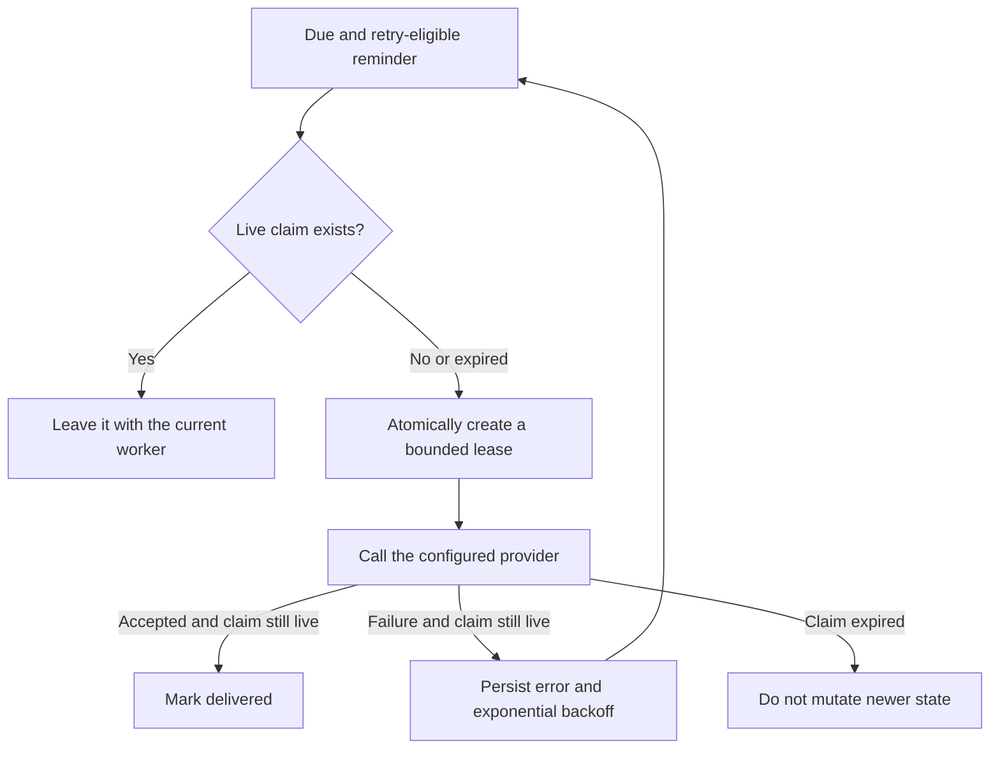

# Automation and Integrations



Integrations are not all at the same maturity or trust boundary. This page
describes the code and operator boundaries that are present.



## Status matrix

| Integration                                  | Runtime status                        | Gate                                                                                                                                                          |
| -------------------------------------------- | ------------------------------------- | ------------------------------------------------------------------------------------------------------------------------------------------------------------- |
| MCP                                          | Shipped, with documented scope limits | Account credential or full decrypting token; server-enforced read-only/write mode; bridge writes off by default; selected-tag scope is not currently enforced |
| OpenClaw                                     | Shipped with local MCP                | Local MCP configuration and provider                                                                                                                          |
| Workflows/n8n                                | Shipped link discovery; operator-managed n8n | Operator master switch, per-user link entitlement, independent n8n authentication                                                                        |
| Webhooks                                     | Shipped                               | Authenticated user or administrator for global hooks                                                                                                          |
| GitHub publish                               | Shipped                               | Explicit user action and user-supplied PAT                                                                                                                    |
| Browser OCR                                  | Shipped                               | Client setting/operator intent                                                                                                                                |
| Server OCR                                   | Shipped, off by default               | Operator master switch and per-user permission                                                                                                                |
| CalDAV                                       | Shipped read-only, off by default     | Operator master switch, per-user permission, dedicated token                                                                                                  |
| Plugins gallery proxy                        | Shipped, operator-configured          | Repository URL and rendering policy                                                                                                                           |
| Server reminders (Email, Telegram, WhatsApp) | Shipped, operator-dependent           | Operator master switch, per-user feature setting, enabled delivery config, and provider credentials                                                           |
| Assistant proxy                              | Shipped, operator/provider-dependent  | Per-user AI gate, provider configuration, limits                                                                                                              |

## Workflows and n8n

Standard Red Notes exposes only a validated discovery link. Both the
`WORKFLOWS_ENABLED` master switch and the user’s `WorkflowsEnabled` setting
must be on. Selecting the link requires explicit confirmation and opens a new
tab to a distinct n8n origin.

n8n authenticates and authorizes the user independently. Standard Red Notes
does not proxy n8n, embed its editor, create an n8n account, forward an SRN
cookie or token, or treat an SRN entitlement as n8n access control.

To let n8n read or update notes, an operator can manually connect n8n's MCP
Client to the authenticated Standard Red Notes MCP bridge with a dedicated,
revocable, least-privilege account token. Keep the account token out of URLs,
workflow source, logs, and pinned execution data.

See [Workflows with n8n](workflows.md) for the architecture, separate-hostname
deployment, exact URL validation, MCP setup, revocation procedure, and
troubleshooting.

## Webhooks

Webhooks can be user-specific or global. Only an administrator may register a
global webhook. Use HTTPS, verify the receiving endpoint, subscribe to the
smallest event set, and ensure the receiver is idempotent.

Webhook payloads and delivery metadata can leave the encrypted application
boundary depending on the event. Do not send decrypted note content unless the
integration explicitly requires and protects it.

Rotate or delete unused webhooks and audit global-hook changes.

## GitHub publishing

`POST /v1/integrations/github/publish` publishes one note after the client
converts it to Markdown. The request contains:

- decrypted note content;
- a user-supplied GitHub personal access token; and
- repository/path/commit information.

The gateway forwards the content and PAT to GitHub and is designed not to
persist or log either. Use a fine-grained token limited to the target repository
and revoke it when publishing is complete. Review the rendered Markdown for
secrets, embedded files, internal links, and private metadata.

The browser is a separate persistence boundary. **Remember this token on this
device** is off by default; enabling it stores the PAT unencrypted in that
browser’s `localStorage`. Leave it off on shared or untrusted devices. To remove
a previously remembered PAT, submit the next publish with **Remember** cleared,
or remove only the `standardnotes.github.publish.token.v1` key with the
browser’s site-storage tools. Do not clear all Standard Red Notes site data
unless the account is fully synchronized and backed up. Revoke the PAT at
GitHub if the device may be lost or compromised.

## OCR

Browser OCR keeps page imagery on the device. Server OCR requires the client to
decrypt PDF pages and upload rasterized images to `/v1/ocr/recognize`; the server
therefore sees those page images for the duration of the request.

Server OCR fails closed behind:

1. `OCR_SERVER_ENABLED`;
2. the per-user `OCR_SERVER_ALLOWED` setting; and
3. the client offering the action only when both are true.

Administrators can also set the default language, maximum pages, and maximum
image bytes. Use browser OCR for sensitive documents when possible.



## CalDAV

CalDAV publishes a read-only reminders/calendar feed under the configurable
base path (default `/dav`). It uses dedicated `calendar-read` tokens. The
operator master switch and the user’s CalDAV setting must both be enabled before
token issuance.

Create one labeled token per calendar client. The username shown by the web UI
is `caldav`; the generated token is the password. Revoke a token when a device
is lost. The feed is a published view, not bidirectional editing.

## Plugins gallery

The gateway can retrieve a configured `packages.json` index and package files,
and can serve component assets for isolated rendering. A repository compromise
can turn plugin distribution into code delivery.

- Pin the repository to a trusted HTTPS origin.
- Review packages and checksums before publishing the index.
- Keep same-origin rendering disabled unless its stronger trust is explicitly
  accepted.
- Use restrictive content security and sandboxing.
- Remove the repository URL to disable an untrusted source.

## Reminders and assistant providers

### Reminder delivery

Server-side reminder delivery supports Email, Telegram, and WhatsApp. It is off
until the operator master switch, the user’s reminder setting, and the user’s
delivery configuration are all enabled. A reminder can use that default channel
and destination or publish its own override. The published reminder text, due
time, destination, and delivery status are server-readable; they are deliberately
outside the encrypted note store so the server can send them.



The authenticated opt-out path deliberately remains available after either the
operator or account gate is disabled. If a synchronous provider call is already
in flight, opt-out fails closed and leaves the plaintext record in place so the
user can retry after the bounded provider deadline; it never reports a send as
cancelled after the provider boundary was crossed.

Each scheduler scan atomically claims a bounded batch in the published-reminders
store. A claim records a cryptographically random claim ID, a random worker
owner ID, its start time, and lease expiry. Processes sharing the same local
store file cannot claim the same occurrence concurrently while that lease is
live. This is a local shared-file guarantee, not a distributed coordinator for
independent store copies or arbitrary network filesystems. Success and retry
updates are conditional on the same worker still owning the live claim, so a
stale worker cannot complete or release a claim recovered by another process.

The default lease is ten minutes. Current HTTP transports time out within one
minute, and the bounded SMTP phases total no more than six minutes, so these
providers do not need claim renewal. Keep any future provider’s worst-case
transport time below the lease or add a safe renewal protocol before enabling
it. Failed attempts use persisted exponential backoff, from one minute up to six
hours by default, and expired claims are recovered after a worker crash. Editing
the message, due time, channel, or destination creates a new delivery revision
and invalidates the old claim.

**Delivery is at-least-once, not exactly-once.** If a provider accepts a message
and the worker crashes before recording success, the lease eventually expires
and another worker retries. That recovery prevents silent loss but can produce a
duplicate. The current adapters do not turn the reminder ID into a provider
idempotency key, so operators must account for this duplicate window. An
ambiguous provider timeout can create the same outcome even when the worker does
not crash.

AI assistant requests can be routed to Anthropic, OpenAI, or Ollama-compatible
providers according to operator configuration. Apply per-user enablement and
request/token limits. Hosted providers receive the prompt and selected content;
local providers reduce external disclosure but still require secured local
logs, models, and network access.



## Integration review checklist

For every integration, record:

- master switch and per-user gate;
- credential owner, scope, rotation, and revocation;
- decrypted content that leaves the client;
- destination and transport security;
- retry/idempotency behavior;
- audit or structured-log evidence;
- failure behavior; and
- how to disable and remove retained data.

For MCP and assistant-specific configuration, see [MCP Bridge](mcp-bridge.md)
and [OpenClaw](openclaw.md).
