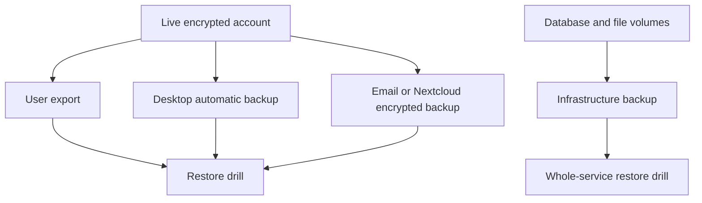
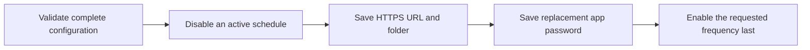

# Backups and Recovery

Sync is not a backup. Sync propagates both desired changes and mistakes; a
backup is an independent, restorable copy with a known retention policy.



## Backup layers

| Layer | Protects against | Does not by itself protect against |
| --- | --- | --- |
| Encrypted account export | Accidental deletion, client loss, account migration | Forgotten export password/key, missing external files if not included |
| Decrypted export | Easy content-level recovery | Disclosure if the file or storage is compromised |
| Desktop encrypted text backup | Frequent local note recovery | Loss of the same computer/disk |
| Desktop plaintext backup | Simple inspection and emergency recovery | Any attacker who can read the folder |
| Desktop file backup | Attachment recovery | Notes, tags, account settings, or server identity |
| Email encrypted backup | Off-device encrypted account copy | Mailbox loss, mail retention, or forgotten decryption material |
| Nextcloud/WebDAV encrypted backup | Scheduled off-server encrypted copy | Nextcloud account loss or incomplete WebDAV configuration |
| Database and volume backup | Whole self-hosted service recovery | Client-only unsynchronized edits or unknown application secrets |
| Optional account-recovery escrow | Forgotten account password when enabled beforehand and the separate code survives | Deleted items, unsynced local data, server loss, code loss, or code compromise |

Use at least one user-level export and one infrastructure-level backup for a
self-hosted deployment.



## Manual account exports

The client supports encrypted and decrypted data exports and import. Prefer an
encrypted export for routine retention:

1. Run a full sync.
2. Export the account data.
3. Move the file to independent storage.
4. Record the client/server version and export date.
5. Verify the archive can be opened or imported in an isolated test account.

A decrypted export should be treated as sensitive plaintext. Encrypt the
storage medium or place the export in a separately encrypted archive, and
delete temporary copies after verification.



The `srn-client export` command can also create JSON or Markdown exports. Its
output is decrypted and therefore inherits the same plaintext handling rules.

If account recovery is enabled, keep its code outside the account and outside
the only backup archive. Backing up the server-side escrow without the code is
not sufficient; putting the code beside the escrow removes the intended
separation. A code suspected of exposure must be replaced from **Preferences ->
Security -> Account recovery**.

## Desktop automatic backups

The desktop client exposes separate backup paths:

- automatic encrypted text backups;
- optional plaintext backups;
- attachment/file backups; and
- a cross-platform backup decryption drop zone.

Keep the destination outside application data so uninstalling the client does
not remove the only copy. For stronger resilience, replicate the folder to an
offline or separately authenticated destination.



## Email backups

Email backups are available only when the server enables them and the account
is entitled/configured. They are scheduled encrypted artifacts, not plaintext
messages containing every note.

Before depending on email delivery:

- verify `EMAIL_BACKUPS_ENABLED` is effective;
- confirm outbound mail works;
- inspect the received attachment;
- understand mailbox retention and attachment-size limits; and
- complete a test decrypt/import.

## Nextcloud/WebDAV backups

Nextcloud backups use encrypted server-generated backup blobs uploaded over
WebDAV. Both the server master switch and complete per-user settings are
required:

- Nextcloud base URL;
- optional destination folder (blank means the WebDAV account root);
- dedicated app password; and
- backup frequency.

Create a low-privilege Nextcloud app password rather than reusing the main
account password. The app password is sensitive server-side configuration and
is not returned by the administrator settings API.



The client validates the complete configuration before writing any setting. If
an existing schedule is being edited, it disables that schedule first, saves
the HTTPS URL, folder, and optional replacement app password, and writes the
requested frequency last. A failed intermediate write therefore leaves the
schedule disabled instead of activating a mixed old/new configuration.

Each upload attempt has these transport boundaries:

- the base URL is parsed and canonicalized once and must be the final HTTPS
  origin, without embedded credentials, query, or fragment;
- the account identifier, every supplied folder component, and the generated
  file name must be safe path segments. A completely empty folder preserves the
  established account-root destination, while leading, trailing, or interior
  empty components and dot, dot-dot, backslash, or control-character components
  are rejected;
- every DNS answer must be public, then one validated address is pinned to the
  outbound socket while the original host remains the HTTP `Host` and TLS SNI
  identity. Private, loopback, link-local, and metadata destinations fail
  closed;
- redirects are never followed or counted as WebDAV success, so the Basic
  credential cannot be replayed to another origin;
- one 60-second absolute deadline covers DNS resolution, every nested `MKCOL`,
  the `PUT`, and response-body draining; and
- `MKCOL` accepts only `201` (created) or `405` (already exists), while `PUT`
  accepts only `200`, `201`, or `204`.

There is no automatic retry inside an upload attempt. An interrupted upload can
have an ambiguous outcome, so the next scheduled job is the safe retry boundary
and uploads the same date-stamped encrypted artifact again.

### Verify and recover a Nextcloud backup

After configuration, confirm a new `SN-Data-YYYY-MM-DD.json` file appears, then
perform a restore drill with a disposable account:

1. Download the newest artifact without modifying the Nextcloud copy.
2. Record its size and checksum, and preserve the original during the drill.
3. Import it through the application’s backup import flow using the account
   password required to decrypt its item payloads.
4. Verify representative notes, tags, and expected metadata. This current-item
   backup does not replace revision-history or attachment/file-volume backups.
5. Revoke the drill credential and remove disposable restored data according to
   the retention policy.

If an upload fails, keep scheduling disabled while checking the final URL,
public DNS answers, TLS certificate, destination folder, server master switch,
per-user administrator opt-in, and app-password permissions. Replace rather
than reuse a credential after any suspected disclosure. Server logs expose a
stable failure category but do not include the URL or app password.

## Self-hosted infrastructure backups

Back up these together:

- MariaDB/MySQL data;
- Redis only if the deployment deliberately relies on persistent Redis state;
- encrypted file-storage volumes or object storage;
- the `server-data` gateway settings and encrypted subscription-pairing store;
- the exact secrets needed to validate sessions and decrypt protected
  configuration; and
- deployment manifests and image/version identifiers.

Do not store the only copy of `.env` beside the live host. Protect database
credentials, JWT secrets, valet secrets, shared access keys, SMTP credentials,
provider keys, subscription-pairing encryption keys, and backup app passwords.
Keep the pairing key separately from the only `server-data` backup: the
encrypted pairing file cannot be recovered without both.



The repository’s `yarn ops:backup-restore` gate exercises the scripted backup
and restore contract. It is validation evidence, not a substitute for restoring
your own production-size data on your own storage.

## Restore order

For a whole-server recovery:

1. Stop application writes.
2. Preserve the failed state for investigation.
3. Restore configuration and secrets.
4. Restore the database.
5. Restore encrypted file storage.
6. Start dependencies, then application services.
7. Run liveness and readiness checks.
8. Sign in with a test account and open representative notes, revisions, and
   files.
9. Re-enable external traffic.
10. Confirm scheduled backups run again.

Follow the exact commands in [Self-Hosting](self-hosting.md) and
[Operations Hardening](operations-hardening.md) for the deployed profile.



## Recovery drills

A useful quarterly drill proves:

- the backup exists outside the live failure domain;
- checksums or archive integrity pass;
- the required password and secrets are available;
- notes, tags, revisions, and representative attachments open;
- a restored client can sync without overwriting production; and
- the measured recovery time meets the service objective.

Record the date, backup identifier, restore duration, gaps found, and corrective
action. A backup that has never been restored is only an assumption.

Include account recovery in a drill only with a disposable account: enable it,
save the code outside the account, sign out, recover with a new password, save
the replacement code, verify the old code fails, and then disable recovery if
the production policy does not require it. Never use a production account as
the first recovery test.

## Retention and deletion

Live-account deletion does not remove independent copies. Define retention for
desktop folders, exports, email, Nextcloud, database snapshots, object storage,
and disaster-recovery replicas. When a deletion request must cover backups,
document whether the copy is immediately purged or expires through normal
rotation.

For migrations to or from original Standard Notes clients and servers, review
the evidence and test matrix in [Standard Notes
Compatibility](standard-notes-compatibility.md).
