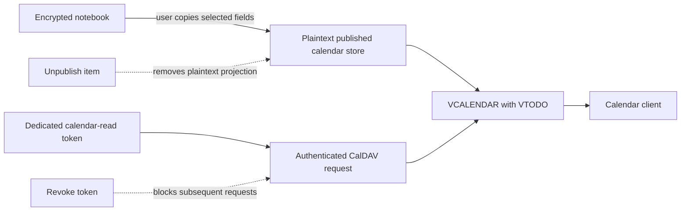



# CalDAV

Standard Red Notes can expose an opt-in, read-only `VTODO` calendar to CalDAV
clients that support to-do collections. It does not decrypt or scan notes. The
feed contains only items that you explicitly publish from **Preferences →
Security → CalDAV Access**.



## Enable and connect

The operator and user gates must both be open before a user can publish an item
or create a token:

1. Set `CALDAV_ENABLED=true` on the API gateway.
2. Optionally set `CALDAV_BASE_PATH` to a safe absolute path. The default is
   `/dav`.
3. Persist the gateway CalDAV data directory. The default is
   `./data/caldav`; it contains `tokens.json` and `published.json`.
4. In **Preferences → Security → CalDAV Access**, enable CalDAV.
5. Publish one or more to-dos.
6. Create one labeled token per calendar client. Copy the token immediately; its
   plaintext is shown once.
7. Copy the collection URL displayed by the app. It comes from the exact server
   mount configuration and therefore also works with a non-default base path.
8. Use any non-empty username and the generated token as the Basic-auth
   password.

Always use HTTPS outside a trusted local network. HTTP Basic protects the
credential format, not the transport.



## Publish and remove items

The CalDAV settings pane is the supported publication manager. It can create,
edit, list, and unpublish calendar items. Editing exposes every stored `VTODO`
field, so it does not silently discard start, due, completion, or priority
metadata.

Authenticated API clients can use the same bounded projection:

```text
GET    /v1/caldav/todos
POST   /v1/caldav/todos
DELETE /v1/caldav/todos/:uid
```

An omitted `uid` on `POST` creates a server-generated UUID. Supplying an
existing `uid` replaces that published item. Dates must be either `YYYY-MM-DD`
or an ISO 8601 date-time with an explicit `Z` or numeric offset. When both
`start` and `due` are present, they must use the same value type and `due` must
be later. `summary` must contain a non-whitespace character. `priority` accepts
an integer from `0` through `9`: `0` means unspecified, `1` is highest, and `9`
is lowest.

For example:

```json
{
  "uid": "release-checklist",
  "summary": "Ship the release",
  "description": "Verify signatures before publishing",
  "start": "2026-08-01",
  "due": "2026-08-02",
  "completed": false,
  "priority": 1
}
```

The `POST` response includes the normalized stored item plus millisecond
`createdAt` and `updatedAt` timestamps. Set `completed` to `true` before
supplying `completedAt`.

Listing and deletion remain available when the master or user gate is off. This
is intentional: disabling a feature must never strand retained plaintext.

## Tokens and revocation

Token management uses:

```text
GET    /v1/caldav/tokens/config
GET    /v1/caldav/tokens
POST   /v1/caldav/tokens
DELETE /v1/caldav/tokens/:uuid
DELETE /v1/caldav/tokens
```

The token has the form `<uuid>.<secret>`. The server stores a random salt and
scrypt hash, not the secret. Verification uses asynchronous scrypt and
rechecks the exact row inside the same durable file transaction that
linearizes revocation.

Turning CalDAV off in the settings pane revokes all current tokens before it
updates the user setting. Successful account-setting updates and deletions
invalidate the gateway's cached cross-service token, so the management API sees
the new gate on the next request. The standalone Basic-auth router is
credential-based, however: a setting changed by an administrator or another
client does not itself revoke an already issued calendar token. After an
out-of-band opt-out, revoke the user's tokens as a separate cleanup action. The
operator master switch is different: turning it off makes the entire DAV
surface return `404`.

## Implemented DAV contract

The configured base path exposes these resources:

```text
<base>/
<base>/principals/
<base>/principals/<userUuid>/
<base>/calendars/<userUuid>/
<base>/calendars/<userUuid>/todos/
<base>/calendars/<userUuid>/todos/<uid>.ics
```

The read-only surface supports:

- `OPTIONS`;
- `PROPFIND` with `Depth: 0` or `Depth: 1`;
- component-only `calendar-query`;
- required `calendar-multiget`, including per-href `404` results;
- `GET` and explicit `HEAD` for the calendar and individual objects;
- strong representation-based ETags, `If-None-Match`, and `If-Match`;
- deterministic object ordering and RFC 5545 text escaping/line folding; and
- strict ownership checks on every user-addressed resource.

The server returns `405` for write methods. It does not advertise or implement:

- `PUT`, `DELETE`, `MKCALENDAR`, or two-way synchronization;
- `sync-collection` or `sync-token` history;
- CalDAV time-range filters;
- scheduling/free-busy; or
- `/.well-known/caldav` discovery.

Use the exact collection URL from the settings pane instead of relying on
well-known discovery. The automated suite verifies the HTTP/DAV and iCalendar
contract directly. No named desktop or mobile client compatibility fixture is
part of this repository, so treat client-specific behavior as unverified.

## Persistence and operations

CalDAV data is held in gateway-local, bounded, schema-validated JSON files. This
is not a replicated database. Run one API-gateway instance for this feature, or
ensure every process uses the exact same filesystem with compatible exclusive
creation, rename, and durability semantics. Independent data directories on
load-balanced gateway instances will produce divergent feeds and intermittent
token failures. A local shared file uses an exclusive lock and atomic durable
replacement, so concurrent processes using that file do not lose unrelated
records and cannot bypass per-user caps.

Each JSON file is limited to 1 MiB. The token store accepts at most 10,000
tokens in total and 100 per user. The publication schema accepts at most 10,000
users and 10,000 items per user, but the 1 MiB file limit will normally be
reached first; each summary is capped at 4,096 characters and each description
at 65,536 characters. This storage model is intended for a bounded
self-hosted/single-gateway projection, not a large replicated calendar service.

Back up the CalDAV data directory if published feeds and token metadata must
survive a container rebuild. The publication store is plaintext; protect the
backup accordingly. Restoring the directory also restores token hashes, so
revoke tokens before exporting or sharing a snapshot.

If a client cannot connect:

1. confirm the operator master switch is on;
2. copy the current collection URL from the app rather than assuming `/dav`;
3. verify the username is non-empty and the token is the password;
4. confirm the token has not been revoked;
5. check that a reverse proxy forwards `OPTIONS`, `PROPFIND`, `REPORT`, `GET`,
   and `HEAD`; and
6. inspect gateway logs for a store validation, permission, or lock error.
