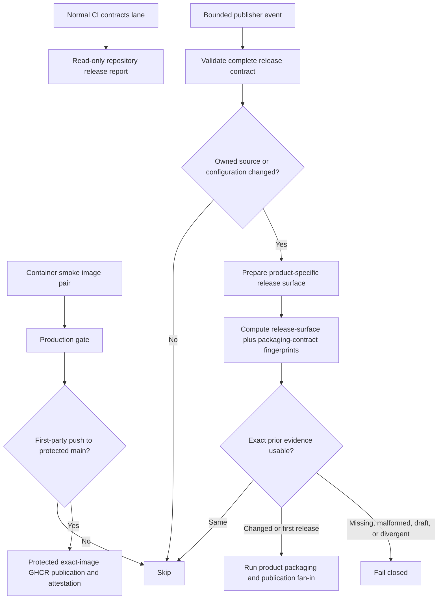

# CI Production Gates



The root [CI workflow](../.github/workflows/ci.yml) is the production gate for
the complete repository. Pull requests, schedules, manual dispatches, and
non-main repositories never publish containers. Only a first-party push to
`main` can hand the exact tested image pair to the isolated
`publish-containers` job after every required lane succeeds. All build and test
jobs keep read-only repository permissions; registry, identity-token, and
attestation authority exists only on that protected publisher.

The `main` branch currently has no GitHub branch-protection rule or required
status check. The `production-gate` fan-in remains visible on every CI run and
still protects container publication. It fails unless every required lane
succeeds; a failed, cancelled, or skipped dependency cannot turn the fan-in
green.

## Required Lanes

| Lane                 | Contract                                                                                                                                                                                                                                                                                                                               | Timeout |
| -------------------- | -------------------------------------------------------------------------------------------------------------------------------------------------------------------------------------------------------------------------------------------------------------------------------------------------------------------------------------- | ------: |
| `contracts`          | Immutable root install; fail-closed production dependency audits for every committed lock domain; CI validator tests; release impact, fingerprint, comparator, packaging-invocation, target, and artifact contracts; generated docs/search freshness, link/navigation integrity, Mermaid rendering; actionlint over root workflows.    |  12 min |
| `check`              | Immutable installs in the root, app, and server projects, followed by the coordinated type, lint, format, and test gate.                                                                                                                                                                                                               |  45 min |
| `build`              | A second clean set of immutable installs followed by the coordinated MCP, OpenClaw, app, and server build.                                                                                                                                                                                                                             |  45 min |
| `desktop-electron`   | A production desktop build followed by the seven real Electron suites under Xvfb. The guarded runner requires the built entry point and cannot silently fall back to skipped headless tests.                                                                                                                                           |  45 min |
| `container-smoke`    | Hadolint, exact clean-commit BuildKit image identity, immutable app/server marker and OCI-label equality, an isolated Compose stack, required encrypted two-editor online/offline convergence, the realtime mint boundaries and Redis push delivery, a cross-device push round trip through the public front door, Chromium app-open checks, bounded parallel sync and Redis operations, MariaDB backup/restore, image/container hardening assertions, and a closing gRPC phase that proves `SYNC_ITEMS` and the oversized-result contract. |  70 min |
| `production-gate`    | Fail-closed fan-in for all five implementation lanes above.                                                                                                                                                                                                                                                                            |   5 min |
| `publish-containers` | On an accepted first-party `main` push only, verify and publish the exact app/server archive produced by `container-smoke`, re-pull both images, verify their identities and labels, attest both registry digests, and record digest-pinned deployment references.                                                                     |  45 min |

The required browser selection contains three app-open tests and one combined
sync/Redis test. The generated JSON report must contain at least four expected
tests and exactly zero skipped, unexpected, or flaky tests. The stack uses a
run-specific Compose project and generated credentials, then removes its
containers and volumes even after a failure.

Before browser work begins, the required stack proves that the checkout is
clean and exactly `GITHUB_SHA`, builds both images with the same validated
revision/version, checks their OCI labels and root-owned marker bytes, and then
compares the public app marker with the server's aggregate-readiness identity.
A null or mixed-revision deployment fails even when its ordinary liveness
checks are otherwise healthy. Scheduled cache restores receive the same build
and runtime identity inputs.

Before browser smoke, the live server container must also pass the encrypted
Yjs two-editor drill with gateway availability required. It covers late join,
simultaneous online edits, edits made independently during a disconnect, and
post-reconnect convergence; an unavailable gateway is a hard failure rather
than an optional local skip.

The dependency audit inventories Git-tracked npm, Yarn, and pnpm lockfiles
before it contacts the package registries. An unconfigured lockfile, an audit
transport or parse failure, or a new high or critical production advisory fails the
lane. Compatibility exceptions live in
`scripts/production-audit-allowlist.json`; every entry binds the registry
advisory ID, package, lock domain, rationale, and expiry. Expired, duplicate,
or no-longer-observed exceptions also fail so the allowlist cannot become a
permanent suppression list. The app graph contract additionally preserves the
loopback-only embedded server patch, patched PDF.js, and both supported
fast-xml-parser major lines.

## Realtime proofs in the container lane

Four scripts under `server/packages/websocket-gateway/e2e` run against the live
disposable stack. Between them they cover the two realtime lanes end to end: the
legacy socket that carries pushes, collaboration and invites, and the worker sync
lane that carries durable commands.

None of it can be quietly removed. The workflow contract in
`scripts/validate-ci-contract.mjs` pins each of the four scripts by name, the two
origins the mint-boundary drill needs, and the switch that starts the gRPC phase,
so deleting a step fails the `contracts` lane rather than shrinking the evidence
the container lane produces.

### Cross-device push round trip

`push-roundtrip.e2e.mjs` is the only test that walks the whole delivery chain:
a save reaches the syncing-server, becomes a `WEB_SOCKET_MESSAGE_REQUESTED`
event, crosses SNS/SQS, is drained by a gateway worker, and lands on another
device's socket. A broken queue, a filtered subscription, a dead worker, or a
swallowed event fails here and nowhere else.

The script runs from the runner against the public front door, which is the only
origin a browser uses. It registers an account, signs a second session in, opens
that session's legacy socket, then makes twenty saves one second apart from the
first session. Every save must be accepted, every push must arrive inside the
first settle window, and nothing may arrive only in the wider window that
follows. A straggler is reported as a late arrival and fails the run rather than
passing quietly.

Push payload mode is read off the **frames**, never off the
`WEBSOCKET_SYNC_PUSH_ENABLED` flag. Any frame carrying items puts the run in
payload mode, where accounting is by item UUID and a redelivery collapses;
otherwise the run is in notification mode, where each push frame is worth exactly
one unit and nothing can be deduplicated. The same script is therefore correct on
either side of the default, and payload mode can name the item that never
arrived while notification mode does not pretend it can.

Run the parser, the accounting rules, and the socket plumbing with no stack and
no Docker:

```bash
cd server
yarn workspace @standard-red-notes/websocket-gateway node \
  e2e/push-roundtrip.e2e.mjs --self-test
```

### Oversized sync results under gRPC proxies

The worker sync lane carries `SYNC_ITEMS` only when the api-gateway speaks gRPC
to the syncing-server, so the oversized-result contract is unprovable under the
default HTTP proxies. The lane closes with a gRPC phase: it appends
`SERVICE_PROXY_TYPE=grpc`, recreates the stack without rebuilding, and reruns the
realtime scripts. This is last because every later step inspects images rather
than containers, so nothing needs the default proxy configuration restored.

`sync-items-oversized.e2e.mjs` requests a ticket through the front door and reads
the operations it negotiated. With `REQUIRE_SYNC_ITEMS=1` a ticket that does not
negotiate `SYNC_ITEMS` fails the lane instead of skipping, so a silently
misconfigured proxy cannot turn this step green.

It then commits enough notes over the lane that the committed result cannot fit
one 512 KiB frame, and asserts the full contract:

- the answer is a `STATUS` frame, never an `ERROR`;
- its status is `COMMITTED` and its code is `RESULT_TOO_LARGE`;
- it omits the result entirely;
- it keeps the same request, command, and digest identity;
- the socket stays open afterwards.

The client then replays the identical command over HTTP with `x-sync-command-id`
and `x-sync-command-digest`. The journal must return every item committed over
the socket, and a second identical replay must return the same result without
double-committing. `ERROR RESULT_TOO_LARGE` stays reserved for oversized ingress
and must not appear on this path.

The push round trip runs a second time under the gRPC proxies, so the delivery
chain is proved in both service-proxy configurations.

### Where each realtime script mints its token

`WEBSOCKET_GATEWAY_INTERNAL_SECRET` can mint a socket token for any user, so the
front doors blank `X-Internal-Secret` on `/sockets` and the gateway refuses an
internal mint that arrives proxied or from a non-loopback peer. That refusal is
asserted in CI rather than assumed.

`realtime.e2e.mjs` runs inside the server container because it is the one
vantage point that reaches both origins at once: the front door on the Compose
network, and loopback. It requires the internal mint through the front door to
return no token, then requires the same mint from loopback to succeed. It also
mints over the cross-service `x-auth-token` path the api-gateway uses for the web
client and requires a bad token to be rejected. Finally it publishes to the Redis
push channel and asserts the message reaches a connected client, that a push
tagged with the listener's own originating session is suppressed, and that a push
for a different user is not delivered there.

`collab-yjs.e2e.mjs` mints with the internal secret as well, so it likewise runs
from loopback inside the container. `push-roundtrip.e2e.mjs` and
`sync-items-oversized.e2e.mjs` need no internal secret at all: they register real
accounts and mint with the user's own access token, which is why they run from
the runner through the public front door.

## Protected publication after the gate

The app and server are published together for `linux/amd64` as:

- `ghcr.io/supermarsx/standard-red-notes-app`
- `ghcr.io/supermarsx/standard-red-notes-server`

Both receive the same unique, non-floating, retry-stable
`sha-<40-character-commit>-run-<run-id>.<producer-attempt>` tag. A failed-job
rerun consumes the successful producer job's original artifact ID and identity,
so it safely repairs a partial push with the same tested bytes. Protected-main
push runs cannot cancel one another, and other event classes use separate
concurrency groups.

The workflow creates no `latest` or `main` tag. The container lane saves the
locally tested image IDs, deployment revision/version labels, platform, archive,
and SHA-256 checksum. The protected publisher does not check out or execute
repository code: it verifies and loads that same-run archive, uses the built-in
`GITHUB_TOKEN` to push, re-pulls both coordinates, proves the remote image IDs
and OCI labels still match, publishes GitHub build-provenance attestations, and
verifies those attestations before reporting digest-pinned references. A
package owner may make the GHCR packages public once if anonymous pulls are
required; the workflow never relaxes package visibility itself.

The pair becomes consumable only when `publish-containers` succeeds and the
workflow summary contains both digest-qualified references. A failed partial
tag is not a release. The exact-image handoff is retained for one day; during
that window, use GitHub's rerun-failed-jobs operation. If it has expired, rerun
the complete CI workflow so `container-smoke` produces a new coordinated
attempt. This container-only recovery rule does not replace the stricter
same-evidence retry rules for signed product publishers below.

This coordinated container publication is continuous deployment input, not a
ninth versioned product release: it creates neither a Git tag nor a GitHub
Release. Each of the eight versioned product publishers independently checks
out complete history, validates the repository release contract before impact
analysis, selects an ancestry-safe product baseline, builds only after a managed
source/configuration change, and compares its product-specific release surface
plus named packaging contract with the exact prior fingerprint assets. For
mobile, that comparison is a deterministic pre-sign source/configuration and
toolchain identity; signed APK, AAB, and IPA bytes are validated and checksummed
separately before publication.

The release-policy JavaScript is parsed with the public, exact
`@babel/parser` dependency declared in `scripts/package.json` and locked in
`scripts/package-lock.json`. CI, local public commands, and every publisher
install it with the same isolated immutable command immediately before policy
analysis or native fingerprinting. A missing parser fails the gate. Changes to
that manifest or lock are release-significant for all eight products because
they can change how every semantic policy partition is interpreted.



The native release tests capture the actual shell-free executable and argument
array used for every target, including the pinned packager/runtime/flags and
target-specific output name. The fingerprint contains that same canonical
invocation set, and home-server migration archive creation is included as a
product-specific supplemental invocation. Desktop, mobile, and OpenClaw have
equivalent named contracts for their deterministic inputs, toolchains, target
matrices, and packaging behavior. Raw workflow text is not hashed, so prose,
display-name, and permissions-only edits do not fabricate releases.

Native executor and packaging-policy source is compared as a canonical semantic
AST. Formatting and comments affect no product; product-owned semantics affect
only that product; native-shared semantics affect the five native products; and
cross-product shared semantics affect all eight. The v4 native semantic identity
has one conservative transition from the legacy v3 exact-byte baseline: the
first comparison may release all five native products once, after which the
scoped rules apply. Malformed or ambiguous policy fails closed.

External action references in publisher workflows are restricted to an exact
commit-SHA allowlist. Their version comments are validated for readability but
excluded from semantic fingerprints; the SHA itself remains release-significant.
Runner-image resolution and secret/signing-key rotation are still external-state
boundaries. They are documented with the audited manual-force procedure in
[Releases and Upgrades](releases-and-upgrades.md#repository-release-contracts);
the pre-publication fingerprint must not be presented as evidence that those
external values stayed unchanged.

The five rolling native publishers allocate one stable release identity and
reuse a validated draft on retry. Publication checks the draft identity, uploads
with replacement semantics, verifies the exact remote asset set and downloaded
hashes, and only then publishes it. Validator mutations reject any return to
version allocation inside the final release job or direct one-shot release
creation.

Those publishers authorize only the exact protected `origin/main` head and put
identity plus publication behind the `release-production` environment. Every
package handoff is retained for 30 days. Before publication, all six Windows,
Linux, and macOS x64/arm64 assets execute on matching runners with network proxy
variables cleared; the job verifies binary format, architecture, and the exact
offline self-test response. The draft is bound to a sorted
name/SHA-256/size-manifest marker before any remote asset deletion or upload.

The root desktop publisher applies the same exact-main authorization, protected
environment, and 30-day handoff policy. Desktop fan-in verifies each updater
entry's exact basename, size, and Base64 SHA-512 plus real package format and
architecture across NSIS, AppImage, ZIP/DMG, and DEB artifacts. If packaging
fails after reserving an automatic draft, that exact draft remains available to
a same-source failed-job retry. A later source or intent may supersede at most
one such reservation only after complete-inventory and immutable-ID reads agree
that it is the uniquely named, bot-authored, tagless, unpublished, mutable,
asset-free automatic desktop draft. Any forced, populated, published, immutable,
duplicate, malformed, tagged, or concurrently mutated reservation detected by
those checks remains untouched and blocks allocation for manual reconciliation.
GitHub exposes no conditional release DELETE, so the final tag and immutable-ID
checks narrow but cannot eliminate a mutation in the last check-to-delete
interval; release-write authority must remain tightly restricted.
The embedded
Snap-capable recovery path must pass an exact-main protected gate before calling
its reusable workflow. OpenClaw rolling sources likewise require exact main;
explicit tags must resolve to the checked-out commit on protected-main ancestry,
and identity, attestation, and publication are protected production jobs with
30-day artifacts.

Mobile validation requires the exact four-ABI Android matrix
(`armeabi-v7a`, `arm64-v8a`, `x86`, `x86_64`), symmetric native-library path
sets in APK and AAB, and valid APK/AAB signatures. iOS validation deep-checks
the code signature and scans every extracted Mach-O for an exact device-only
`arm64` architecture. Signing secrets use restrictive file modes and immediate
`always()` cleanup; every later publication stage rechecks the validated
artifact checksums and exact app/build identity.

Mobile branch analysis and manual publication require the exact fetched
protected `origin/main` head. A web-tag release must resolve to the event commit,
that commit must be an ancestor of protected `main`, and its stable SemVer must
match the web manifest. Release reservation, signed Android/iOS builds, every
store mutation, and final GitHub publication are protected by the
`mobile-production` environment. The marker-bound GitHub draft is reserved
before any store mutation and only that reserved prerelease can be published
after both store branches finish.

Validated payloads and the same-run GitHub/store intent evidence are retained
for exactly 30 days. Recovery must use GitHub's rerun-failed-jobs operation so
only the failed job and its dependent jobs resume. Never rerun all jobs and
never rebuild signed bytes under the same version/build identity; absent,
expired, foreign, duplicate, or ambiguous markers fail closed.

## Extended Profiles

The Sunday schedule runs both extended lanes after the required container lane
has passed. A manual run accepts one of these profiles:

| Profile      | Additional work                                                                                                                                                         |
| ------------ | ----------------------------------------------------------------------------------------------------------------------------------------------------------------------- |
| `required`   | Run only the pull-request production gate.                                                                                                                              |
| `load`       | Run 250 encrypted notes through four parallel browser clients while four Redis workers perform 500 verified operation loops each.                                       |
| `exhaustive` | Run every non-load Playwright spec across Chromium, Firefox, and WebKit. Intentional engine-specific skips must include a reason and remain below the asserted ceiling. |
| `all`        | Run both `load` and `exhaustive`.                                                                                                                                       |

The load lane is capped at 75 minutes and the browser matrix at 120 minutes.
Both always upload Playwright JSON, retained traces, Compose status/logs, and a
container resource snapshot. Required artifacts use `if-no-files-found: error`;
missing evidence is a failure rather than a silent pass.

## Docker Assertions

The default production stack is validated at three levels:

1. Every tracked Dockerfile passes a digest-pinned Hadolint image.
2. Compose configuration must drop all capabilities, enable
   `no-new-privileges`, set memory and PID ceilings, keep infrastructure ports
   internal, and keep the raw Docker socket out of the server container.
3. Built app/server images must declare a non-root runtime user and healthcheck.
   Live stack containers must be healthy, unprivileged, capability-dropped, and
   constrained by memory and PID limits.

BuildKit's GitHub Actions cache is shared by the required and extended lanes.
The image build steps have `push: false`; they cannot write to a registry. On an
accepted first-party `main` run, `container-smoke` exports the exact images only
after their live acceptance checks pass. The later no-checkout publisher alone
can push that verified archive to GHCR.

## Local Validation

Run the workflow policy and its failure-case tests without starting Docker:

```bash
yarn deps:security:production
yarn ci:contracts
actionlint .github/workflows/ci.yml
```

These public Yarn commands install the isolated parser dependency from
`scripts/package-lock.json` automatically. `ci:contracts` installs it once and
then invokes the direct internal `:run` scripts; callers should use the public
commands rather than invoking a `:run` alias without that install boundary.

For a focused release-contract iteration, the same gate is split into explicit
behavior and mutation checks:

```bash
yarn test:release-impact
yarn test:release-contract
yarn release:contract
```

`test:release-impact` covers source ancestry, product scoping, tree
normalization, canonical packaging inputs, exact native invocations, and
fail-closed fingerprint comparison. `test:release-contract` mutates protected
workflow/helper fragments and requires the validator to reject each drift.

Run the same desktop artifact and live Electron suite locally on a machine with
a display:

```bash
cd app
yarn build:desktop
yarn workspace @standardnotes/desktop ava:electron
```

On headless Linux, prefix the final command with `xvfb-run --auto-servernum`.
The runner sets its own test gate and fails when the desktop entry point is
missing, so this command cannot report success by substituting skipped tests.

Validate the current Compose model:

```bash
yarn ci:docker-hardening
```

After starting a disposable stack, run the same required operations commands:

```bash
APP_URL=http://127.0.0.1:3001 \
OPS_LOAD_NOTES=25 \
OPS_LOAD_CLIENTS=2 \
OPS_REDIS_WORKERS=2 \
OPS_REDIS_OPS_PER_WORKER=50 \
npm --prefix e2e run test:ops-load

yarn ops:backup-restore
```

The root, app, and server dependency graphs are lockfile-backed and installed
with `--immutable`. The E2E package does not currently commit an npm lockfile,
so CI names the exact Playwright package version instead of resolving its
declared range. Changing that version requires updating the workflow contract
and rerunning all browser lanes.

## Runtime Tradeoffs

On a cold runner, dependency installation, native app packages, and two Docker
image builds dominate elapsed time. The required lanes are separated so checks,
builds, contracts, and container integration run concurrently; warm Yarn and
BuildKit caches reduce later runs without allowing a cache miss to skip work.

The normal pull-request path intentionally keeps the live test corpus small but
still crosses the browser, encryption/sync, MariaDB, Redis, SNS/SQS emulator,
backup, restore, and hardened-container boundaries. Larger note counts and the
three-engine suite run on schedule or explicit dispatch because placing them on
every commit would consume substantially more runner time and make feedback less
useful without increasing the breadth of the required boundary checks.
