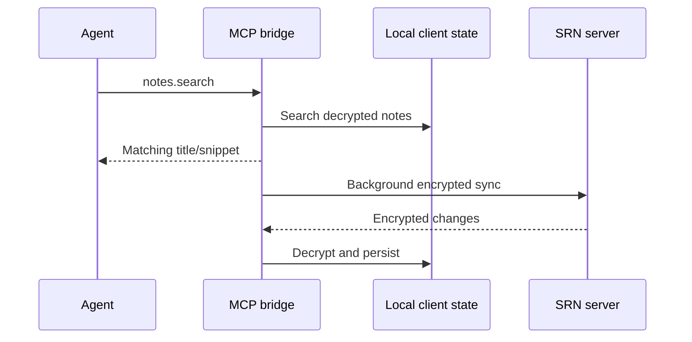

# MCP Bridge

The MCP bridge is a real headless Standard Notes client. It signs in, keeps a
local client database, decrypts notes locally, and synchronizes changes back as
encrypted payloads. It is not a thin plaintext REST proxy.

This page documents the implemented runtime in
[`mcp/src/index.ts`](../mcp/src/index.ts). Its supported transports, tools, and
security boundaries are capabilities you can use now, subject to the explicit
configuration gates below.



## Available tools

| Tool | Access | Purpose |
| --- | --- | --- |
| `standard_red_notes_status` | Always callable | Report configuration, sign-in, transport, write mode, and background-sync health |
| `notes.list` | Read | List note IDs, titles, and update times with pagination |
| `notes.search` | Read | Search decrypted title/body text locally |
| `notes.read` | Read | Read one decrypted note, tags, vault, and timestamps |
| `notes.create` | Write | Create a note, optionally in a vault |
| `notes.update` | Write | Change title, body, or tags |
| `notes.delete` | Write | Delete a note |
| `tags.list` | Read | List account tags |
| `vaults.list` | Read | List vaults and shared status |
| `vaults.create` | Write | Create a vault |

Write tools require `STANDARD_RED_NOTES_ALLOW_WRITES=1`. A read-only MCP token
forcibly disables writes even if that environment variable is set.



## Authentication choices

Prefer a dedicated MCP token in read-only mode:

```text
STANDARD_RED_NOTES_MCP_TOKEN=<revocable-token>
STANDARD_RED_NOTES_SERVER_URL=https://notes.example.test
STANDARD_RED_NOTES_ALLOW_WRITES=0
```

Alternatively, the bridge can use:

```text
STANDARD_RED_NOTES_EMAIL=automation@example.test
STANDARD_RED_NOTES_PASSWORD=<account-password>
STANDARD_RED_NOTES_MFA_CODE=<current-code>
```

Do not place credentials in a checked-in MCP client configuration. Use the
client’s secret mechanism, a protected environment file, or an OS secret store.



Creating a dedicated automation account limits which notes the bridge can ever
sync. Selecting tags while creating a token does **not** currently provide that
isolation.

## Scope and revocation limits

The current implementation has two effective write gates:

- `read` versus `write` mode is returned during token authentication; a
  read-only session disables bridge writes.
- `STANDARD_RED_NOTES_ALLOW_WRITES=1` must also be present before write tools
  are registered.

The token record can also contain selected tag UUIDs, but the bridge currently
does not apply them when it lists, searches, reads, or synchronizes notes.
Treat selected-tag scope as metadata, not an access-control boundary.

Deleting a token prevents it from authenticating again. It does **not**
invalidate a session already minted from that token, stop a running bridge,
erase its local database, or retract plaintext already returned to an agent.
After a token leak:

1. Delete the token so it cannot create another session.
2. Stop every bridge process that used it.
3. Revoke the corresponding account session or all unknown sessions.
4. Rotate any exposed MCP HTTP bearer token and hosted-model credential.
5. Securely remove the exact `STANDARD_RED_NOTES_DATA_DIR` only after confirming
   it is the intended bridge profile and no recovery evidence is needed.
6. Treat notes already returned to the agent or model as disclosed.

## Local stdio transport

Stdio is the default and is the safest choice for a desktop agent that can spawn
the bridge:

```text
MCP_TRANSPORT=stdio
STANDARD_RED_NOTES_SERVER_URL=http://127.0.0.1:3001
STANDARD_RED_NOTES_MCP_TOKEN=<token>
STANDARD_RED_NOTES_ALLOW_WRITES=0
STANDARD_RED_NOTES_DATA_DIR=/private/path/srn-mcp
```

Build and start from the repository root:

```bash
yarn build:mcp
yarn start:mcp
```

The MCP client should launch the built command directly and communicate only
over its standard input/output. Keep ordinary diagnostic logging off stdout so
it cannot corrupt the protocol stream.

## Authenticated HTTP transport

HTTP mode is intended for a long-lived sidecar:

```text
MCP_TRANSPORT=http
MCP_HTTP_PORT=3010
MCP_HTTP_TOKEN=<long-random-bearer-token>
```

The server refuses to start HTTP mode without `MCP_HTTP_TOKEN`. Clients connect
to `/mcp` and send:

```http
Authorization: Bearer <MCP_HTTP_TOKEN>
```

The bearer comparison is constant-time. This protects the MCP transport, while
`STANDARD_RED_NOTES_MCP_TOKEN` or the account credentials authenticate the
bridge to Standard Red Notes. They are separate credentials and should be
rotated independently.

{% include safety-alert.html
  level="danger"
  title="HTTP mode listens on every IPv4 interface"
  body="HTTP mode currently binds to 0.0.0.0 and has no bind-host setting. Do not publish that port directly: restrict it with the host firewall or container port mapping, and place any non-local access behind a TLS-authenticated reverse proxy. The bearer token does not make plaintext public-internet transport safe."
  link_url="/operations-hardening.html#docker-image-and-runtime-hardening"
  link_text="Harden the exposed runtime"
%}

## Runtime settings

| Variable | Default | Meaning |
| --- | --- | --- |
| `STANDARD_RED_NOTES_SERVER_URL` | `http://localhost:3001` | Standard Red Notes front door |
| `STANDARD_RED_NOTES_DATA_DIR` | `/var/lib/standard-red-notes-mcp` | Persistent headless-client state |
| `STANDARD_RED_NOTES_SYNC_INTERVAL_MS` | `10000` | Background sync interval |
| `STANDARD_RED_NOTES_ALLOW_REGISTER` | Off | Register the configured email rather than sign in |
| `STANDARD_RED_NOTES_ALLOW_WRITES` | Off | Enable write tools, subject to token scope |
| `MCP_TRANSPORT` | `stdio` | `stdio` or `http` |
| `MCP_HTTP_PORT` | `3010` | HTTP listener port |

Registration is an exceptional bootstrap action. Disable
`STANDARD_RED_NOTES_ALLOW_REGISTER` immediately after account creation.

## Data path



An AI agent receives the tool results returned to it. If the agent uses a hosted
model, that provider may receive note content. A read-only MCP token prevents
mutation; it does not prevent disclosure through successful reads.

## Health and troubleshooting

Call `standard_red_notes_status` first. Check:

- `accountConfigured`;
- `signedIn`;
- `syncHealthy`;
- `consecutiveSyncFailures`; and
- `lastSyncError`.

A signed-in bridge with repeated background-sync failures is unhealthy even if
the MCP protocol still responds. Confirm the server URL, whether new token
authentication is allowed, local data-directory permissions, current session
state, and server health. The initialization path deliberately retries after
transient failures rather than caching a failed sign-in forever.

The MCP E2E suite covers protocol behavior, read-only token behavior, rejection
of revoked-token reauthentication, account lifecycle, encryption on the wire,
offline recovery, conflicts, collaboration, files, server restart, MFA, and
backup round trips.
