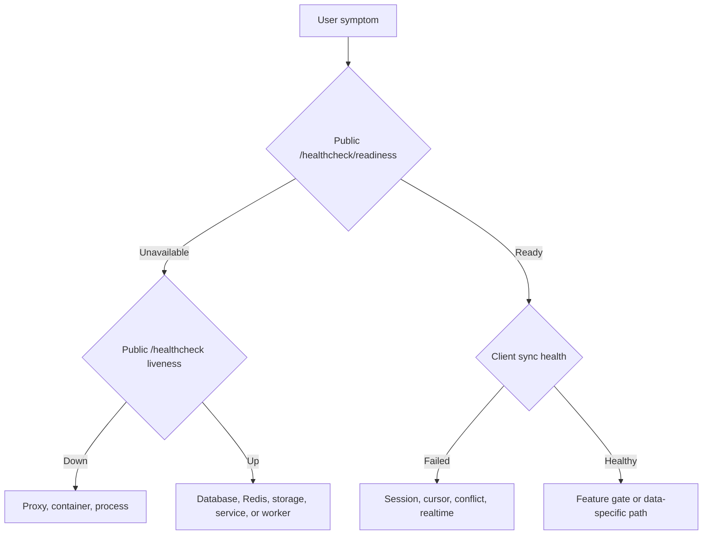

# Monitoring and Troubleshooting

Diagnose from the outside in. A process can be alive while its database, Redis,
worker, or downstream service is unavailable.





## Health layers

| Layer             | Check                                     | What it proves                                                        |
| ----------------- | ----------------------------------------- | --------------------------------------------------------------------- |
| Public readiness  | `GET /healthcheck/readiness`              | Every required service, dependency, storage path, and worker is ready |
| Public liveness   | `GET /healthcheck`                        | The gateway process and public route respond; not safe for acceptance |
| Service liveness  | Internal `/healthcheck`                   | The individual process/event loop responds                            |
| Service readiness | Internal `/healthcheck/readiness`         | The service can reach its required database, Redis, or storage         |
| Stack state       | `srn-server status` / `docker compose ps` | Container lifecycle and Docker health                                 |
| Server aggregate  | Admin Server tab or `srn-admin status`    | Per-sibling readiness and response time                               |
| Client data path  | Manual sync and a second client           | Authentication, encrypted sync, reconciliation, and local persistence |
| MCP               | `standard_red_notes_status`               | Bridge sign-in and background-sync health                             |

The public access-key gate exempts health paths so infrastructure probes remain
usable. Docker and LXC acceptance use aggregate readiness; keep liveness for
diagnosis only. Even successful readiness does not authenticate a user or prove
an end-to-end encrypted client sync.

Files readiness checks read/write access and available filesystem blocks for
local storage. S3 storage uses the authenticated, non-mutating `HeadBucket`
probe; its credential must grant `s3:ListBucket`, which is also required by the
existing file-list/quota path.

## First-response sequence

1. Record the exact time, user, client version, server URL, and action.
2. Preserve the error text and request/correlation identifiers.
3. Check public health.
4. Check aggregate/internal readiness.
5. Inspect bounded logs around the recorded time.
6. Query admin/security audit events for relevant configuration changes.
7. Reproduce with a non-destructive read or test account.
8. Back up affected state before repair.

Avoid restarts until evidence is captured. A restart can remove the failure
signal and complicate a partially applied write.

## Logs

Use bounded queries first:

```bash
srn-server logs server --tail 200
docker compose exec server srn-admin logs --service auth --level error --tail 200
docker compose exec server srn-admin audit --limit 100
```

Worker programs do not expose dedicated health ports. Inspect their logs for
event backlog, retry, mail, backup, or scheduler failures.

Never paste unredacted logs containing tokens, email addresses, IP addresses,
provider responses, or request bodies into a public issue.

### Safe operational logging

Security-sensitive server auth, gateway, WebSocket, sync, event, and worker
paths—and the migrated app API, encryption, mobile, SNJS, and utility
packages—emit allowlisted diagnostics rather than raw request, response, error,
or payload objects.

| Kept for diagnosis                                 | Removed or bounded                                                                    |
| -------------------------------------------------- | ------------------------------------------------------------------------------------- |
| Event/action name                                  | Access, refresh, offline, feature, subscription, and WebSocket tokens                 |
| HTTP method, status, and safe error code/type      | Authorization and cookie headers                                                      |
| URL origin and path                                | URL user info, query values, and fragments                                            |
| Query-parameter count                              | Email addresses, passwords, PKCE values, API keys, and session identifiers            |
| Explicit user, request, or ephemeral connection ID | Request/response bodies, provider payloads, encrypted content, and exception messages |

The sanitizer is defensive against nested and circular objects, accessors,
hostile proxies, oversized strings, and oversized collections. It does not
invoke getters while preparing a log entry. Internal subscription validation
also carries its credential in `x-subscription-token`; the token is not placed
in the request path.

Client-safe 4xx responses retain their established status, content type, and
allowlisted error tag. Thrown or untrusted 5xx failures return a stable generic
service error rather than reflecting an upstream body, header, or exception
message.

Before merging changes to these surfaces, run the source regression gate:

```bash
node scripts/validate-safe-logging.mjs
node scripts/validate-safe-logging.mjs --report-allowlist
node --test scripts/validate-safe-logging.test.mjs
```

The gate scans authored runtime JavaScript and TypeScript across CLI, MCP,
OpenClaw, server packages, and these exact app package roots: `api`,
`encryption`, `mobile`, `snjs`, and `utils`. Its machine-readable scope is
`guardedRuntimeRoots` in the validator. It complements runtime tests by
rejecting raw-token, raw-object, session-in-log, credential-in-path,
native-bridge-message, and crypto-error logging patterns. Allowlist entries are
exact and stale-checked: changing or removing an intentional match without
updating the review record fails the gate.

Other app package roots are not claimed by this gate yet. Their coverage must be
enabled atomically with the corresponding consumer migrations and tests.

The reviewed-residual list is intentionally empty. WebSocket bridges record
`originExcluded` as structured boolean metadata, never the underlying session
UUID, so those diagnostics need no exception.

## Symptom guide

### Cannot sign in

- Confirm the exact server URL and shared access key.
- Check auth readiness and database/Redis.
- Distinguish wrong password, MFA challenge, account lockout, ban, suspension,
  unconfirmed email, and registration policy.
- Review pending push-MFA approvals and trusted devices.
- Do not reset MFA as a generic password-recovery action.

### Sync is stale

- Confirm the client is signed in and sync is not still running.
- Check syncing-server readiness.
- Disable network filters temporarily in a controlled test.
- Manual sync; then verify on a second client.
- Check for conflict copies and repeated cursor/session errors.
- Realtime may be disabled while manual sync remains functional.

### Realtime updates are missing

- Confirm ordinary sync works first.
- Check WebSocket gateway `/health`, token issuance, reverse-proxy upgrade
  headers, and client connection logs.
- Confirm the user’s realtime feature flag.
- Do not treat WebSocket failure as item loss until manual sync is tested.

### Files fail but notes sync

- Check the files service readiness and encrypted blob storage.
- Confirm upload-size and user storage limits.
- Inspect the file metadata item separately from the blob.
- Test a small file and a known existing file.

### Admin console returns 403

- Confirm the user’s effective `ADMIN_USER` role.
- Sign out and back in after a recent role grant.
- Check the server route and cross-service token, not just client visibility.
- Use `srn-admin user <account>` for independent evidence.

### MCP responds but data is old

Call `standard_red_notes_status`. Three or more consecutive sync failures mark
the signed-in bridge unhealthy. Check the local data directory, server URL,
token revocation, and `lastSyncError`, then restart only after preserving the
error.

### Backups are missing

- Confirm the server master switch and per-user settings.
- Check scheduler/worker logs.
- Validate SMTP or WebDAV connectivity without exposing credentials.
- Check the destination’s retention and quota.
- Run a restore drill rather than relying on a successful upload message.

## Safe service recovery

Restart the narrowest failed component. Afterward:

1. wait for readiness;
2. verify the public health endpoint;
3. sign in with a test account;
4. synchronize a test note on two clients;
5. upload and download a small file;
6. inspect worker logs; and
7. confirm the incident symptom is resolved.

If database or file integrity is in doubt, stop writes and follow [Backups and
Recovery](backups-and-recovery.md) instead of repeatedly restarting.

## Escalation bundle

Prepare:

- deployment profile and component versions;
- sanitized Compose configuration;
- public and internal health results;
- bounded, redacted service and worker logs;
- relevant audit events;
- reproduction steps and affected/non-affected data paths;
- last known good time; and
- backup/restore status.

This evidence distinguishes an edge, dependency, authorization, sync,
feature-gate, and data-integrity problem before code changes begin.
