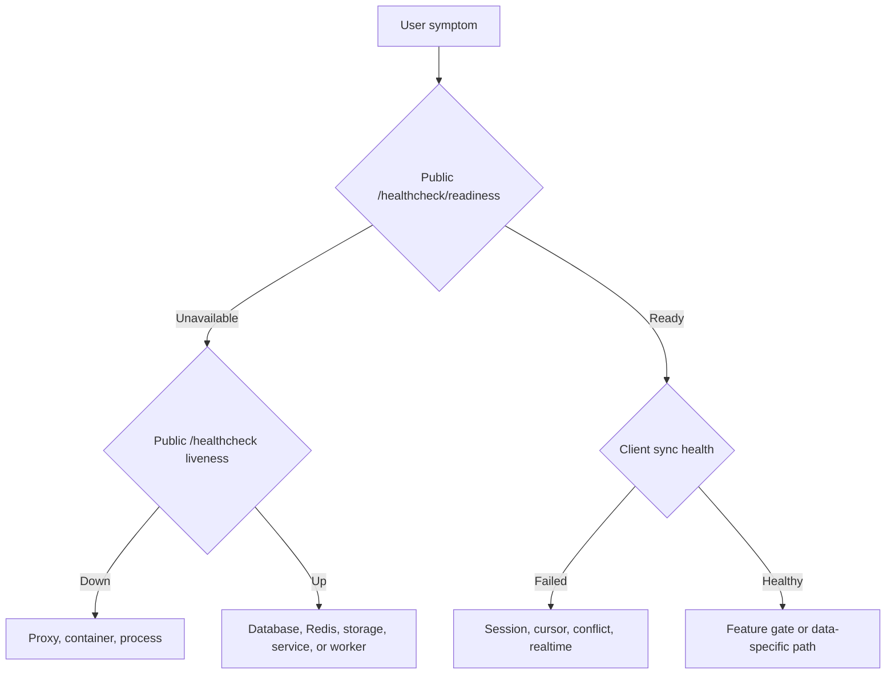

# Monitoring and Troubleshooting

Diagnose from the outside in. A process can be alive while its database, Redis,
worker, or downstream service is unavailable.





## Health layers

| Layer             | Check                                     | What it proves                                                        |
| ----------------- | ----------------------------------------- | --------------------------------------------------------------------- |
| Public readiness  | `GET /healthcheck/readiness`              | Every required service, dependency, storage path, and worker is ready |
| Public liveness   | `GET /healthcheck`                        | The gateway process and public route respond; not safe for acceptance |
| Service liveness  | Internal `/healthcheck`                   | The individual process/event loop responds                            |
| Service readiness | Internal `/healthcheck/readiness`         | The service can reach its required database, Redis, or storage         |
| Stack state       | `srn-server status` / `docker compose ps` | Container lifecycle and Docker health                                 |
| Server aggregate  | Admin Server tab or `srn-admin status`    | Per-sibling readiness and response time                               |
| Client data path  | Manual sync and a second client           | Authentication, encrypted sync, reconciliation, and local persistence |
| MCP               | `standard_red_notes_status`               | Bridge sign-in and background-sync health                             |

The public access-key gate exempts health paths so infrastructure probes remain
usable. Docker and LXC acceptance use aggregate readiness; keep liveness for
diagnosis only. Even successful readiness does not authenticate a user or prove
an end-to-end encrypted client sync.

Files readiness checks read/write access and available filesystem blocks for
local storage. S3 storage uses the authenticated, non-mutating `HeadBucket`
probe; its credential must grant `s3:ListBucket`, which is also required by the
existing file-list/quota path.

## First-response sequence

1. Record the exact time, user, client version, server URL, and action.
2. Preserve the error text and request/correlation identifiers.
3. Check public health.
4. Check aggregate/internal readiness.
5. Inspect bounded logs around the recorded time.
6. Query admin/security audit events for relevant configuration changes.
7. Reproduce with a non-destructive read or test account.
8. Back up affected state before repair.

Avoid restarts until evidence is captured. A restart can remove the failure
signal and complicate a partially applied write.

## Logs

Use bounded queries first:

```bash
srn-server logs server --tail 200
docker compose exec server srn-admin logs --service auth --level error --tail 200
docker compose exec server srn-admin audit --limit 100
```

Worker programs do not expose dedicated health ports. Inspect their logs for
event backlog, retry, mail, backup, or scheduler failures.

Never paste unredacted logs containing tokens, email addresses, IP addresses,
provider responses, or request bodies into a public issue.

### Safe operational logging

Security-sensitive server auth, gateway, WebSocket, sync, event, and worker
paths—and the migrated app API, encryption, mobile, SNJS, and utility
packages—emit allowlisted diagnostics rather than raw request, response, error,
or payload objects.

| Kept for diagnosis                                 | Removed or bounded                                                                    |
| -------------------------------------------------- | ------------------------------------------------------------------------------------- |
| Event/action name                                  | Access, refresh, offline, feature, subscription, and WebSocket tokens                 |
| HTTP method, status, and safe error code/type      | Authorization and cookie headers                                                      |
| URL origin and path                                | URL user info, query values, and fragments                                            |
| Query-parameter count                              | Email addresses, passwords, PKCE values, API keys, and session identifiers            |
| Explicit user, request, or ephemeral connection ID | Request/response bodies, provider payloads, encrypted content, and exception messages |

The sanitizer is defensive against nested and circular objects, accessors,
hostile proxies, oversized strings, and oversized collections. It does not
invoke getters while preparing a log entry. Internal subscription validation
also carries its credential in `x-subscription-token`; the token is not placed
in the request path.

Client-safe 4xx responses retain their established status, content type, and
allowlisted error tag. Thrown or untrusted 5xx failures return a stable generic
service error rather than reflecting an upstream body, header, or exception
message.

Before merging changes to these surfaces, run the source regression gate:

```bash
node scripts/validate-safe-logging.mjs
node scripts/validate-safe-logging.mjs --report-allowlist
node --test scripts/validate-safe-logging.test.mjs
```

The gate scans authored runtime JavaScript and TypeScript across CLI, MCP,
OpenClaw, server packages, and these exact app package roots: `api`,
`encryption`, `mobile`, `snjs`, and `utils`. Its machine-readable scope is
`guardedRuntimeRoots` in the validator. It complements runtime tests by
rejecting raw-token, raw-object, session-in-log, credential-in-path,
native-bridge-message, and crypto-error logging patterns. Allowlist entries are
exact and stale-checked: changing or removing an intentional match without
updating the review record fails the gate.

Other app package roots are not claimed by this gate yet. Their coverage must be
enabled atomically with the corresponding consumer migrations and tests.

The reviewed-residual list is intentionally empty. WebSocket bridges record
`originExcluded` as structured boolean metadata, never the underlying session
UUID, so those diagnostics need no exception.

## Realtime health in the admin panel

**Settings → Admin → Diagnostics** reads the same health snapshot that
`/healthcheck/readiness` reports, but splits it into rows an operator can act on.
Everything in its **Realtime health** section is informational. Readiness is
deliberately not gated on any of it, because a container that restarts itself on
a Redis blip turns ten seconds of degradation into an outage. The panel's job is
to make a degradation visible, not to act on it.

### Boot gate versus attach outcome

The **Boot gate** section shows separate verdicts rather than one combined
answer: whether the socket transport came up, whether `SYNC_ITEMS` was advertised
or withheld, whether ticket minting is answering right now, and a **Gateway**
chip reading *Attached* or *Not attached*. The lane and `SYNC_ITEMS` are split
because they became two decisions — a durable-backend condition withholds
`SYNC_ITEMS` without taking the socket down — and one combined verdict would
either hide a live lane or hide a missing operation.

The gateway chip is not a restatement of the lane verdict. The gate records a
**decision** to build the lane; the composition root records the **outcome** of
attaching a gateway. They come from different places and can disagree. An invalid
`WEBSOCKET_REDIS_NAMESPACE` produces exactly that disagreement: the gate passes,
the host then declines to attach rather than publish on a sibling stack's
channels, and tickets mint while nothing is ever delivered. Showing only the
decision is how this panel once reported a working lane over a gateway that was
never there.

### The six realtime health rows

When a gateway is attached, the panel renders the gateway's own view of itself as
six rows:

| Row                  | Reads                            | What a bad value means                                                                                                              |
| -------------------- | -------------------------------- | ------------------------------------------------------------------------------------------------------------------------------------- |
| Gateway              | attached / not attached          | Unattached means nothing reaches a client over a socket, whatever the boot gate decided.                                            |
| Push bridge          | `redis`, `in-process`, or `none`, with readiness | Both `redis` and `in-process` count as bound and healthy; a single process that holds every socket needs no Redis to deliver a push. `none` means nothing carries change notifications at all. Bound but not ready is a reconnect window that recovers on its own. |
| Queue consumer       | running / not running            | Expected to be idle where pushes arrive through the bridge alone; on a stack that provisions the websocket queue it means those events are not being drained. |
| Collaboration relay  | healthy / unhealthy              | Unhealthy still leaves collaboration working between clients on the **same** replica, which is why it fails quietly on a multi-replica deployment. |
| Sync lane            | up / down                        | Down means the gateway would refuse a client on `/sockets/sync` right now; the live refusal reasons above the rows say why.          |
| Pushes dispatched    | a count since this gateway attached | It resets on every restart. A count that stays at zero on a busy deployment is the signature of a delivery path that never fires.   |

When the server reports no realtime snapshot at all the panel prints no rows and
says so without guessing between the two causes: either no gateway is attached to
the process that answered, or the build predates the snapshot. The boot-gate
section distinguishes them.

### Two findings the rows cannot state on their own

Two combinations are raised as explicit findings because every other panel on the
screen would look healthy:

- **The lane is enabled but no attached gateway was recorded.** The gate built
  the lane and the host recorded no successful attach, so tickets mint while
  nothing is delivered. On a server older than the attach-outcome record the
  field is simply never set, and the line then means only that it was not
  reported.
- **The socket is attached with no push bridge.** The lane accepts clients, but
  nothing carries server-side change notifications to them, so a save on one
  device never reaches another until that device syncs on its own. This is a
  misconfiguration rather than a topology: a process that was asked for a
  Redis-backed plane without a reachable Redis host. A deployment that simply has
  no Redis reports an in-process bridge instead and is healthy.

## Symptom guide

### Cannot sign in

- Confirm the exact server URL and shared access key.
- Check auth readiness and database/Redis.
- Distinguish wrong password, MFA challenge, account lockout, ban, suspension,
  unconfirmed email, and registration policy.
- Review pending push-MFA approvals and trusted devices.
- Do not reset MFA as a generic password-recovery action.

### Sync is stale

- Confirm the client is signed in and sync is not still running.
- Check syncing-server readiness.
- Disable network filters temporarily in a controlled test.
- Manual sync; then verify on a second client.
- Check for conflict copies and repeated cursor/session errors.
- Realtime may be disabled while manual sync remains functional.

### Realtime updates are missing

- Confirm ordinary sync works first.
- Read `/healthcheck/readiness`. Its `gateway.realtime` block says whether the
  gateway is attached, which push bridge it uses, whether that bridge and the
  SQS consumer are running, whether the collaboration relay is healthy, and how
  many pushes it has dispatched. It is informational and never fails the
  healthcheck, so a green `status` with a degraded realtime block is expected.
- Read `/v1/sockets/sync/capabilities`. An empty list means the socket transport
  is closed; the three causes are a missing `WEB_SOCKET_CONNECTION_TOKEN_SECRET`,
  `WEBSOCKET_SYNC_ENABLED=false`, and unreachable Redis. An unbound gRPC command
  port withholds only the `SYNC_ITEMS` operation and leaves the list populated.
- Read the gateway's own log lines. The realtime gateway runs in-process inside
  the api-gateway, and supervisord writes that program's output to
  `/var/lib/server/logs/api-gateway.log` (with `.err` alongside), so
  `docker compose logs server` shows only supervisord bookkeeping. Boot lines to
  look for name the unmet preconditions and the `SYNC_ITEMS` decision.
- Check token issuance, reverse-proxy upgrade headers, and client connection
  logs. There is no separate gateway container and no gateway `/health`: through
  the front door, `/health` is the web app's own static response.
- Confirm the user's **Live sync (`LIVE_SYNC_ENABLED`)** setting. A user with it
  off is refused `SYNC_ITEMS` with the code `LIVE_SYNC_DISABLED`.
- Do not treat WebSocket failure as item loss until manual sync is tested.

### Files fail but notes sync

- Check the files service readiness and encrypted blob storage.
- Confirm upload-size and user storage limits.
- Inspect the file metadata item separately from the blob.
- Test a small file and a known existing file.

### Admin console returns 403

- Confirm the user’s effective `ADMIN_USER` role.
- Sign out and back in after a recent role grant.
- Check the server route and cross-service token, not just client visibility.
- Use `srn-admin user <account>` for independent evidence.

### MCP responds but data is old

Call `standard_red_notes_status`. Three or more consecutive sync failures mark
the signed-in bridge unhealthy. Check the local data directory, server URL,
token revocation, and `lastSyncError`, then restart only after preserving the
error.

**Email is queued, late, or not delivered.**

- First identify the topology. The full Redis-backed deployment has relay,
  queue, and log controls. The single/home in-memory deployment uses direct SMTP
  compatibility, and Redis Cluster deliberately does the same because a
  node-local AOF acknowledgement cannot be proven.
- In **Settings → Admin → Server → Email delivery**, confirm at least one
  valid profile is enabled, save, wait up to five seconds for readiness to
  refresh, and run **Send test**. `501` means the advanced capability is not
  present in this topology; `503` means it is present but temporarily
  unavailable.
- Use **Refresh queue** to inspect `ready`, `leased`, and `dead` records. Retry a
  dead or otherwise eligible record only after correcting the relay problem. A
  leased record is in flight and cannot be retried or discarded.
- If reminder delivery was disabled, published-reminder jobs are settled before
  the relay boundary. The account opt-out endpoint remains available while gates
  are off and erases stored publication history/destination after cancellation.
  An in-flight refusal is intentional: retry opt-out after the bounded provider
  call finishes rather than claiming that a provider request was revoked.
- Use **Refresh logs** to filter attempt metadata by relay and outcome. Compare
  `rate-limited`, `transient-failure`, and `permanent-failure` results with relay
  order, fallback policy, and each profile's `max` per `window` setting. Logs and
  queue views intentionally omit recipients, subjects, bodies, attachments,
  credentials, and raw provider responses.
- Check the gateway's redacted `EmailDeliveryReadiness`,
  `EmailDeliveryRedisCapacity`, worker-batch, and queue-producer diagnostics.
  Do not enable payload logging during a test. A missing readiness marker means
  the worker is stopped, no valid enabled relay exists, Redis capacity is below
  its safety floor, or the configuration could not be decrypted.
- Verify Redis AOF is enabled and that the instance supports local `WAITAOF`.
  The supplied Compose deployment defaults to `appendfsync everysec`; each new
  job is nevertheless reported as accepted only after its explicit local
  `WAITAOF` acknowledgement. The default encrypted-byte caps are 25 MiB per job
  and 64 MiB total; Redis also needs at least 64 MiB of additional headroom.
- After a server-key rotation, old relay settings and queue payloads cannot be
  decrypted. Restore the matching protected settings, Redis state, and key as one
  recovery set. The admin UI intentionally refuses to overwrite an envelope it
  cannot authenticate; re-entering credentials is therefore not a safe recovery
  shortcut. For an intentional rotation, drain and verify the queue first, retain
  the old recovery set, export the operator-known relay values, save an empty
  profile list while the old key can still authenticate it, verify the envelope
  is absent, the non-secret `relayConfigurationManaged` marker is `true`, and
  readiness expires; then rotate the key and recreate/test the relays. An
  explicitly empty managed configuration does not resurrect legacy environment
  SMTP.

Delivery is at least once. If a provider accepted a message but its response was
lost, retry can produce a duplicate even though deterministic job identifiers
prevent duplicate queue insertion. Treat an ambiguous timeout as an unknown
provider outcome, not proof that nothing was sent.

### Backups are missing

- Confirm the server master switch and per-user settings.
- Check scheduler/worker logs.
- Validate the selected email relay or WebDAV connectivity without exposing
  credentials.
- Check the destination’s retention and quota.
- Run a restore drill rather than relying on a successful upload message.

## Safe service recovery

Restart the narrowest failed component. Afterward:

1. wait for readiness;
2. verify the public health endpoint;
3. sign in with a test account;
4. synchronize a test note on two clients;
5. upload and download a small file;
6. inspect worker logs; and
7. confirm the incident symptom is resolved.

If database or file integrity is in doubt, stop writes and follow [Backups and
Recovery](backups-and-recovery.md) instead of repeatedly restarting.

## Escalation bundle

Prepare:

- deployment profile and component versions;
- sanitized Compose configuration;
- public and internal health results;
- bounded, redacted service and worker logs;
- relevant audit events;
- reproduction steps and affected/non-affected data paths;
- last known good time; and
- backup/restore status.

This evidence distinguishes an edge, dependency, authorization, sync,
feature-gate, and data-integrity problem before code changes begin.
