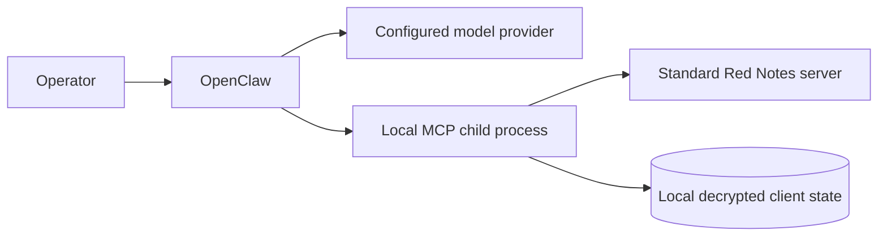

# OpenClaw

OpenClaw connects an Anthropic, OpenAI, Ollama, or Hermes model to a separately
installed local Standard Red Notes MCP bridge. It provides:

- `openclaw doctor`;
- `openclaw ask "<question>"`; and
- `openclaw chat`.

The implemented runtime is documented in
[`openclaw/README.md`](../openclaw/README.md) and here.



## Architecture



OpenClaw does not bundle `srn-mcp`. Install both components and point the
OpenClaw configuration at an absolute MCP command.

## Install a release

OpenClaw ships as a platform-neutral
`srn-openclaw-<version>-node-any.tgz`. It requires Node.js 26 or newer and npm.
Release assets also include a manifest, SHA-256 checksums, and a signed
provenance bundle.

Verify the checksum and provenance before installation, then install without
running package scripts:

```bash
npm install --global --offline --ignore-scripts ./srn-openclaw-<version>-node-any.tgz
openclaw --help
```

On Windows, the npm-generated entry point is `openclaw.cmd`.

## Configuration

Create `~/.openclaw/config.toml`, or set `OPENCLAW_CONFIG` to a different path:

```toml
[provider]
type = "ollama"
model = "llama3.1"
base_url = "http://127.0.0.1:11434"

[mcp.local]
command = "/absolute/path/to/srn-mcp"
args = []
scopes = ["read"]

[mcp.local.env]
MCP_TRANSPORT = "stdio"
STANDARD_RED_NOTES_ALLOW_WRITES = "0"
STANDARD_RED_NOTES_SERVER_URL = "http://127.0.0.1:3001"
STANDARD_RED_NOTES_MCP_TOKEN = "<token>"

[agent]
max_steps = 8
scratchpad_kb = 64
audit_file = "~/.openclaw/audit.log"

[security]
allow_filesystem_paths = []
```

On POSIX, the configuration must not be group- or world-readable:

```bash
chmod 600 ~/.openclaw/config.toml
openclaw doctor
```

The schema accepts `read`, `write`, `files`, `export`, and `admin` scopes. Start
with `read`. A scope declaration tells OpenClaw what the child is intended to
use; the MCP/server credential must independently enforce the same or narrower
authority. The current Standard Red Notes bridge implements read/write note,
tag, and vault tools; a broader schema label does not make an absent MCP tool
available.

## Providers

| Provider type | Default connection | Credential |
| --- | --- | --- |
| `anthropic` | Hosted API unless `base_url` is overridden | `ANTHROPIC_API_KEY` |
| `openai` | Hosted API unless `base_url` is overridden | `OPENAI_API_KEY` |
| `ollama` | `http://127.0.0.1:11434` | Normally local, no hosted key |
| `hermes` | `http://127.0.0.1:11434`, Ollama transport by default | Optional environment key for an OpenAI-compatible endpoint |

Provider base URLs must be absolute HTTP(S) URLs with a host. Hosted providers
receive the prompt and relevant tool-result content. Choose local Ollama or
Hermes when note content must remain on the machine, and validate the local
model service’s own logging and storage.

## Commands

Run `doctor` after every provider, MCP path, credential, or permission change:

```bash
openclaw doctor
openclaw ask "Which notes mention the budget?"
openclaw chat
```

`ask` is a single request. `chat` maintains an interactive session and may
accumulate more context. Exit the session when its task is complete.

## Security controls

- `max_steps` bounds the number of agent iterations.
- `audit_file` records agent activity for later review.
- MCP scopes should default to `read`.
- The underlying MCP bridge should also have writes disabled and use a
  server-enforced read-only token.

`scratchpad_kb` and `security.allow_filesystem_paths` are accepted by the
configuration schema but are not consumed by `ask` or `chat`. They are inert
settings, **not enforced security boundaries**.

The audit file can contain sensitive metadata or content. The runtime creates
or appends it using the process defaults, so pre-create a private directory and
file on POSIX systems:

```bash
install -d -m 700 ~/.openclaw
touch ~/.openclaw/audit.log
chmod 600 ~/.openclaw/audit.log
```

On Windows, keep it inside the user profile and restrict its NTFS ACL to the
account running OpenClaw. Rotate it as sensitive data. Do not place provider
keys in the TOML file when an environment variable is supported.

`ask` and `chat` require `mcp.local`. Although the configuration parser accepts
an `mcp.remote` table, the command runtime does not execute it. Deploy only the
local child-process mode documented above.

## Troubleshooting

1. Run `openclaw doctor`.
2. Confirm Node 26+ and the installed command shim.
3. Verify `mcp.local.command` is absolute and executable.
4. Run the MCP bridge alone and call its status tool.
5. Confirm the provider URL and provider-specific API-key environment variable.
6. Reduce scopes to `read` while diagnosing.
7. Inspect the protected audit file and MCP stderr for a bounded time window.

If a hosted request exposes too much context, stop OpenClaw and its MCP bridge,
delete the MCP token, revoke the bridge’s already-issued account session,
rotate the provider and MCP HTTP bearer keys, preserve the audit evidence, and
review the provider’s retention controls. Token deletion alone does not erase
the bridge’s local data or retract content already returned to the model.
