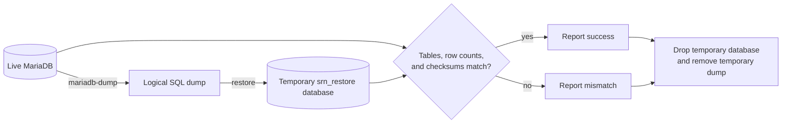

# Operations Hardening

This page is the operator-facing checklist for the production Docker stack. It
covers the parts that protect availability and blast radius: MariaDB durability,
connection limits, Redis/cache ceilings, request limits, signup controls, and
container hardening.



## Database Resilience

The multi-container stack stores primary state in the `mariadb-data` named
volume. The database is internal-only: it publishes no host port and is reachable
only on the Compose network.

The MariaDB service now starts with explicit safety defaults:

| Control                             |               Default | Why it exists                                                              |
| ----------------------------------- | --------------------: | -------------------------------------------------------------------------- |
| `DB_MAX_CONNECTIONS`                |                 `150` | Keeps a runaway client pool from exhausting the server.                    |
| `DB_CONNECTION_LIMIT`               | `20` per Node process | Bounds each TypeORM pool. Keep the DB max above the sum of active pools.   |
| `DB_MAX_QUERY_EXECUTION_TIME`       |            `45000` ms | Logs slow queries for diagnosis.                                           |
| `DB_INNODB_BUFFER_POOL_SIZE`        |                `512M` | Gives InnoDB a bounded cache within the default `DB_MEM_LIMIT=1g`.         |
| `DB_MAX_ALLOWED_PACKET`             |                `128M` | Allows large encrypted payloads without leaving the packet size unbounded. |
| `DB_INNODB_FLUSH_LOG_AT_TRX_COMMIT` |                   `1` | Favors crash durability by flushing transaction logs at commit.            |
| `local_infile`                      |              disabled | Removes an unnecessary file-loading surface.                               |

The `db` healthcheck runs a real `SELECT 1` against the configured application
database instead of only checking that the MariaDB process is alive.

### Connection Budget

The server container runs several Node services under supervisord. Each
MySQL-backed package uses `DB_CONNECTION_LIMIT`; the current default is 20.
For a single server container, `DB_MAX_CONNECTIONS=150` leaves headroom for auth,
syncing, revisions, websocket/legacy packages, migration/admin tasks, and a
short overlap during restarts.

If you scale out more server containers, increase `DB_MAX_CONNECTIONS` and
`DB_MEM_LIMIT` together. A practical starting formula is:

```text
DB_MAX_CONNECTIONS >= (server replicas * DB-using processes per replica * DB_CONNECTION_LIMIT) + admin headroom
```

Do not raise the per-process pool first. Raise it only when live metrics show
connection wait time is the bottleneck.

### Backup And Restore

Take logical database backups while the stack is running:

```bash
docker compose exec db sh -c \
  'exec mariadb-dump -uroot -p"$MYSQL_ROOT_PASSWORD" --single-transaction --routines "$MYSQL_DATABASE"' \
  > backup.sql
```

Restore into a running stack:

```bash
docker compose exec -T db sh -c \
  'exec mariadb -uroot -p"$MYSQL_ROOT_PASSWORD" "$MYSQL_DATABASE"' \
  < backup.sql
```

Run the non-destructive restore drill before trusting a backup procedure:

```bash
node scripts/verify-backup-restore.mjs
```

The drill dumps the live MariaDB database, restores it into a temporary
`srn_restore_*` database, compares the restored table list, row counts, and
table checksums, then drops only the temporary database. Run it when the system
is idle so live writes do not change the source database while the comparison is
in progress. Use `--keep-backup` or `--output backup.sql` when you want to keep
the generated dump for inspection.



Back up the `uploads` volume with the database if you use file attachments.
Keep `.env` backed up separately. Losing server secrets can invalidate sessions
or make server-side encrypted settings unreadable.

### Restart Safety

The admin UI can restart Redis and MariaDB only when the optional `ops` profile
is running and the server has `SERVICE_CONTROL_DOCKER_ENABLED=true`. The server
never receives the raw Docker socket. It talks to `docker-socket-proxy`, which is
configured to permit only container restart endpoints.

Database restarts are intentionally visible operations. Use them for controlled
maintenance, not routine remediation. Back up before risky changes such as
database image upgrades, memory reductions, or major version moves.

## Operation Limits

The stack has several independent limits. They are intentionally layered because
each protects a different failure mode.

| Surface                                     |             Default | Control                                                                    |
| ------------------------------------------- | ------------------: | -------------------------------------------------------------------------- |
| Gateway JSON/body payload                   |             `50 MB` | `HTTP_REQUEST_PAYLOAD_LIMIT_MEGABYTES`                                     |
| File upload chunk                           | `100,000,000` bytes | `MAX_CHUNK_BYTES`                                                          |
| File download request deadline              |        `30 seconds` | `FILE_DOWNLOAD_DEADLINE_MS`                                                |
| Absolute attachment size                    |             `5 GiB` | `MAX_ATTACHMENT_BYTE_SIZE`                                                 |
| Login/recovery attempts                     |         `10/min/IP` | `RATE_LIMIT_LOGIN_MAX`, `RATE_LIMIT_WINDOW_SECONDS`                        |
| Registration and magic-link-sensitive calls |          `5/min/IP` | `RATE_LIMIT_REGISTRATION_MAX`                                              |
| Authenticated expensive endpoints           |                 off | `RATE_LIMIT_USER_MAX`, `RATE_LIMIT_USER_WINDOW_SECONDS`                    |
| AI daily request cap                        |                 off | `ASSISTANT_DAILY_REQUEST_LIMIT`                                            |
| AI token windows                            |                 off | `ASSISTANT_5H_TOKEN_LIMIT`, `ASSISTANT_WEEKLY_TOKEN_LIMIT`                 |
| Server-side OCR                             |                 off | `OCR_SERVER_ENABLED`, `OCR_SERVER_MAX_PAGES`, `OCR_SERVER_MAX_IMAGE_BYTES` |
| Revision retention                          |           unlimited | `REVISIONS_RETENTION_DAYS`, `REVISIONS_MAX_COUNT_PER_ITEM`                 |

Unauthenticated rate limits are Redis-backed and fail open if Redis is down, so a
cache outage cannot lock legitimate users out of their notes. The tradeoff is
that IP blocks and rate limits temporarily degrade during a Redis outage.

For public instances, consider setting:

```dotenv
REGISTRATION_INVITE_ONLY=true
REGISTRATION_APPROVAL_REQUIRED=true
REGISTRATION_SIGNUPS_PER_IP_MAX=5
REGISTRATION_SIGNUPS_PER_IP_WINDOW_HOURS=24
REGISTRATION_MAX_TOTAL_ACCOUNTS=<your planned capacity>
```

For expensive authenticated operations, consider:

```dotenv
RATE_LIMIT_USER_MAX=30
RATE_LIMIT_USER_WINDOW_SECONDS=60
ASSISTANT_DAILY_REQUEST_LIMIT=100
ASSISTANT_5H_TOKEN_LIMIT=200000
ASSISTANT_WEEKLY_TOKEN_LIMIT=1000000
```

Tune these to your hardware and user count. A small personal instance can keep
most authenticated limits off; a public instance should set them deliberately.

## Redis Limits

Redis is used for cache, rate-limit counters, transient operation state, and
event plumbing. It is persisted with append-only files, but it is not the source
of truth for notes.

The Compose service now sets:

```dotenv
CACHE_MEM_LIMIT=256m
CACHE_MAXMEMORY=192mb
CACHE_MAXMEMORY_POLICY=noeviction
```

`CACHE_MAXMEMORY` is below the container memory limit so Redis returns controlled
write errors instead of being OOM-killed. `noeviction` avoids silently discarding
keys that may represent rate-limit or transient operation state. If you operate
a high-churn instance and accept eviction semantics, choose a policy explicitly.

## WebSocket Sync Safety

Worker WebSocket sync is the preferred transport, with the durable HTTP command
path as fallback. The socket **transport** is advertised only when three
conditions hold: `WEB_SOCKET_CONNECTION_TOKEN_SECRET` is set, the
`WEBSOCKET_SYNC_ENABLED` kill switch is not the exact string `false`, and the
fleet-shared Redis ticket, command-lease and socket-budget stores report ready.
An admissible browser origin is checked per upgrade, not at negotiation: an
explicit `WEBSOCKET_SYNC_ALLOWED_ORIGINS` entry, an origin derived from
`PUBLIC_URL`, or an origin equal to the upgrade's own `Host` all pass.

The durable gRPC command port is a **separate, fourth** condition and gates only
the `SYNC_ITEMS` operation. When it is unbound the socket opens and serves live
collaboration, API RPC, invite events, the assistant stream and the files lane;
only item sync uses HTTP. Operators read the unmet conditions as stable codes:
`WEB_SOCKET_CONNECTION_TOKEN_SECRET_MISSING`,
`WEBSOCKET_SYNC_DISABLED_BY_CONFIGURATION`, `REDIS_UNBOUND` and
`SYNCING_SERVER_GRPC_UNBOUND`, each with a remedy naming a variable and never a
value. This keeps a partial rollout from accepting work that another replica
cannot resume safely, without letting one unmet server-to-server dependency
close five capabilities that do not depend on it.

| Variable                                    |                   Default | Operational effect                                                                                                                                                                                      |
| ------------------------------------------- | ------------------------: | ------------------------------------------------------------------------------------------------------------------------------------------------------------------------------------------------------- |
| `WEBSOCKET_SYNC_ENABLED`                    |                    `true` | Exact `false` is the emergency kill switch. Any other non-empty boolean spelling fails startup.                                                                                                         |
| `WEBSOCKET_SYNC_ALLOWED_ORIGINS`            | derived from `PUBLIC_URL` | Comma-separated exact origins; wildcard, `null`, `file:`, URL paths, credentials, queries, and fragments are rejected.                                                                                  |
| `WEBSOCKET_SYNC_MAX_SOCKETS_PER_USER`       |                       `4` | Fleet-wide live worker-socket budget for one user.                                                                                                                                                      |
| `WEBSOCKET_SYNC_REDIS_KEY_PREFIX`           |          `srn:ws-sync:v1` | Namespace for tickets, command leases, and socket leases. Use a distinct value when multiple installations share Redis.                                                                                 |
| `WEBSOCKET_SYNC_REDIS_OPERATION_TIMEOUT_MS` |                    `1500` | Fails capability/commands closed when Redis does not answer promptly.                                                                                                                                   |
| `WEBSOCKET_SYNC_COMMAND_LEASE_TTL_MS`       |                   `30000` | Bounds ownership of one durable command across reconnects/replicas.                                                                                                                                     |
| `WEBSOCKET_SYNC_SOCKET_LEASE_TTL_MS`        |                   `75000` | Bounds stale fleet-wide socket reservations after a dead process.                                                                                                                                       |
| `SERVICE_PROXY_TYPE`                        |                     empty | Empty keeps the HTTP proxies between api-gateway and auth/syncing-server. `grpc` binds the durable command port and is what enables realtime `SYNC_ITEMS`; it moves every internal call to gRPC, not only sync. Not used by the single container or LXC. |
| `WEBSOCKET_SYNC_FILES_URL`                  |  `http://localhost:3104`* | Container-internal files service URL behind the socket files lane. Unset means uploads and downloads use HTTP. *The Compose default; there is no built-in default in a bare image run. |
| `WEBSOCKET_REDIS_NAMESPACE`                 |                     empty | `^[a-z0-9:_-]{1,64}$` prefix for the push channel, the collaboration relay and room keys, the SQS dedup keys and the invite streams. Empty keeps the existing names. Invalid stops the multi-container api-gateway; the single container instead degrades to HTTP and records `WEBSOCKET_REDIS_NAMESPACE_INVALID`. |
| `WEB_SOCKET_CONNECTION_TOKEN_TTL`           |                     `60s` | `<n>s`, `<n>m`, `<n>h`, or a bare integer meaning seconds. Validated at boot; an unparseable or zero value stops the process with the variable named. |
| `WEBSOCKET_SYNC_PUSH_ENABLED`               |                     empty | Only the exact string `true` inlines changed payloads into a push. Off, a save publishes the plain change notification and the receiver pulls over HTTP. |
| `WEBSOCKET_SYNC_PUSH_MAX_BYTES`             |                  `204800` | Serialised-payload cap for an inlined push; a larger change set degrades to the plain notification. |
| `SYNCING_SERVER_INTERNAL_GRPC_AUTH_SECRET`  |        generated by setup | Separate HMAC key for standalone API-gateway to syncing-server durable command/status metadata. Missing closes `SYNC_ITEMS` only; never reuse `AUTH_JWT_SECRET`. HomeServer direct calls do not use it. |

Single-container and LXC deployments accept only `REDIS_HOST`/`REDIS_PORT` for
this socket plane; that connector has no Redis authentication or TLS support.
Use it only on the same private trusted network. Leaving Redis unset there does
not merely disable item sync over the socket: no realtime gateway is started at
all, so push, live collaboration, presence, comments, realtime invites and
push-approved multi-factor prompts are absent and only HTTP and periodic sync
remain.

`WEBSOCKET_GATEWAY_INTERNAL_SECRET` is an internet-facing credential, not merely
a server-internal one: whoever holds it can mint a legacy connection token for
any user and session. The three shipped front doors blank `X-Internal-Secret`
on `/sockets`, and the gateway refuses an internal mint that arrives proxied or
from a non-loopback peer. Keep the value out of clients, browsers and build
artefacts regardless.

That refusal is a required check rather than an assumption. The container lane
runs a script inside the server container, the one vantage point that reaches
both the public front door and loopback, and fails if a front-door mint carrying
the real secret returns a token — or if the same mint from loopback does not.
See [Realtime proofs in the container lane](ci-production-gates.md#realtime-proofs-in-the-container-lane).

On a multi-container upgrade from a keyless release, a normal setup rerun adds
only this missing key using one atomic, permission-preserving `.env` migration
and timestamped backup. It refuses malformed or duplicate assignments and does
not rotate an existing valid key.

The browser first checks the unauthenticated capability document, then mints a
one-use ticket over its authenticated HTTP session. The upgrade URL contains no
credential or ticket; the ticket arrives in the first `AUTH` frame. A transport
probe therefore needs only an exact allowed `Origin` and a valid WebSocket key:

```bash
curl -fsS "$PUBLIC_URL/v1/sockets/sync/capabilities"
# enabled: {"capabilities":[{"id":"ws-sync","version":1,"endpoint":"/sockets/sync"}]}

curl -sik --http1.1 --max-time 2 \
  -H "Origin: $PUBLIC_URL" \
  -H 'Connection: Upgrade' -H 'Upgrade: websocket' \
  -H 'Sec-WebSocket-Version: 13' \
  -H 'Sec-WebSocket-Key: dGhlIHNhbXBsZSBub25jZQ==' \
  "$PUBLIC_URL/sockets/sync"
# expect 101; the unauthenticated probe then closes because it sends no AUTH frame
```

A ticket request refused only because a shared store has not reported ready yet
answers `503` with `Retry-After: 5` and `transient: true` in the body, so a page
load that races a restart retries instead of negotiating HTTP-only for the whole
session. A refusal with a configuration cause carries no `transient` flag,
because retrying cannot fix it.

Legacy upgrades are accepted on the exact path `/sockets` only. Any other path
under that prefix is closed with `1008 unknown path`; `/sockets/sync` remains the
worker lane.

During shutdown the public capability provider is cleared before the gateway is
drained, and the HTTP listener closes only after that drain. Monitor Redis
latency/errors and empty capability responses together; HTTP sync should remain
available while the socket plane is intentionally closed.

## Docker Image And Runtime Hardening

The stack is designed so the app front door is the only publicly reachable
Standard Red Notes service. The server, database, cache, queue emulator, MCP
bridge, and docker socket proxy remain internal-only. The optional n8n profile
publishes a loopback-only development port; production should remove that
mapping and use a dedicated TLS proxy hostname.

Runtime hardening currently includes:

| Service                  | Hardening                                                                                                                                                         |
| ------------------------ | ----------------------------------------------------------------------------------------------------------------------------------------------------------------- |
| `app`                    | Unprivileged nginx image, `no-new-privileges`, all capabilities dropped, memory/PID limits, tmpfs scratch paths.                                                  |
| `server`                 | Unprivileged `srn` user, no compiler toolchain in runtime stage, `no-new-privileges`, all capabilities dropped, memory/PID limits, internal-only ports.           |
| `db`                     | Internal-only MariaDB, least capabilities for official entrypoint ownership drop, memory/PID/no-file limits, graceful stop period.                                |
| `cache`                  | Internal-only Redis, least capabilities for user drop, memory/PID/no-file limits, explicit Redis maxmemory.                                                       |
| `floci`                  | Internal-only SNS/SQS emulator, `no-new-privileges`, all capabilities dropped, memory/PID limits.                                                                 |
| `n8n`                    | Optional profile, unprivileged image, all capabilities dropped, persistent credential volume, loopback-only development port; independent TLS/auth in production. |
| `docker-socket-proxy`    | Optional profile, raw socket mounted only here, all Docker API surfaces denied except restart endpoints.                                                          |
| single-container profile | Unprivileged `srn` user, capability drop, `no-new-privileges`, memory/PID limits, tmpfs `/tmp`, one published port.                                               |

`read_only` is not globally enabled because several containers intentionally
rewrite runtime config, write supervisor logs, write sqlite/uploads, or maintain
database/cache state. Writable paths are constrained with named volumes and tmpfs
where the current images support it safely.

### Image Pinning

Compose supports image override variables for production pinning:

```dotenv
MARIADB_IMAGE=mariadb:12.3.2
REDIS_IMAGE=redis:8.8.0-alpine
FLOCI_IMAGE=floci/floci:1.5.33-compat
N8N_IMAGE=n8nio/n8n:2.32.6
DOCKER_SOCKET_PROXY_IMAGE=tecnativa/docker-socket-proxy:v0.4.2
```

For reproducible production pulls, replace mutable tags with exact tags or
`repo@sha256:<digest>` values after your own image update review. This is
especially important for optional services that otherwise track moving upstream
tags, such as n8n.

## Verification Commands

Check the rendered Compose model:

```bash
docker compose config
docker compose -f docker-compose.single.yml config
```

Check service health:

```bash
docker compose ps
docker compose exec db sh -c \
  'mariadb -uroot -p"$MYSQL_ROOT_PASSWORD" "$MYSQL_DATABASE" -e "SELECT 1"'
```

Check key MariaDB variables:

```bash
docker compose exec db sh -c \
  'mariadb -uroot -p"$MYSQL_ROOT_PASSWORD" "$MYSQL_DATABASE" -e "SHOW VARIABLES WHERE Variable_name IN (\"max_connections\", \"max_allowed_packet\", \"innodb_buffer_pool_size\", \"innodb_flush_log_at_trx_commit\", \"local_infile\")"'
```

Check Redis memory policy:

```bash
docker compose exec cache redis-cli CONFIG GET maxmemory
docker compose exec cache redis-cli CONFIG GET maxmemory-policy
```

Run the e2e safety gates after hardening changes:

```powershell
$env:APP_URL = "http://localhost:3001"
npm --prefix e2e test -- app-opens.spec.ts --project=chromium
npm --prefix e2e test -- encryption-data-safety.spec.ts --project=chromium
npm --prefix e2e run test:ops-load
node scripts/verify-backup-restore.mjs
```

The ops load gate can be scaled without editing code:

```powershell
$env:OPS_LOAD_NOTES = "250"
$env:OPS_LOAD_CLIENTS = "4"
$env:OPS_REDIS_WORKERS = "4"
$env:OPS_REDIS_OPS_PER_WORKER = "500"
npm --prefix e2e run test:ops-load
```

It registers a real account, pushes encrypted notes to the server, signs in
parallel clients, verifies pulled note integrity, runs concurrent Redis
SET/GET/INCR churn, checks Redis throughput, and confirms MariaDB persisted the
expected note rows.
