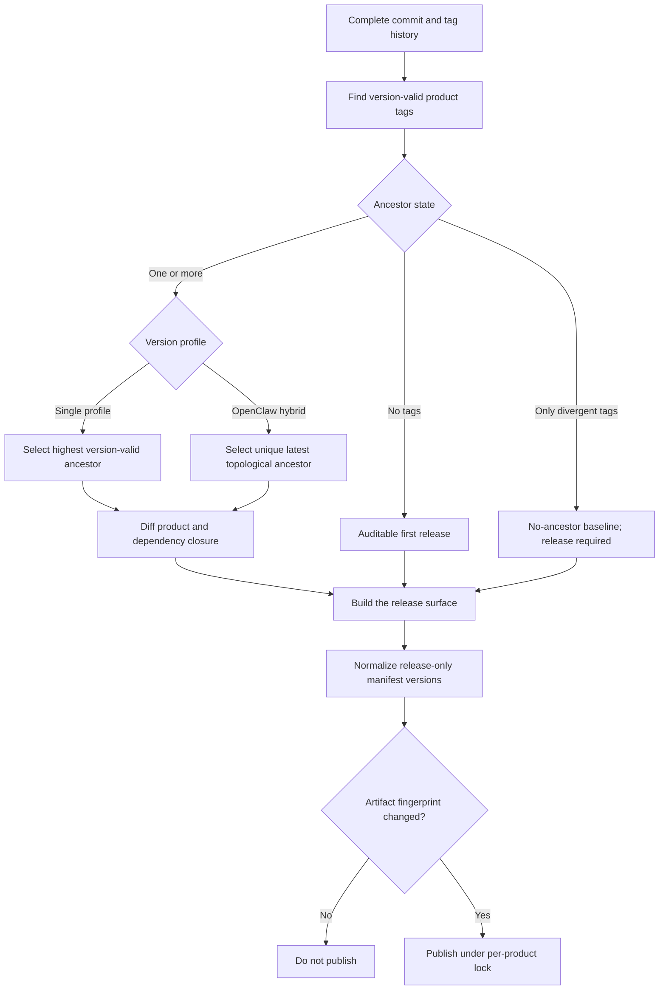



# Releases and Upgrades

Standard Red Notes publishes several independently versioned products from one
repository. Select an asset by component, operating system, and architecture;
the repository-wide “Latest” pointer is reserved for desktop and is not a
complete product catalog.

## Release streams

| Component    | Release shape                                                                                        |
| ------------ | ---------------------------------------------------------------------------------------------------- |
| Desktop      | macOS DMG/ZIP, Windows NSIS, Linux AppImage/DEB; x64 and arm64                                       |
| Mobile       | Universal Android APK, Android AAB, and iOS device arm64 artifact                                    |
| `srn-client` | Native/standalone artifacts for Windows, Linux, and macOS on x64/arm64                               |
| `srn-server` | Native/standalone artifacts for Windows, Linux, and macOS on x64/arm64                               |
| `srn-admin`  | Native tool artifacts for the six OS/architecture targets and an in-container wrapper                |
| MCP bridge   | Release artifacts for the six OS/architecture targets                                                |
| Home server  | Release artifacts for the six OS/architecture targets                                                |
| OpenClaw     | One Node-any `.tgz`, manifest, checksums, and signed provenance; smoke-tested across the six targets |

Desktop and the rolling `srn-*` streams use namespaced component tags. OpenClaw
also supports explicit namespaced release tags. Non-desktop publishers are
configured not to take the repository-global Latest pointer.

## Verify before installation

1. Confirm the component tag and version.
2. Match the OS and CPU architecture.
3. Download the checksum/manifest supplied with that release.
4. Verify the cryptographic checksum.
5. Verify build provenance/attestation where published.
6. Inspect the package signature/notarization information for the platform.
7. Keep the previous installer and a current backup until the new version is
   verified.

For OpenClaw, GitHub build provenance can be checked with:

```bash
gh attestation verify srn-openclaw-<version>-node-any.tgz \
  --repo supermarsx/standard-red-notes
```

Do not install an asset merely because its filename contains the desired
architecture. Use the release manifest and checksum.

## Desktop and mobile

Desktop packages are produced by a complete builder matrix:

- macOS: DMG and ZIP for x64 and arm64;
- Windows: NSIS for x64 and arm64; and
- Linux: AppImage and Debian packages for x64 and arm64.

Mobile CI validates native payload architectures. The Android universal package
contains `arm64-v8a` and `x86_64` libraries. The iOS package is a device arm64
build and must not contain simulator architecture.

Back up and complete sync before replacing a client. After upgrading, verify
sign-in, a recent note, a new note round trip, representative files, and
platform integrations such as the share target or automatic backups.

## Self-hosted upgrade sequence

1. Read release notes and dependency/schema changes.
2. Record current image digests and configuration.
3. Run a full database and file-storage backup.
4. Complete a restore test or confirm the most recent drill.
5. Validate configuration with `srn-server config` and
   `docker compose config`.
6. Pull/build the intended immutable versions.
7. Start dependencies, then application services.
8. Wait for migrations and readiness.
9. Run smoke checks for authentication, sync, files, revisions, WebSockets,
   admin, and enabled integrations.
10. Retain the previous artifacts until the observation window passes.

Avoid floating tags in production. An upgrade should identify exact images or
source revision so rollback is reproducible.

## Compatibility order

The safest order is:

1. make the server compatible with both old and new clients;
2. upgrade the server;
3. verify old clients still sync;
4. roll out new clients;
5. remove compatibility behavior only in a later controlled release.

MCP and OpenClaw are separate packages. Upgrade the MCP bridge and verify its
status/tools before upgrading OpenClaw.

## Rollback

Application rollback and data rollback are different:

- Reinstalling an older binary may be safe if the storage schema is backward
  compatible.
- Restoring an old database loses changes made after the snapshot.
- An older client may not understand items created by a newer editor.
- Rolling back the database without matching file storage can orphan metadata
  or blobs.

When schema compatibility is unknown, stop writes, preserve the failed state,
and restore the database and file store as one recovery point. Follow [Backups
and Recovery](backups-and-recovery.md).

## Repository release contracts

`yarn release:contract` validates workflow coverage, target matrices, asset
conventions, Latest-pointer behavior, OpenClaw provenance, and mobile native
architectures. The release workflows remain the publishing authority; a local
contract pass proves configuration consistency, not that a remote release
completed.

Every publisher checks complete Git history and tags before it compares the
current source with a release. Single-profile streams select the highest
version-valid tag that is an ancestor of the commit being built. OpenClaw's
mixed rolling/SemVer stream instead selects the unique latest ancestor by
commit topology, so a later explicit SemVer release cannot be shadowed by a
numerically larger older rolling tag. Incomparable hybrid release ancestors
fail closed. A tag on another branch is never used as a diff base; it is listed
as a divergent off-history tag in the machine result and audit report. A manual
force is accepted only with a non-empty reason, which is preserved in the
result.

Tag validity is product-specific:

- rolling products accept only `srn-<product>-vYY.N`, without prerelease or
  build metadata;
- mobile and independent workspace-package tags require full SemVer and allow
  valid SemVer prerelease/build metadata; and
- OpenClaw accepts its rolling `YY.N` identity or a full SemVer identity for
  the documented explicit-tag path.

For OpenClaw, `YY.N` and `YY.N.0` would produce the same internal package
version. If both identities exist, analysis stops with a release-version
collision instead of guessing which artifact is authoritative.

Numeric components are compared at arbitrary precision, so a very large
version cannot be rounded into another tag during baseline selection.



Fingerprints are calculated from the built release surface, not from a package
version alone. Bundled tools therefore include their compiled dependency
closure; desktop, mobile, and OpenClaw normalize release-only manifest versions;
and the home-server fingerprint covers both its executable bundle and every
shipped migration.

Run `yarn release:report` from a complete clone to write:

- `release-impact.json`, the machine-readable product and workspace audit; and
- `release-impact.md`, the same audit as readable tables.

The release-contract workflow uploads both files and adds the Markdown report
to its job summary. The managed-product table includes all eight publishers.
The workspace table separately inventories all 44 manifests discovered through
the root, app, and server Yarn workspace declarations. It deliberately excludes
the two standalone managed CLI manifests, `cli/srn-client/package.json` and
`cli/srn-server/package.json`; those have their own table and are already
represented by `srn-client` and `srn-server` in the eight-product table.

Each Yarn workspace has its own tag prefix, latest matching tag, selected
ancestor baseline, change reasons, and one of these categories:

- `release-managed`: an `srn-*` workflow explicitly owns the product;
- `publishable-unmanaged`: the manifest is not private, but this repository has
  no publisher for it; or
- `private`: the package manifest prevents registry publication.

`publishable-unmanaged` is inventory metadata, not an npm publishing promise.
In particular, the report does not infer or create publishing for upstream
`@standardnotes/*` packages.
