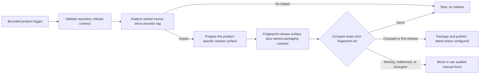
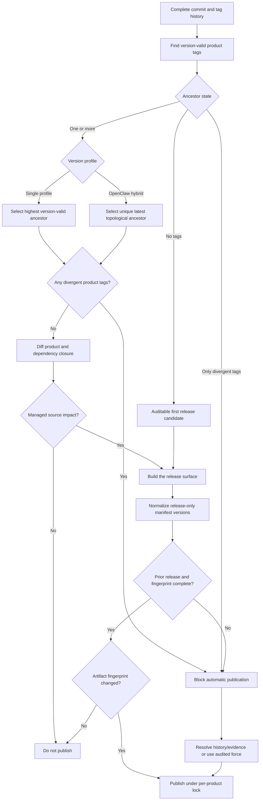
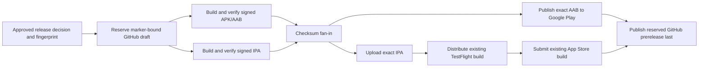



# Releases and Upgrades

Standard Red Notes publishes several independently versioned products from one
repository. Select an asset by component, operating system, and architecture;
the repository-wide “Latest” pointer is reserved for desktop and is not a
complete product catalog.

## Release streams

| Component             | Release shape                                                                                        |
| --------------------- | ---------------------------------------------------------------------------------------------------- |
| Desktop               | macOS DMG/ZIP, Windows NSIS, Linux AppImage/DEB; x64 and arm64                                       |
| Mobile                | Universal Android APK/AAB with four ABIs, plus an arm64-only iOS device artifact                     |
| `srn-client`          | Native/standalone artifacts for Windows, Linux, and macOS on x64/arm64                               |
| `srn-server`          | Native/standalone artifacts for Windows, Linux, and macOS on x64/arm64                               |
| `srn-admin`           | Native tool artifacts for the six OS/architecture targets and an in-container wrapper                |
| MCP bridge            | Release artifacts for the six OS/architecture targets                                                |
| Home server           | Release artifacts for the six OS/architecture targets                                                |
| OpenClaw              | One Node-any `.tgz`, manifest, checksums, and signed provenance; smoke-tested across the six targets |
| App/server containers | One coordinated, attested GHCR pair for `linux/amd64`, identified by source commit and CI run        |

Desktop and the rolling `srn-*` streams use namespaced component tags. OpenClaw
also supports explicit namespaced release tags. Non-desktop publishers are
configured not to take the repository-global Latest pointer.

## Verify before installation

1. Confirm the component tag and version.
2. Match the OS and CPU architecture.
3. Download the checksum/manifest supplied with that release.
4. Verify the cryptographic checksum.
5. Verify build provenance/attestation where published.
6. Inspect the package signature/notarization information for the platform.
7. Keep the previous installer and a current backup until the new version is
   verified.

For OpenClaw, GitHub build provenance can be checked with:

```bash
gh attestation verify srn-openclaw-<version>-node-any.tgz \
  --bundle srn-openclaw-<version>-node-any.provenance.sigstore.json \
  --repo supermarsx/standard-red-notes \
  --source-digest <40-character-release-source-commit> \
  --signer-workflow supermarsx/standard-red-notes/.github/workflows/srn-openclaw.yml
```

Do not install an asset merely because its filename contains the desired
architecture. Use the release manifest and checksum.

## Paired GHCR app/server containers

Trusted-main CI promotes the exact container bytes that passed the required
stack and hardening checks to these packages:

- `ghcr.io/supermarsx/standard-red-notes-app`
- `ghcr.io/supermarsx/standard-red-notes-server`

Select the same unique, non-floating
`sha-<40-character-commit>-run-<run-id>.<producer-attempt>` tag for both. The
workflow does not publish floating `main` or `latest` tags. This initial stream
is `linux/amd64` only. A tag is retry-stable rather than registry-enforced
immutable: consume it only after `publish-containers` succeeds and its summary
lists both immutable digest-qualified references. A failed partial tag is not a
release.

GHCR packages start private unless an owner changes their visibility. Private
pulls require `docker login ghcr.io` with narrowly scoped `read:packages`
access; public packages need no registry credentials. Production rollouts
should use the two digest-qualified references from one successful workflow
summary, because the app and server have different manifest digests even though
they share one coordinated tag.

The normal setup `--up` path remains a clean-checkout source build. Registry
deployment is explicit and uses `APP_IMAGE`, `SERVER_IMAGE`, and
`docker compose up --no-build`; see [Deploy a verified GHCR image
pair](self-hosting.md#deploy-a-verified-ghcr-image-pair) for the complete pull,
architecture, readiness, and rollback procedure.

## Desktop and mobile

Desktop packages are produced by a complete builder matrix:

- macOS: DMG and ZIP for x64 and arm64;
- Windows: NSIS for x64 and arm64; and
- Linux: AppImage and Debian packages for x64 and arm64.

Mobile CI validates signatures and the complete native payload. Both Android
artifacts must contain exactly `armeabi-v7a`, `arm64-v8a`, `x86`, and `x86_64`;
each ABI must expose the same normalized native-library path set. CI verifies
the APK signature and AAB JAR signature before either store is contacted. The
iOS IPA must pass deep code-signature verification, and every extracted Mach-O
file must contain exactly the device `arm64` architecture with no simulator
slice.

Back up and complete sync before replacing a client. After upgrading, verify
sign-in, a recent note, a new note round trip, representative files, and
platform integrations such as the share target or automatic backups.

## Self-hosted upgrade sequence

1. Read release notes and dependency/schema changes.
2. Record current image digests and configuration.
3. Run a full database and file-storage backup.
4. Complete a restore test or confirm the most recent drill.
5. Validate configuration with `srn-server config` and
   `docker compose config`.
6. Pull/build the intended immutable versions. For GHCR, select both digest
   references from one coordinated app/server run.
7. Start dependencies, then application services.
8. Wait for migrations and readiness.
9. Run smoke checks for authentication, sync, files, revisions, WebSockets,
   admin, and enabled integrations.
10. Retain the previous artifacts until the observation window passes.

Avoid floating tags in production. An upgrade should identify exact images or
source revision so rollback is reproducible.

## Compatibility order

The safest order is:

1. make the server compatible with both old and new clients;
2. upgrade the server;
3. verify old clients still sync;
4. roll out new clients;
5. remove compatibility behavior only in a later controlled release.

MCP and OpenClaw are separate packages. Upgrade the MCP bridge and verify its
status/tools before upgrading OpenClaw.

## Rollback

Application rollback and data rollback are different:

- Reinstalling an older binary may be safe if the storage schema is backward
  compatible.
- Restoring an old database loses changes made after the snapshot.
- An older client may not understand items created by a newer editor.
- Rolling back the database without matching file storage can orphan metadata
  or blobs.

When schema compatibility is unknown, stop writes, preserve the failed state,
and restore the database and file store as one recovery point. Follow [Backups
and Recovery](backups-and-recovery.md).

For a container-only rollback, restore both previous app/server digest
references together and start with `--no-build --pull never`. Never use
`docker compose down -v`; it destroys the volumes needed for either a forward
repair or a controlled data restore.

## Repository release contracts

`yarn release:contract` validates workflow coverage, target matrices, asset
conventions, Latest-pointer behavior, OpenClaw provenance, mobile native
architectures, and the executable packaging contract used by each publisher.
The release workflows remain the publishing authority; a local contract pass
proves configuration consistency, not that a remote release completed.
The public release-policy commands install the exact parser dependency from
`scripts/package-lock.json` before analysis. CI and every publisher use the same
`npm ci --prefix scripts --ignore-scripts --no-audit --no-fund` boundary, so a
developer, pull request, and release runner interpret JavaScript release policy
with the same pinned `@babel/parser` version.

The packaging contract is active, shipped release functionality.
Every one of the eight publisher workflows validates the complete contract
before its impact analyzer runs. A publisher then applies two independent
gates:

1. **Source impact:** compare the product's owned package and dependency closure
   with its ancestry-selected release tag. Unrelated changes stop here.
2. **Release identity:** compute the product-specific release surface together
   with its canonical packaging inputs. Native, desktop, and OpenClaw include
   built or extracted payloads. Mobile uses a deterministic pre-sign
   source/configuration/toolchain fingerprint, then independently verifies and
   checksums the signed APK, AAB, and IPA before publication. An unchanged
   identity stops before publication.



The canonical document in
`scripts/release-packaging-contract.mjs` is serialized deterministically and
versioned independently from the raw workflow text. Therefore a comment,
display-name, or permissions-only workflow edit can trigger validation without
inventing a product release. Material changes to a named product contract,
resolved toolchain metadata, build configuration, target set, or output command
change its fingerprint. Missing selected inputs and malformed normalization
requests fail closed.

For the five native command-line products, fingerprinting and packaging consume
the same canonical invocation set. It contains all six target/output names, the
embedded Node runtime, exact `@yao-pkg/pkg` version and flags, executable, and
arguments. Tests capture every invocation and the validator prevents the
executor from bypassing the fingerprinted set. The home-server's migrations ZIP
is a product-specific supplemental invocation, so changing it affects the home
server without forcing sibling native products to publish.

The executor and packaging-policy modules use a canonical semantic AST instead
of their raw source bytes. Comments and formatting disappear from that identity;
a product-local semantic change releases only its owner, shared native behavior
releases all five native products, and shared cross-product policy releases all
eight managed products. An unparseable or structurally ambiguous change fails
closed instead of being guessed into a smaller scope.

{% include safety-alert.html
  level="caution"
  title="The native semantic baseline has a one-time migration"
  body="The v4 semantic identity supersedes the legacy v3 exact-byte native executor identity. The first comparison against a v3 baseline may conservatively release all five native products once because the old evidence cannot prove product-level equivalence. After that v4 baseline exists, comments and formatting release nothing, product-local semantics release only their product, and shared native semantics fan out to all five. Do not suppress the migration with force or by replacing prior fingerprint assets."
%}

Desktop fingerprints each extracted `app.asar` runtime and unpacked payload
with the app lockfile, Yarn patches/releases, shared build configuration,
desktop manifests, exact matrix arguments, resolved Electron and
electron-builder versions, and Node version. The desktop contract additionally
binds fixed builder flags, runner labels, action references, Python, Corepack,
and signing auto-discovery behavior.

Mobile fingerprints the generated Android and iOS JavaScript, embedded web
bundle, native Android/iOS source inputs, app and Ruby lockfiles, native version
files, and mobile/shared build configuration. Its named contract binds Android
and iOS architectures, Java/Ruby/Xcode versions, runner labels, action
commit SHAs, Corepack, and the exact Fastlane publication commands. This is a
pre-sign deterministic input fingerprint, not a claim that signing keys or the
resulting signed bytes were unchanged. The signed artifacts receive their own
signature, identity, architecture, checksum, and fan-in checks.

OpenClaw fingerprints the extracted npm payload and the packaging implementation
used to create it. Package version and only four volatile release-identity
fields in `release-package.json` (`tag`, `version`, `sourceCommit`, and
`sourceDate`) are normalized. The remaining manifest semantics, package scripts,
runtime dependencies, README, license, Node/Yarn/Corepack versions, and pinned
action commits remain release-significant.

All external `uses:` references in publisher workflows are commit-SHA pinned.
The nearby version comment is checked against the repository allowlist for
readability, but is intentionally excluded from product fingerprints; changing
only that human label cannot invent a release. Changing the pinned action SHA is
release-significant.

{% include safety-alert.html
  level="danger"
  title="External release state is outside a Git fingerprint"
  body="Signing certificates, Android keystores, App Store credentials, repository secrets, and the concrete VM image behind a runner label can change without changing Git. Publisher actions are commit-pinned, but those other external values remain outside the pre-publication fingerprint. Audit them before a manual force. force_release bypasses comparison evidence only: it does not override an existing tag or GitHub Release and does not make app-store calls transactional. For mobile, reuse the exact validated artifact when reconciling a partial store publication, or choose a new version; never replace published bytes under an existing identity. Verify signatures, checksums, and OpenClaw provenance before rollout."
%}

Every pull request and every push to `main` runs the normal `CI` workflow with a
complete checkout and fetched tags. Its contracts job writes and uploads one
repository-wide `release-impact.json` plus `release-impact.md`, even when no
release is due. This job is evidence-only: it contains no GitHub Release,
Fastlane, registry, or app-store publisher.

Actual publishers remain separate, per-product workflows. Each has a bounded
`main` path trigger and an ancestry-aware source gate. The contract validator
computes the current dependency closure from the workspace manifests and fails
if a workflow's static path list no longer covers every package directory and
release-build configuration file in that closure. Renamed files are evaluated
as a deletion plus an addition, so moving a source file out of a managed
package cannot hide its removal from the release decision.

Every publisher checks complete Git history and tags before it compares the
current source with a release. Single-profile streams select the highest
version-valid tag that is an ancestor of the commit being built. OpenClaw's
mixed rolling/SemVer stream instead selects the unique latest ancestor by
commit topology, so a later explicit SemVer release cannot be shadowed by a
numerically larger older rolling tag. Incomparable hybrid release ancestors
fail closed. Every version-valid tag on another branch is listed as a divergent
off-history tag; the report separately identifies only those that are newer
than the selected baseline. Any divergent release line sets the visible
publication gate to `blocked-release-history`; it is diagnostic evidence, never
permission to publish from an older baseline.

Shared release-analysis, comparison, fingerprint, and validation scripts are
normal-CI contract inputs, not product payloads. Changing one runs the
repository report and focused release-contract checks. The canonical packaging
contract is semantically partitioned by product, while the native executor is
partitioned across the five native command-line publishers. Those changes can
wake the owning workflows for evaluation, but a wake-up is not a release: each
publisher compares only its applicable semantic partition and built surface
with its prior fingerprint.

`scripts/package.json` and `scripts/package-lock.json` are different: they pin
the interpreter used to derive those semantic partitions and are explicit
configuration inputs for all eight publishers. A parser dependency change
therefore changes all eight release identities by design. The workflow still
requires a valid ancestry-selected baseline and exact fingerprint comparison;
it does not publish merely because a path filter fired.

Tag validity is product-specific:

- rolling products accept only `srn-<product>-vYY.N`, without prerelease or
  build metadata;
- production mobile accepts only an exact `@standardnotes/web@X.Y.Z` source tag
  matching the web manifest's stable core SemVer. Prerelease/build metadata,
  partial versions, and leading-zero numeric identifiers are rejected; and
- OpenClaw accepts its rolling `YY.N` identity or a full SemVer identity for
  the documented explicit-tag path.

For OpenClaw, `YY.N` and `YY.N.0` would produce the same internal package
version. The rolling allocator skips an `N` already reserved by an explicit
stable `YY.N.0` tag. If both identities are introduced outside that allocator,
analysis stops with a release-version collision instead of guessing which
artifact is authoritative.

Numeric components are compared at arbitrary precision, so a very large
version cannot be rounded into another tag during baseline selection.

### Retry-safe native publication

Each rolling native publisher allocates one stable `YY.N` identity in a
dedicated `identity` job and creates or reuses the matching draft GitHub
Release. The package job receives that exact version, tag, release ID, and
reuse decision instead of allocating a second identity. Before upload, the
release job verifies the draft's tag, title, target commit, and expected marker;
it refuses published releases, existing Git tags, and incompatible drafts.

Impact analysis authorizes only the exact current `origin/main` commit. Release
identity allocation and publication are protected by the
`release-production` environment, and intermediate packages are retained for 30
days so a failed fan-in has bounded recovery evidence. Before publication, the
downloaded executables run on all six promised OS/architecture combinations:
Windows x64/arm64, Linux x64/arm64, and macOS x64/arm64. Each smoke leg rejects
the wrong binary format or architecture, clears network proxy variables, and
requires the exact offline `--srn-release-self-test` response.

Before the first asset deletion or upload, the release binds the sorted
name/SHA-256/size manifest to the validated draft with a canonical
`srn-release-assets-sha256` marker. Assets are then uploaded with `--clobber`;
the workflow requires the exact expected asset-name set, downloads the remote
assets again, and compares their hashes with the local validated files. Only
after those checks pass does it publish the draft with `make_latest=false`. A
rerun therefore repairs the same manifest-bound draft rather than silently
incrementing to a new `YY.N` or publishing a mixture of old and new assets.

OpenClaw uses a separate attestation-first publisher with the same stable-draft
principle. Its identity job creates or adopts exactly one draft bound to the
source commit, package fingerprint, and retry intent. The attestation job writes
a Sigstore bundle into the checksummed payload and verifies that bundle against
the exact repository, source commit, and signer workflow. Publication rechecks
the local bundle, exact five-file inventory, checksums, fingerprint, draft
marker, and remote API digests before a final draft PATCH. A rerun may replace
assets only on that same validated draft; stale, duplicate, or ambiguous
reservations fail closed.

OpenClaw branch and manual rolling releases require the exact protected
`origin/main` head. An explicit tag release requires the checked-out commit to
equal the tag target and that commit to be an ancestor of protected `main`.
Identity allocation, provenance attestation, and publication use the protected
`release-production` environment, and recovery artifacts are retained for 30
days.

The root desktop publisher is the canonical change-gated route and publishes
the six GitHub installer legs. The embedded app desktop workflow is an audited,
manual-only recovery path that additionally handles Snap. It requires an
explicit confirmation and bounded reason. If Snapcraft reports an existing
revision for the version, recovery stops: the available Snapcraft metadata does
not prove remote byte equality, so version/channel identity alone is not
accepted as idempotency evidence.

The root publisher deliberately retains an empty automatic draft when a build
fails after identity allocation, so rerunning failed jobs for the same source
continues to use the original release ID. Before a different source or release
intent allocates its identity, the publisher may delete at most one superseded
reservation. It first proves from the complete release inventory and a second
immutable-ID read that the tag, title, source commit, and single automatic
marker agree; the release must still be authored by the canonical GitHub
Actions bot and be a tagless, unpublished, mutable, non-prerelease draft with no
assets. It refreshes the inventory, checks the Git tag, and refetches the exact
release ID immediately before deletion. A forced, populated, published,
immutable, duplicate, malformed, tagged, or concurrently changed reservation
detected by those checks is refused and requires manual reconciliation. GitHub
does not provide a conditional release DELETE, so those checks minimize but
cannot absolutely exclude a mutation in the final GET-to-DELETE interval;
release-write authority must remain tightly restricted.

Both routes authorize the exact protected `origin/main` head before building;
release identity and remote mutation jobs use the protected
`release-production` environment, and all handoff artifacts are retained for 30
days. Their fan-in rejects updater metadata unless every entry names an exact
installer basename and matches its byte size and Base64 SHA-512. Legacy
`path`/`sha512`/`size` entries remain accepted only under the same checks. The
verifier reads actual formats and architectures rather than trusting filenames:
PE for Windows, ELF for AppImage, Mach-O app executables inside ZIP/DMG, and DEB
control metadata plus every shipped ELF executable or shared object. Every
published architecture must have exactly one matching updater entry, and an
opposite-architecture or mislabeled artifact fails the release.



Fingerprints are calculated from a product-specific deterministic release
surface plus canonical packaging inputs, not from a package version alone.
Bundled tools therefore include their compiled dependency closure and exact
executable invocation set; desktop includes extracted runtime payloads and
deterministic toolchain/configuration inputs; mobile fingerprints its pre-sign
source/configuration/toolchain surface and later validates the signed bytes;
OpenClaw normalizes only release-identity fields; and the home-server fingerprint
covers its executable bundle, every shipped migration, and the
migrations-archive invocation.

All eight publishers use the same fail-closed comparison contract:

| State                                                                | Automatic result                                           |
| -------------------------------------------------------------------- | ---------------------------------------------------------- |
| No version-valid product tag exists                                  | Treat as an auditable first release                        |
| Selected ancestor and every expected fingerprint asset matches       | Skip publication                                           |
| Selected ancestor and at least one valid fingerprint differs         | Continue to package and publish                            |
| Selected ancestor plus any version-valid off-history product tag     | Block; reconcile histories or use an audited manual force  |
| Matching tags exist but none is an ancestor                          | Block; do not create another divergent release             |
| Selected GitHub release is unavailable                               | Block; do not interpret an API/network failure as a change |
| Selected GitHub release is still a draft                             | Block; drafts are not published fingerprint baselines      |
| Expected fingerprint asset is missing, malformed, or incomplete      | Block; preserve explicit comparison evidence               |
| Manual force is requested with a non-empty reason and publish intent | Bypass comparison under the product's non-cancelling lock  |

The comparator queries the exact ancestry-selected tag, not the repository's
global Latest pointer and not a separately sorted release list. Its JSON
evidence records `release-first`, `release-changed`, `skip-unchanged`,
`release-forced`, or `blocked`. A blocked comparison exits unsuccessfully
before any tag, GitHub Release, Fastlane lane, or external publisher runs.
`force_release` is accepted only from `workflow_dispatch`; push and tag events
cannot synthesize it. Its reason is trimmed, must be one printable line, and is
limited to 500 characters.

### Managed products and fingerprint ownership

| Product      | Automatic source trigger                                         | Release baseline                 | Compared release surface                                             |
| ------------ | ---------------------------------------------------------------- | -------------------------------- | -------------------------------------------------------------------- |
| `srn-client` | `cli/srn-client/**` plus its release/build configuration         | `srn-client-vYY.N`               | Bundle plus the six canonical native invocations                     |
| `srn-server` | `cli/srn-server/**` plus its release/build configuration         | `srn-server-vYY.N`               | Bundle plus the six canonical native invocations                     |
| MCP bridge   | MCP workspace and root dependency/build configuration            | `srn-mcp-vYY.N`                  | Bundle plus the six canonical native invocations                     |
| Home server  | Server workspace                                                 | `srn-home-server-vYY.N`          | Bundle, migrations, six native invocations, and migrations ZIP       |
| `srn-admin`  | Server workspace                                                 | `srn-admin-vYY.N`                | Bundle plus the six canonical native invocations                     |
| OpenClaw     | OpenClaw workspace and root dependency/build configuration       | namespaced rolling/SemVer tag    | Normalized npm payload, packaging implementation, and pinned tooling |
| Desktop      | App workspaces and shared app build configuration                | `srn-desktop-vYY.N`              | Six runtime payloads plus lock/config/toolchain/target inputs        |
| Mobile       | Exact 18-package app dependency closure plus shared build config | `@standardnotes/mobile@<semver>` | Native/web payloads plus lock/config/toolchain/publication inputs    |

All rows also include the shared release-policy dependency manifest and lock.
Changing that parser boundary is intentionally global; ordinary source changes
remain constrained to the product ownership shown above.

### Mobile: impact is not publication intent

Mobile has two deliberately separate decisions:

1. A bounded `main` push touching the computed mobile dependency closure runs
   source-impact analysis and uploads its evidence. It cannot invoke the
   version, fingerprint, Android, iOS, or release jobs.
2. Publication requires either an `@standardnotes/web@*` tag or a manual
   dispatch with `publish_release=true`. A manual force additionally requires
   `force_release=true` and a non-empty `force_reason`.

Branch analysis and manual publication authorize only the exact fetched
`origin/main` head. A web-tag publication additionally proves that the tag
resolves to the event commit and that this commit is an ancestor of protected
`origin/main`; its version must exactly match the stable web manifest. Every job
that reserves a release, handles Android/iOS signing, or mutates GitHub or a
store runs through the protected `mobile-production` environment.

The established Fastlane contract uses the stable core version from
`app/packages/web/package.json` as iOS `MARKETING_VERSION`, Android
`versionName`, and the `@standardnotes/mobile@<version>` GitHub tag. A web-tag
publication request must match that manifest version. Before any store call,
the workflow creates or adopts only the prerelease draft carrying the exact
run/source/version/fingerprint intent marker. An unowned release, a tag without
that recoverable release record, or a conflicting target is rejected.
`force_release` bypasses fingerprint comparison only and cannot override those
ownership checks. The workflow-created mobile tag is not a trigger, preventing
a recursive release. These checks do not make branch analysis an app-store
publisher.

The production workflow builds both signed platforms before any store API is
called. Their checksum fan-in feeds four distinct publication stages: Android
AAB upload, iOS binary upload, TestFlight external distribution, and App Store
submission. The final GitHub prerelease waits for Android publication and iOS
submission.



The iOS upload, distribution, and submission lanes are deliberately disjoint.
A failed distribution or submission can resume from the exact existing app
version and build number without uploading another binary. Every publication
job redownloads the fan-in artifact and rechecks its checksum; Android also
publishes the exact AAB path from that payload. Validated build payloads and the
same-run GitHub, Google Play, App Store upload, TestFlight distribution, and App
Store submission intent markers are retained for exactly 30 days.

{% include safety-alert.html
  level="danger"
  title="Mobile stores do not share one transaction"
  body="Google Play, App Store Connect, TestFlight review, App Store review, and GitHub Releases can accept work independently. An API timeout can leave a successful remote operation that the runner did not observe. Before retrying, inspect the exact Android versionName/versionCode and AAB hash or the exact iOS app version/build/review state. Use GitHub's rerun-failed-jobs operation so only the failed job and its dependent jobs resume from the same 30-day evidence. NEVER rerun all jobs or rebuild signed bytes under the same identity. The workflow reserves a marker-bound GitHub draft before the first store mutation and a same-run retry adopts only that exact draft. Exact same-run store intent markers can reconcile an already-completed upload, TestFlight group/review operation, or App Store submission; missing, conflicting, stale, duplicate, or ambiguous evidence fails closed. force_release never overrides those ownership checks."
%}

Run `yarn release:report` from a complete clone to write the same evidence
locally:

- `release-impact.json`, the machine-readable product and workspace audit; and
- `release-impact.md`, the same audit as readable tables.

Normal CI and the focused release-contract workflow both add the Markdown
report to their job summaries and upload both files. The managed-product table
includes all eight publishers. The workspace table separately inventories all
44 manifests discovered through the root, app, and server Yarn workspace
declarations. It deliberately excludes the two standalone managed CLI
manifests, `cli/srn-client/package.json` and
`cli/srn-server/package.json`; those have their own table and are already
represented by `srn-client` and `srn-server` in the eight-product table.

Each Yarn workspace has one of these categories:

- `release-managed`: an `srn-*` workflow explicitly owns the product;
- `publishable-unmanaged`: the manifest is not private, but this repository has
  no publisher for it; or
- `private`: the package manifest prevents registry publication.

Only `release-managed` rows receive a tag baseline and managed source-impact
decision. `publishable-unmanaged` and `private` rows are `inventory-only`,
carry `changed: null`, and have no inferred release tag or baseline.
`publishable-unmanaged` means only that the manifest is not private; it is not
an npm publishing promise. The report does not infer or create publishing for
upstream `@standardnotes/*` packages.
