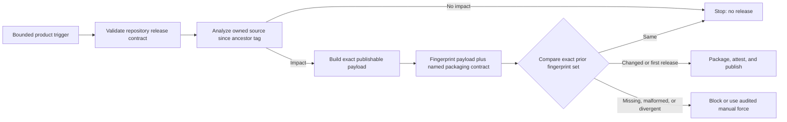
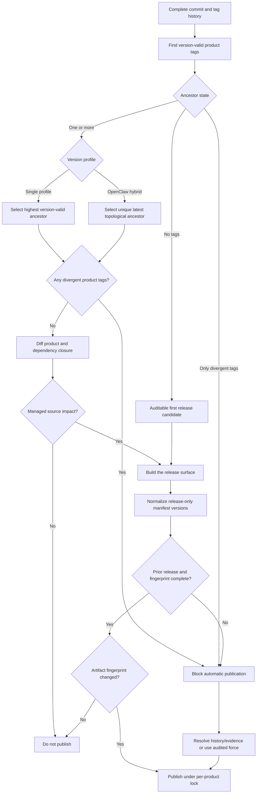



# Releases and Upgrades

Standard Red Notes publishes several independently versioned products from one
repository. Select an asset by component, operating system, and architecture;
the repository-wide “Latest” pointer is reserved for desktop and is not a
complete product catalog.

## Release streams

| Component    | Release shape                                                                                        |
| ------------ | ---------------------------------------------------------------------------------------------------- |
| Desktop      | macOS DMG/ZIP, Windows NSIS, Linux AppImage/DEB; x64 and arm64                                       |
| Mobile       | Universal Android APK, Android AAB, and iOS device arm64 artifact                                    |
| `srn-client` | Native/standalone artifacts for Windows, Linux, and macOS on x64/arm64                               |
| `srn-server` | Native/standalone artifacts for Windows, Linux, and macOS on x64/arm64                               |
| `srn-admin`  | Native tool artifacts for the six OS/architecture targets and an in-container wrapper                |
| MCP bridge   | Release artifacts for the six OS/architecture targets                                                |
| Home server  | Release artifacts for the six OS/architecture targets                                                |
| OpenClaw     | One Node-any `.tgz`, manifest, checksums, and signed provenance; smoke-tested across the six targets |

Desktop and the rolling `srn-*` streams use namespaced component tags. OpenClaw
also supports explicit namespaced release tags. Non-desktop publishers are
configured not to take the repository-global Latest pointer.

## Verify before installation

1. Confirm the component tag and version.
2. Match the OS and CPU architecture.
3. Download the checksum/manifest supplied with that release.
4. Verify the cryptographic checksum.
5. Verify build provenance/attestation where published.
6. Inspect the package signature/notarization information for the platform.
7. Keep the previous installer and a current backup until the new version is
   verified.

For OpenClaw, GitHub build provenance can be checked with:

```bash
gh attestation verify srn-openclaw-<version>-node-any.tgz \
  --repo supermarsx/standard-red-notes
```

Do not install an asset merely because its filename contains the desired
architecture. Use the release manifest and checksum.

## Desktop and mobile

Desktop packages are produced by a complete builder matrix:

- macOS: DMG and ZIP for x64 and arm64;
- Windows: NSIS for x64 and arm64; and
- Linux: AppImage and Debian packages for x64 and arm64.

Mobile CI validates native payload architectures. The Android universal package
contains `arm64-v8a` and `x86_64` libraries. The iOS package is a device arm64
build and must not contain simulator architecture.

Back up and complete sync before replacing a client. After upgrading, verify
sign-in, a recent note, a new note round trip, representative files, and
platform integrations such as the share target or automatic backups.

## Self-hosted upgrade sequence

1. Read release notes and dependency/schema changes.
2. Record current image digests and configuration.
3. Run a full database and file-storage backup.
4. Complete a restore test or confirm the most recent drill.
5. Validate configuration with `srn-server config` and
   `docker compose config`.
6. Pull/build the intended immutable versions.
7. Start dependencies, then application services.
8. Wait for migrations and readiness.
9. Run smoke checks for authentication, sync, files, revisions, WebSockets,
   admin, and enabled integrations.
10. Retain the previous artifacts until the observation window passes.

Avoid floating tags in production. An upgrade should identify exact images or
source revision so rollback is reproducible.

## Compatibility order

The safest order is:

1. make the server compatible with both old and new clients;
2. upgrade the server;
3. verify old clients still sync;
4. roll out new clients;
5. remove compatibility behavior only in a later controlled release.

MCP and OpenClaw are separate packages. Upgrade the MCP bridge and verify its
status/tools before upgrading OpenClaw.

## Rollback

Application rollback and data rollback are different:

- Reinstalling an older binary may be safe if the storage schema is backward
  compatible.
- Restoring an old database loses changes made after the snapshot.
- An older client may not understand items created by a newer editor.
- Rolling back the database without matching file storage can orphan metadata
  or blobs.

When schema compatibility is unknown, stop writes, preserve the failed state,
and restore the database and file store as one recovery point. Follow [Backups
and Recovery](backups-and-recovery.md).

## Repository release contracts

`yarn release:contract` validates workflow coverage, target matrices, asset
conventions, Latest-pointer behavior, OpenClaw provenance, mobile native
architectures, and the executable packaging contract used by each publisher.
The release workflows remain the publishing authority; a local contract pass
proves configuration consistency, not that a remote release completed.

The packaging contract is active, shipped release functionality.
Every one of the eight publisher workflows validates the complete contract
before its impact analyzer runs. A publisher then applies two independent
gates:

1. **Source impact:** compare the product's owned package and dependency closure
   with its ancestry-selected release tag. Unrelated changes stop here.
2. **Built release identity:** build the selected product and hash its shipped
   payload together with that product's canonical packaging inputs. An
   unchanged result stops before packaging or publication.



The canonical document in
`scripts/release-packaging-contract.mjs` is serialized deterministically and
versioned independently from the raw workflow text. Therefore a comment,
display-name, or permissions-only workflow edit can trigger validation without
inventing a product release. Material changes to a named product contract,
resolved toolchain metadata, build configuration, target set, or output command
change its fingerprint. Missing selected inputs and malformed normalization
requests fail closed.

For the five native command-line products, fingerprinting and packaging consume
the same canonical invocation set. It contains all six target/output names, the
embedded Node runtime, exact `@yao-pkg/pkg` version and flags, executable, and
arguments. Tests capture every invocation and the validator prevents the
executor from bypassing the fingerprinted set. The home-server's migrations ZIP
is a product-specific supplemental invocation, so changing it affects the home
server without forcing sibling native products to publish.

Desktop fingerprints each extracted `app.asar` runtime and unpacked payload
with the app lockfile, Yarn patches/releases, shared build configuration,
desktop manifests, exact matrix arguments, resolved Electron and
electron-builder versions, and Node version. The desktop contract additionally
binds fixed builder flags, runner labels, action references, Python, Corepack,
and signing auto-discovery behavior.

Mobile fingerprints the generated Android and iOS JavaScript, embedded web
bundle, native Android/iOS source inputs, app and Ruby lockfiles, native version
files, and mobile/shared build configuration. Its named contract binds Android
and iOS architectures, Java/Ruby/Xcode versions, runner labels, action
references, Corepack, and the exact Fastlane publication commands.

OpenClaw fingerprints the extracted npm payload and the packaging implementation
used to create it. Package version and only four volatile release-identity
fields in `release-package.json` (`tag`, `version`, `sourceCommit`, and
`sourceDate`) are normalized. The remaining manifest semantics, package scripts,
runtime dependencies, README, license, Node/Yarn/Corepack versions, and pinned
action commits remain release-significant.

{% include safety-alert.html
  level="danger"
  title="External release state is outside a Git fingerprint"
  body="Signing certificates, Android keystores, App Store credentials, repository secrets, and the concrete VM image behind a runner label can change without changing Git. Most publisher action references are version tags, so their resolved action commit can also move; OpenClaw's critical action references are commit-pinned. These external-only changes do not necessarily change the pre-publication fingerprint. Audit them and use workflow_dispatch force_release with a non-empty reason, plus publish_release for mobile, when replacement artifacts are required. Verify the resulting signatures, checksums, and provenance before rollout."
%}

Every pull request and every push to `main` runs the normal `CI` workflow with a
complete checkout and fetched tags. Its contracts job writes and uploads one
repository-wide `release-impact.json` plus `release-impact.md`, even when no
release is due. This job is evidence-only: it contains no GitHub Release,
Fastlane, registry, or app-store publisher.

Actual publishers remain separate, per-product workflows. Each has a bounded
`main` path trigger and an ancestry-aware source gate. The contract validator
computes the current dependency closure from the workspace manifests and fails
if a workflow's static path list no longer covers every package directory and
release-build configuration file in that closure. Renamed files are evaluated
as a deletion plus an addition, so moving a source file out of a managed
package cannot hide its removal from the release decision.

Every publisher checks complete Git history and tags before it compares the
current source with a release. Single-profile streams select the highest
version-valid tag that is an ancestor of the commit being built. OpenClaw's
mixed rolling/SemVer stream instead selects the unique latest ancestor by
commit topology, so a later explicit SemVer release cannot be shadowed by a
numerically larger older rolling tag. Incomparable hybrid release ancestors
fail closed. Every version-valid tag on another branch is listed as a divergent
off-history tag; the report separately identifies only those that are newer
than the selected baseline. Any divergent release line sets the visible
publication gate to `blocked-release-history`; it is diagnostic evidence, never
permission to publish from an older baseline.

Shared release-analysis, comparison, fingerprint, and validation scripts are
normal-CI contract inputs, not product payloads. Changing one runs the
repository report and focused release-contract checks. The canonical packaging
contract is also an explicit publisher configuration input, while the native
executor is an input only for the five native command-line publishers. Those
changes can wake the owning workflows for evaluation, but a wake-up is not a
release: each publisher selects only its named/product-specific contract and
still skips when the built payload and canonical inputs match its prior
fingerprint.

Tag validity is product-specific:

- rolling products accept only `srn-<product>-vYY.N`, without prerelease or
  build metadata;
- mobile and independent workspace-package tags require full SemVer and allow
  valid SemVer prerelease/build metadata; and
- OpenClaw accepts its rolling `YY.N` identity or a full SemVer identity for
  the documented explicit-tag path.

For OpenClaw, `YY.N` and `YY.N.0` would produce the same internal package
version. The rolling allocator skips an `N` already reserved by an explicit
stable `YY.N.0` tag. If both identities are introduced outside that allocator,
analysis stops with a release-version collision instead of guessing which
artifact is authoritative.

Numeric components are compared at arbitrary precision, so a very large
version cannot be rounded into another tag during baseline selection.



Fingerprints are calculated from the built release surface plus canonical
packaging inputs, not from a package version alone. Bundled tools therefore
include their compiled dependency closure and exact executable invocation set;
desktop and mobile add deterministic toolchain/configuration inputs; OpenClaw
normalizes only release-identity fields; and the home-server fingerprint covers
its executable bundle, every shipped migration, and the migrations-archive
invocation.

All eight publishers use the same fail-closed comparison contract:

| State                                                                | Automatic result                                           |
| -------------------------------------------------------------------- | ---------------------------------------------------------- |
| No version-valid product tag exists                                  | Treat as an auditable first release                        |
| Selected ancestor and every expected fingerprint asset matches       | Skip publication                                           |
| Selected ancestor and at least one valid fingerprint differs         | Continue to package and publish                            |
| Selected ancestor plus any version-valid off-history product tag     | Block; reconcile histories or use an audited manual force  |
| Matching tags exist but none is an ancestor                          | Block; do not create another divergent release             |
| Selected GitHub release is unavailable                               | Block; do not interpret an API/network failure as a change |
| Selected GitHub release is still a draft                             | Block; drafts are not published fingerprint baselines      |
| Expected fingerprint asset is missing, malformed, or incomplete      | Block; preserve explicit comparison evidence               |
| Manual force is requested with a non-empty reason and publish intent | Bypass comparison under the product's non-cancelling lock  |

The comparator queries the exact ancestry-selected tag, not the repository's
global Latest pointer and not a separately sorted release list. Its JSON
evidence records `release-first`, `release-changed`, `skip-unchanged`,
`release-forced`, or `blocked`. A blocked comparison exits unsuccessfully
before any tag, GitHub Release, Fastlane lane, or external publisher runs.
`force_release` is accepted only from `workflow_dispatch`; push and tag events
cannot synthesize it. Its reason is trimmed, must be one printable line, and is
limited to 500 characters.

### Managed products and fingerprint ownership

| Product      | Automatic source trigger                                         | Release baseline                 | Compared release surface                                             |
| ------------ | ---------------------------------------------------------------- | -------------------------------- | -------------------------------------------------------------------- |
| `srn-client` | `cli/srn-client/**` plus its release/build configuration         | `srn-client-vYY.N`               | Bundle plus the six canonical native invocations                     |
| `srn-server` | `cli/srn-server/**` plus its release/build configuration         | `srn-server-vYY.N`               | Bundle plus the six canonical native invocations                     |
| MCP bridge   | MCP workspace and root dependency/build configuration            | `srn-mcp-vYY.N`                  | Bundle plus the six canonical native invocations                     |
| Home server  | Server workspace                                                 | `srn-home-server-vYY.N`          | Bundle, migrations, six native invocations, and migrations ZIP       |
| `srn-admin`  | Server workspace                                                 | `srn-admin-vYY.N`                | Bundle plus the six canonical native invocations                     |
| OpenClaw     | OpenClaw workspace and root dependency/build configuration       | namespaced rolling/SemVer tag    | Normalized npm payload, packaging implementation, and pinned tooling |
| Desktop      | App workspaces and shared app build configuration                | `srn-desktop-vYY.N`              | Six runtime payloads plus lock/config/toolchain/target inputs         |
| Mobile       | Exact 18-package app dependency closure plus shared build config | `@standardnotes/mobile@<semver>` | Native/web payloads plus lock/config/toolchain/publication inputs     |

### Mobile: impact is not publication intent

Mobile has two deliberately separate decisions:

1. A bounded `main` push touching the computed mobile dependency closure runs
   source-impact analysis and uploads its evidence. It cannot invoke the
   version, fingerprint, Android, iOS, or release jobs.
2. Publication requires either an `@standardnotes/web@*` tag or a manual
   dispatch with `publish_release=true`. A manual force additionally requires
   `force_release=true` and a non-empty `force_reason`.

The established Fastlane contract uses the stable core version from
`app/packages/web/package.json` as iOS `MARKETING_VERSION`, Android
`versionName`, and the `@standardnotes/mobile@<version>` GitHub tag. A web-tag
publication request must match that manifest version, and an existing mobile
tag is rejected. The workflow-created mobile tag is not a trigger, preventing a
recursive release. These checks do not make branch analysis an app-store
publisher.

Run `yarn release:report` from a complete clone to write the same evidence
locally:

- `release-impact.json`, the machine-readable product and workspace audit; and
- `release-impact.md`, the same audit as readable tables.

Normal CI and the focused release-contract workflow both add the Markdown
report to their job summaries and upload both files. The managed-product table
includes all eight publishers. The workspace table separately inventories all
44 manifests discovered through the root, app, and server Yarn workspace
declarations. It deliberately excludes the two standalone managed CLI
manifests, `cli/srn-client/package.json` and
`cli/srn-server/package.json`; those have their own table and are already
represented by `srn-client` and `srn-server` in the eight-product table.

Each Yarn workspace has one of these categories:

- `release-managed`: an `srn-*` workflow explicitly owns the product;
- `publishable-unmanaged`: the manifest is not private, but this repository has
  no publisher for it; or
- `private`: the package manifest prevents registry publication.

Only `release-managed` rows receive a tag baseline and managed source-impact
decision. `publishable-unmanaged` and `private` rows are `inventory-only`,
carry `changed: null`, and have no inferred release tag or baseline.
`publishable-unmanaged` means only that the manifest is not private; it is not
an npm publishing promise. The report does not infer or create publishing for
upstream `@standardnotes/*` packages.
