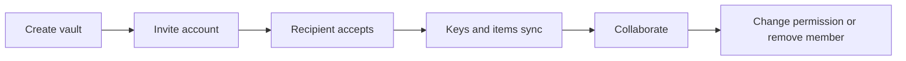

# Sharing and Collaboration

Standard Red Notes has two distinct sharing models:

- **Shared vaults** use authenticated membership and server-enforced
  permissions.
- **Public share links** intentionally give link holders access to the shared
  payload.

Choose the model before sharing. A public link is not a shortcut for a managed
team vault.





## Shared vault lifecycle

The vault creator receives administrative permission. Invitations carry one of
the permissions enforced by the syncing server:

| Permission | Intended capability |
| --- | --- |
| `read` | Read synchronized vault content without saving content changes |
| `write` | Read and edit normal vault content |
| `admin` | Manage vault-level structures and membership operations in addition to content |

Use `read` unless the recipient needs to modify content. Reserve `admin` for
people who should manage the shared space.

## Inviting a collaborator

1. Confirm that shared vaults are enabled for the account.
2. Create or open the intended vault.
3. Enter the recipient’s account identity carefully.
4. Select the minimum permission.
5. Send the invitation and wait for explicit acceptance.
6. Add only the intended notes and files.
7. Verify from a second account that the permission behaves as expected.

Invitations, acceptance, permission changes, and removal are synchronized
operations. Allow both clients to complete sync before diagnosing a missing
vault.

## Encryption and membership

Clients handle the cryptographic material needed for authorized vault members.
The server enforces membership and permission rules when accepting item
changes. This means:

- a modified client cannot turn `read` permission into accepted writes;
- removing a member blocks future authorized sync;
- moving an item between vaults changes its sharing boundary; and
- a former member may still possess plaintext or screenshots obtained while
  access was valid.

Revocation controls future access; it cannot retract knowledge.

## Realtime collaboration

Shared-vault members with current `write` or `admin` permission—including the
note creator—can join the end-to-end encrypted live relay for co-editing,
presence, and comments. The gateway sees room membership and message
timing/size, but it relays only ciphertext and cannot read note updates or
comments.

Members with `read` permission, read-only account sessions, and read-scoped MCP
sessions cannot mint a live-room capability. They retain ordinary encrypted
sync and can view content their vault permission allows; they simply do not
receive or inject live editor, presence, or comment frames.

Room capabilities expire after 300 seconds by default and deployments may set
`COLLABORATION_CAPABILITY_TTL_SECONDS` to a whole number from 30 through 900.
The gateway refuses invalid values. A removed or downgraded member cannot renew,
and the short expiry bounds how long an already-issued capability can be replayed.
Each account may hold 16 simultaneous realtime sockets by default; operators may
set `WEBSOCKET_MAX_CONNECTIONS_PER_USER` to another positive whole number. This
allows normal tabs and devices while bounding per-account connection fan-out.

WebSocket delivery is best-effort, not the durable record. Local edits and
comments persist through ordinary encrypted item sync, so a gateway outage
falls back to normal save/sync behavior and reconnecting editors can converge
again.

If collaborators see stale content:

1. stop simultaneous edits;
2. confirm each account still has vault membership;
3. run manual sync on every client;
4. inspect conflict copies before deleting anything;
5. check WebSocket and sync service health; and
6. confirm that an administrator has not disabled realtime for the user.

## Comments and mentions

Mention candidates are derived from shared-vault users, and display names are
resolved by the client. A mention does not grant access. If a person is not a
member of the vault, mentioning them must not be treated as an invitation or
permission change.

## Public share links

Public shares are suited to publishing or sending a bounded item to someone who
does not have a Standard Red Notes account. Anyone who obtains a valid link may
be able to retrieve the shared data.

Before creating a link:

- remove unrelated content and attachments;
- understand whether the link expires;
- decide whether one-time burn behavior is appropriate;
- assume the recipient can save a copy;
- avoid placing the link in searchable or broadly logged channels; and
- revoke the link when its purpose ends.

Burn-after-reading behavior makes the first successful retrieval significant.
Do not use it for the only copy of important information, and use a separate
channel to confirm that the intended recipient consumed it.

## Survivor designation and removal

The member UI exposes **Designate survivor**, not a general manual ownership
transfer. If the vault owner’s account is later deleted, ownership passes to
that designated survivor. Deleting the vault itself does not trigger a transfer;
it deletes the vault.

Before deleting an owner account or removing members:

1. create an encrypted account export;
2. add the intended survivor and verify they can open representative notes and
   files;
3. use **Designate survivor** in the vault member UI;
4. confirm pending invitations and current permissions;
5. sync from two independent clients; and
6. only then delete the owner account, if account deletion is truly intended.

Member removal and vault deletion remain separate high-impact operations.
Neither can retract plaintext a former member already copied.

## Operational controls

An administrator can enable shared-vault creation per user. That entitlement is
separate from membership inside a particular vault. Admin user-management
actions are described in [Administration](administration.md).

For conflict handling and deletion semantics, see [Sync and Data
Lifecycle](sync-and-data-lifecycle.md). For link and credential risk, see
[Security and Account](security-and-account.md).
