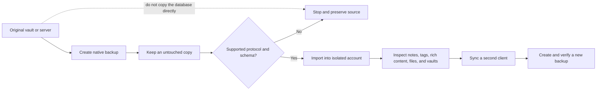

# Standard Notes Compatibility

Standard Red Notes is a fork of the Standard Notes client/server architecture,
but it is **not documented or tested as a drop-in replacement for every
Standard Notes release**. Compatibility depends on the exact client, server,
protocol version, backup shape, and content types involved.



This audit describes what the current repository proves. It does not turn
source-level similarity into an interoperability guarantee. Last audited:
2026-07-30.



## Status key

Confirmed
means a current repository contract or focused test directly exercises the
stated behavior. It does not imply compatibility with an untested external
release.

Conditional
means the formats or endpoints align in source, but success depends on a
specific version pair, content set, or deployment setting that is not covered
by an upstream-to-fork end-to-end test.

One-way / export-only
means the result is useful for reading or migration but is not a complete native
vault that can restore all metadata and features.

Fork-specific
means Standard Red Notes adds or changes the behavior. Do not expect an original
Standard Notes client or server to implement it.

Unverified / incompatible
means the repository has no supporting interoperation test, the upstream
product documents a conflicting limitation, or the path is unsafe enough that
it must be treated as unsupported.

## Compatibility matrix

| Scenario | Status | What the evidence supports |
| --- | --- | --- |
| Read/write encryption protocol versions `001`–`004` inside this fork | Confirmed | The models declare all four versions, the encryption service registers them, and operator tests cover each implementation. Versions `001` and `002` are expired for normal account use even though import/decryption code remains. |
| Current fork encrypted backup exported and re-imported by the current fork | Confirmed | Backup creation, classification, decryption, import, and a live fork-to-fork encrypted round-trip have repository coverage. |
| Original Standard Notes native backup imported into Standard Red Notes | Conditional | The importer recognizes the native `version`, `keyParams`/`auth_params`, and `items` shape and rejects unsupported/newer protocol versions. Detector tests use synthetic examples; the repository has no captured upstream backup fixture or current upstream-to-fork restore test. |
| Standard Red Notes native backup imported into an original Standard Notes client | Conditional | Plain core items and protocol `004` follow familiar shapes, but fork-only content types, editor nodes, and settings may not be understood. No fork-to-upstream restore test is present. |
| Original desktop/mobile client pointed at a Standard Red Notes server | Conditional | The fork retains modern and legacy auth/sync response factories and pinned wire constants. Original Standard Notes documents custom sync-server configuration for desktop/mobile, but this exact server/client pairing is not tested here. |
| Original production web app pointed at a custom server | Incompatible path | Standard Notes documents that its production web app cannot use a custom sync server. A self-built client is a different, version-specific scenario. |
| Standard Red Notes client pointed at the hosted Standard Notes service | Unverified | No live test targets the hosted service. Fork-specific API calls and entitlement assumptions make a successful sign-in insufficient evidence of safe operation. |
| Markdown, TXT, PDF, DOCX, ODT, or `srn-client` content export | One-way / export-only | These are readable escape formats, not complete encrypted-account backups. They can omit item keys, revisions, permissions, collaboration state, and other metadata. |
| AI, OCR, public shares, MCP, app passwords, workflows, and expanded administration | Fork-specific | These flows use fork endpoints, settings, or trust boundaries. They are not an original-client compatibility surface. |
| Direct reuse of an original Standard Notes server database or volumes | Treat as incompatible | No supported database migration, rollback, or cross-server fixture was found. Server migrations in this repository evolve the fork’s own schema. Use client-level export/import instead. |
| Protocol versions newer than `004` or future upstream content types | Unverified | The importer deliberately rejects unsupported versions. Re-audit the exact releases before moving data. |

## Backups and imports

The native backup model is a JSON object containing `items` and optionally
`version`, `keyParams`, or legacy `auth_params`. The current importer:

- classifies encrypted, decrypted, legacy-encrypted, and corrupt backup shapes;
- accepts protocol versions registered by the encryption service;
- refuses a backup newer than the destination account;
- decrypts root keys, items keys, and vault keys when the required password is
  available; and
- preserves still-encrypted payloads instead of silently discarding them.

That is meaningful format support, but the only explicit “Standard Notes
backup” detector tests in this repository construct small synthetic JSON
objects. They are not fixture captures from a released original client.



The official Standard Notes documentation also describes encrypted and
decrypted native backups and import. Use that as an upstream-format baseline,
not as proof for this fork:
[Standard Notes backup and import documentation](https://standardnotes.com/help/14/how-do-i-create-and-import-backups-of-my-standard-notes-data).

### What to test after import

Do not rely on an item count alone. Open and modify samples from every class
that matters:

1. plain notes and nested tags;
2. Super notes with tables, tasks, embeds, code, or attachments;
3. files, previews, and download/decrypt behavior;
4. protected notes and local locks;
5. revisions and trash;
6. vault membership, invitations, and permissions;
7. items that intentionally remain local-only; and
8. a newly created note synced to a second client.

Create a new encrypted backup from the destination only after those checks
pass. Retain the untouched source backup until the migration has survived a
restore drill.

## Clients and servers

The server contains auth and sync response factories for API versions
`20161215`, `20190520`, `20200115`, and `20240226`. The app declares
`20200115` and `20240226`, and the response package pins HTTP methods, status
codes, error tags, sync parameters, and conflict values as wire contracts.
Those are strong code-level continuity signals.

They are not a client/server certification matrix. This repository has no
end-to-end job that runs a released original Standard Notes client against the
fork server, or the fork client against the hosted Standard Notes service.
There is also no configured upstream Git remote or immutable upstream commit
pairing from which to infer one.

Standard Notes currently documents that its desktop and mobile clients can use
a custom sync server, while its production web app cannot:
[Standard Notes custom sync-server guidance](https://standardnotes.com/help/47/can-i-self-host-standard-notes).
That tells you where configuration exists; it does not prove this fork
implements every endpoint expected by a particular client release.



## Content, features, and local-only data

Core item names such as `Note`, `Tag`, `SN|ItemsKey`, and related encrypted
payload structures remain recognizable. Compatibility becomes less certain as
content moves away from that core:

- **Plain notes and tags:** conditionally compatible. Test Unicode, nested
  organization, references, protected notes, and revisions.
- **Super/rich notes:** conditionally compatible. The fork keeps the
  `com.standardnotes.super-editor` feature identifier but adds custom editor
  nodes and behaviors. Unknown serialized nodes can lose rendering or editing
  fidelity in another client.
- **Folders:** fork-specific in the current model. The client emits a literal
  `Folder` content type and the server explicitly accepts it; an older
  tag-hierarchy migration does not make new folder items portable.
- **Files and vaults:** unverified across original/fork clients. Validate key
  handling, download, permissions, and deletion with a disposable account.
- **Fork settings and services:** AI/OCR configuration, public shares, MCP
  credentials, workflows, expanded administration, and related server records
  should not be expected to transfer.
- **Local-only items:** fork-enforced client behavior, not a portable
  server-side promise. The local-only flag is stored in decrypted app data and
  the fork sync service excludes such items. Do not open the same datastore
  with an untested client and assume it will honor that rule.



## Safe migration playbooks

### Original Standard Notes to Standard Red Notes

1. Update and fully sync the original client.
2. Create both an encrypted native backup and, for essential notes, a readable
   escape export.
3. Copy both artifacts to independent protected storage; do not modify the
   originals.
4. Create an isolated Standard Red Notes account that is not pointed at the
   production vault.
5. Import the native backup and record all warnings or encrypted-item reports.
6. Complete the content checklist above, sync another fork client, then export
   and re-import a fresh encrypted backup.
7. Move production only after defining rollback and keeping the source
   read-only for an agreed retention period.

### Standard Red Notes to original Standard Notes

1. Export an encrypted native backup and a decrypted/readable escape copy.
2. Assume fork-specific items and settings will not transfer.
3. Import into a disposable original account running the exact intended client
   version.
4. Compare representative content manually, especially folders, rich editor
   blocks, files, vaults, and revisions.
5. If native import rejects or degrades content, use the readable export and
   accept that it is a content migration rather than a full vault restore.

### Moving between server deployments

Do not copy an original server database, Redis state, file volume, or secrets
into a Standard Red Notes deployment. No supported direct database conversion
was found. Keep both deployments intact and move data through a client-created
backup. For a same-fork infrastructure restore, follow
[Backups and Recovery](backups-and-recovery.md) instead.

## How to validate a version pair

Record the exact source and destination:

- client application name, version, platform, and build source;
- server version or image digest;
- account encryption protocol;
- backup `version` and whether `keyParams` or `auth_params` is present;
- content types and editor identifiers in the backup;
- enabled fork features; and
- test results for sign-in, sync, conflict, deletion, file, password/MFA, and
  restore flows.

A useful compatibility claim names that version pair and test scope. “Based on
Standard Notes” or “the login worked” is not sufficient evidence.

## Evidence reviewed

The status labels above are grounded in these repository contracts:

- Protocol declarations and expiration:
  `app/packages/models/src/Domain/Local/Protocol/ProtocolVersion.ts`
- Registered encryption versions and operators:
  `app/packages/services/src/Domain/Encryption/EncryptionService.ts` and
  `app/packages/encryption/src/Domain/Operator/{001,002,003,004}`
- Native backup model, creation, decryption, classification, and import:
  `app/packages/models/src/Domain/Abstract/Contextual/BackupFile.ts` and
  `app/packages/services/src/Domain/{Backup,Import}`
- Synthetic backup-shape tests:
  `app/packages/ui-services/src/Import/StandardNotesBackup.spec.ts`
- Fork backup tests:
  `app/packages/snjs/mocha/backups.test.js` and
  `mcp/src/e2e/backup-roundtrip.e2e.ts`
- Wire contracts:
  `app/packages/responses/src/Domain/WireConstants.spec.ts`
- Auth/sync response-version handling:
  `server/packages/auth/src/Domain/Auth` and
  `server/packages/syncing-server/src/Domain/Item/SyncResponse`
- Client storage migrations:
  `app/packages/snjs/lib/Services/Migration` and
  `app/packages/snjs/lib/Migrations`
- Feature and content identifiers:
  `app/packages/features/src/Domain/Feature/NativeFeatureIdentifier.ts`,
  `server/packages/domain-core/src/Domain/Common/ContentType.ts`, and
  `app/packages/models/src/Domain/Syncable/Folder/FolderContentType.ts`
- Local-only sync behavior:
  `app/packages/models/src/Domain/Utilities/Payload/PayloadIsLocalOnly.ts` and
  `app/packages/snjs/lib/Services/Sync/SyncService.ts`

The upstream security documentation currently identifies `004` as the latest
encryption specification:
[Standard Notes security documentation](https://standardnotes.com/help/security).
Re-check that page and the exact source revisions when auditing a future
version.

The largest evidence gap is deliberate and important: no test fixture or CI job
in this repository proves current original-client ↔ fork-server or
fork-client ↔ original-server interoperability. Until that matrix exists,
mixed deployments remain conditional or unverified.
