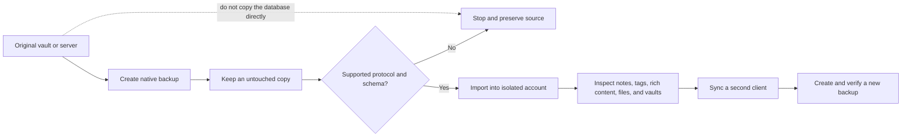

# Standard Notes Compatibility

Standard Red Notes is a fork of the Standard Notes client/server architecture,
but it is **not documented or tested as a drop-in replacement for every
Standard Notes release**. Compatibility depends on the exact client, server,
protocol version, backup shape, and content types involved.



This audit describes what the current repository proves. It does not turn
source-level similarity into an interoperability guarantee. The machine-readable
audit record is `docs/_data/standard_notes_compatibility.json`, and
`yarn docs:compatibility` fails when an audited source contract changes without
this matrix being reviewed. Last audited: 2026-07-31.

## Audited upstream snapshots

The comparison is pinned to immutable upstream revisions, not a floating idea
of “the latest Standard Notes”:

- Standard Notes app
  [`1e7ddb7c40a8d0e0d226301e071cc85d29288513`](https://github.com/standardnotes/app/tree/1e7ddb7c40a8d0e0d226301e071cc85d29288513)
- Standard Notes server
  [`31d2b8a092d8e85982c367197ffcf97cc07e2669`](https://github.com/standardnotes/server/tree/31d2b8a092d8e85982c367197ffcf97cc07e2669)

At those revisions, the fork's protocol enum, native `BackupFile` type,
operator dispatcher, API-version declarations, and auth/sync response-factory
resolvers are byte-identical after line-ending normalization. The fork's
importer, payload downgrade guard, `Folder` type, account recovery, and many
feature routes are not identical. Exact hashes are in the audit record so a
future change forces a fresh comparison.



## Status key

Confirmed inside this fork
means a current repository contract or focused test directly exercises the
stated behavior using fork components. It never means an untested original
client, original server, or upstream backup release is certified.

Conditional
means the formats or endpoints align in source, but success depends on a
specific version pair, content set, or deployment setting that is not covered
by an upstream-to-fork end-to-end test.

One-way / export-only
means the result is useful for reading or migration but is not a complete native
vault that can restore all metadata and features.

Fork-specific
means Standard Red Notes adds or changes the behavior. Do not expect an original
Standard Notes client or server to implement it.

Known incompatible boundary
means source or runtime evidence demonstrates that the full scenario cannot
work as stated. A smaller core-only subset can still be conditional.

Unverified
means no current cross-product test proves the scenario. Absence of a known
failure is not evidence of compatibility.

## Compatibility matrix

| Scenario                                                                                       | Status                                                                                                                          | What the evidence supports                                                                                                                                                                                                                                                                                                 |
| ---------------------------------------------------------------------------------------------- | ------------------------------------------------------------------------------------------------------------------------------- | -------------------------------------------------------------------------------------------------------------------------------------------------------------------------------------------------------------------------------------------------------------------------------------------------------------------------- |
| `001`/`002` key derivation and payload crypto inside this fork                                 | Confirmed inside this fork                              | Both legacy operators have fixed-ciphertext real-crypto tests, and versionless key-parameter inference is tested. `001` and `002` are expired for sign-in: the client requires an explicit warning confirmation and enforces minimum PBKDF costs; strict sign-in refuses them.                                             |
| Complete `001`/`002` native backup restored by the current fork                                | Conditional                                           | The importer accepts versionless pre-`003` envelopes and legacy `auth_params`, then dispatches to the registered operators. There is no full 001/002 native-backup import fixture exercising envelope, keys, items, relationships, and resync together.                                                                    |
| `003` native backup and mixed `003` payload/`004` key migration inside this fork               | Confirmed inside this fork                              | Client-generated `003` backup import and hard-coded real-crypto legacy payloads are exercised, including a `003` item plus an `004` items key. The fixture does not record an immutable original-client release provenance.                                                                                                |
| New registrations, passcodes, upgrades, and current native backup envelope                     | Confirmed inside this fork                              | `004` is the declared latest/default protocol. New native backups declare top-level version `004`. A still-legacy signed-in account can continue using its legacy default key until the security upgrade, so a `004` backup envelope does not prove every enclosed payload is `004`.                                       |
| Current fork encrypted backup exported and re-imported by the current fork                     | Confirmed inside this fork                              | Unit and SNJS harness coverage exercises complete encrypted backup contents and `003`/`004` restore. A live MCP round-trip harness also exists, but it skips when its server is unavailable and is not the upstream interoperation matrix.                                                                                 |
| Original Standard Notes native backup imported into Standard Red Notes                         | Conditional                                           | At the audited app snapshot, the protocol enum and native `BackupFile` shape are byte-identical. The fork importer recognizes `version`, `keyParams`/`auth_params`, and `items`, but no released original-client backup is captured with immutable version provenance and run through a current cross-product restore job. |
| Standard Red Notes core-only backup imported into an original Standard Notes client            | Conditional                                           | Core `004` notes/tags use the shared envelope, but the audited original importer discards non-vault payloads that remain encrypted. The fork deliberately preserves such ciphertext. Verify item-by-item and never treat an upstream import count as full-fidelity proof.                                                  |
| Full Standard Red Notes backup, including literal `Folder` items, synced to an original server | Known incompatible boundary                          | The audited original server's content-type allowlist has no `Folder`; its save rule returns `content_type_error`. Convert folders to supported tags or readable exports before migration. Other fork-only records also lack an upstream contract.                                                                          |
| Original Standard Notes Vaults backup imported into Standard Red Notes                         | Conditional                                           | Both codebases recognize core key-system/vault identifiers, and fork-to-fork real-crypto vault backup tests pass. There is no captured upstream Vaults backup or original-to-fork test for locked password vaults, shared-vault membership, invitations, permissions, and later key rotation.                              |
| Original desktop/mobile client pointed at a Standard Red Notes server                          | Conditional                                           | The audited API-version and response-resolver sources are byte-identical. `20240226` is an accepted marker that resolves to the `20200115 response shape`, not a separate response implementation. No current original-client ↔ fork-server end-to-end test covers sign-in through restore.                                |
| Original production web app pointed at a custom server                                         | Known incompatible boundary                          | Standard Notes documents that its production web app cannot use a custom sync server. A self-built client is a different, version-specific scenario.                                                                                                                                                                       |
| Standard Red Notes client pointed at an original or hosted Standard Notes server               | Known incompatible full feature set; core unverified | No live test targets the hosted service. The original server rejects `Folder`, and fork-only recovery, administration, assistant, MCP, sharing, and settings endpoints are absent. A core notes/tags sign-in is not proof that later sync, files, vaults, credential rotation, or restore is safe.                         |
| Markdown, TXT, PDF, DOCX, ODT, or `srn-client` content export                                  | One-way / export-only                                      | These are readable escape formats, not complete encrypted-account backups. They can omit item keys, revisions, permissions, collaboration state, and other metadata.                                                                                                                                                       |
| AI, OCR, public shares, MCP, app passwords, workflows, and expanded administration             | Fork-specific                                                | These flows use fork endpoints, settings, or trust boundaries. They are not an original-client compatibility surface.                                                                                                                                                                                                      |
| Optional Standard Red Notes account recovery used from an original client                      | Fork-specific                                                | The v2 ciphertext escrow, logged-out lookup, client-side root-key recovery, credential rotation, and replacement-code lifecycle are implemented by this fork. Original clients are not expected to enroll, recover, rotate, or invalidate this escrow correctly.                                                           |
| Direct reuse of an original Standard Notes server database or volumes                          | Known unsupported boundary                           | No supported database migration, rollback, or cross-server fixture was found. Server migrations in this repository evolve the fork’s own schema. Use client-level export/import instead.                                                                                                                                   |
| Protocol versions newer than `004` or unknown upstream content types                           | Unverified                                             | The importer deliberately rejects unsupported versions. Re-audit the exact releases before moving data.                                                                                                                                                                                                                    |

## Encryption protocol boundary

The repository recognizes versions `001`, `002`, `003`, and `004`, but that is
not the same as proving every historical backup or allowing the four formats to
be mixed arbitrarily:

- `001` and `002` keep both encrypt and decrypt operators because a signed-in
  legacy account and its payloads still need coherent behavior. Fixed legacy
  ciphertext and key-parameter inference are tested. Both protocols are
  expired: normal sign-in requires explicit consent and minimum PBKDF costs;
  strict sign-in refuses them. The repository has no complete `001` or `002`
  native-backup round-trip fixture.
- `003` is the last format before root-key-based items keys. It remains a
  working legacy account and migration source. Full backup tests cover a
  client-generated `003` account and hard-coded real-crypto payloads, including
  the transition where `003` content is unlocked by a same-version legacy key
  while newer key material is also present.
- `004` is the latest/default protocol for new root keys, new accounts,
  passcodes, protocol upgrades, and current items keys. The native backup
  envelope always declares `004`, even when it preserves older ciphertext from
  a legacy account. Inspect item prefixes and `keyParams.version`; do not infer
  a complete rewrite from the envelope alone.
- The fork adds a payload downgrade guard that is not present in the audited
  upstream `OperatorWrapper`. It refuses a payload whose claimed version is
  weaker than its trusted key version. A genuine migration must therefore
  select the matching legacy key; mismatches remain encrypted and are reported
  rather than silently decrypted under a weaker operator.



## Backups and imports

The native backup model is a JSON object containing `items` and optionally
`version`, `keyParams`, or legacy `auth_params`. That TypeScript model is
byte-identical to the audited upstream app snapshot. The current fork importer:

- classifies encrypted, decrypted, legacy-encrypted, and corrupt backup shapes;
- accepts only protocol versions registered by the encryption service;
- refuses a backup newer than the destination account;
- decrypts root keys, items keys, and vault keys when the required password is
  available; and
- preserves still-encrypted payloads instead of silently discarding them.

The last point is an intentional fork divergence. At the audited upstream app
snapshot, the original importer keeps decrypted items and encrypted
vault-scoped items, but drops other payloads that remain encrypted and reports
an error count. A fork backup can deliberately retain unreadable ciphertext for
later key recovery. Importing that artifact upstream can therefore omit those
records even though the JSON envelope itself is accepted.

For legacy `001`–`003` encrypted items, the importer must have the matching
legacy root key or derive it from the backup password and key parameters. For
`004`, items commonly reference items keys, vault keys, or key-system material;
having the account password alone does not make a malformed or incomplete
backup whole. Preserve every reported encrypted/error item and stop if key
records, vault membership, or attachments are missing.

That is meaningful format support, but evidence depth differs by version. The
explicit “Standard Notes backup” detector tests use small synthetic JSON
objects. Protocol `001` and `002` have fixed-ciphertext operator tests but no
complete backup fixture. Protocol `003` has client-generated backups and
hard-coded real-crypto import data, but the latter does not name an immutable
original-client build. Protocol `004` has fork-to-fork backup coverage. None of
those is a released-original-client-to-current-fork CI matrix.

The literal fork content type `Folder` is another hard boundary. The audited
original server does not list it in `ContentType.TYPES`; its content-type save
rule returns `content_type_error`. An original client may parse or retain an
unknown record locally, but that does not make the record syncable to the
original server.



The official Standard Notes documentation also describes encrypted and
decrypted native backups and import. Use that as an upstream-format baseline,
not as proof for this fork:
[Standard Notes backup and import documentation](https://standardnotes.com/help/14/how-do-i-create-and-import-backups-of-my-standard-notes-data).

### What to test after import

Do not rely on an item count alone. Open and modify samples from every class
that matters:

1. plain notes and nested tags;
2. Super notes with tables, tasks, embeds, code, or attachments;
3. files, previews, and download/decrypt behavior;
4. protected notes and local locks;
5. revisions and trash;
6. vault membership, invitations, and permissions;
7. items that intentionally remain local-only; and
8. a newly created note synced to a second client.

Create a new encrypted backup from the destination only after those checks
pass. Retain the untouched source backup until the migration has survived a
restore drill.

## Clients and servers

The server accepts API markers `20161215`, `20190520`, `20200115`, and
`20240226`. It does **not** implement four independent response formats. Auth
has concrete `20161215`, `20190520`, and `20200115` factories; sync has
`20161215` and `20200115` factories. Both resolvers map `20240226` to the
`20200115 response shape`. Those version declarations and resolvers are
byte-identical to the audited upstream server snapshot, while the response
package separately pins HTTP methods, status codes, error tags, sync parameters,
and conflict values.

The boundary is asymmetric: a compatible wire response does not mean a client
understands every item type, fork setting, recovery lifecycle, or permission.
Likewise, a client that can sign in and download ciphertext may still fail on a
later credential change, vault operation, file transfer, or conflict response.
Treat the client and server as a tested version pair, not independently
swappable components.

They are not a client/server certification matrix. This repository has no
end-to-end job that runs a released original Standard Notes client against the
fork server, or the fork client against the hosted Standard Notes service. The
repository's only Git remote is the fork; the immutable upstream revisions in
this page are audit inputs, not merge ancestry or a release certification.

The asymmetry has a demonstrated example. The fork server adds literal
`Folder` to its content-type allowlist; the audited original server does not.
Uploading that fork item to the original save rule produces
`content_type_error`. Conversely, an original client that never creates this
item may still reach core fork auth/sync endpoints, but that says nothing about
fork recovery, admin settings, local-only intent, files, or later vault flows.

Standard Notes currently documents that its desktop and mobile clients can use
a custom sync server, while its production web app cannot:
[Standard Notes custom sync-server guidance](https://standardnotes.com/help/47/can-i-self-host-standard-notes).
That tells you where configuration exists; it does not prove this fork
implements every endpoint expected by a particular client release.



## Content, features, and local-only data

Core item names such as `Note`, `Tag`, `SN|ItemsKey`, and related encrypted
payload structures remain recognizable. Compatibility becomes less certain as
content moves away from that core:

- **Plain notes and tags:** conditionally compatible. Test Unicode, nested
  organization, references, protected notes, and revisions.
- **Super/rich notes:** conditionally compatible. The fork keeps the
  `com.standardnotes.super-editor` feature identifier but adds custom editor
  nodes and behaviors. Unknown serialized nodes can lose rendering or editing
  fidelity in another client.
- **Folders:** fork-specific in the current model. The client emits a literal
  `Folder` content type and the fork server explicitly accepts it. The audited
  original server rejects that type. An older tag-hierarchy migration does not
  make new folder items portable.
- **Files:** unverified across original/fork clients. A note backup does not
  prove file bytes, upload sessions, quotas, download/decrypt, or deletion.
- **Vaults:** shared at the architectural level, not fork-only by name. Both
  snapshots include key-system root/items keys, vault listings, vault feature
  identifiers, and shared-vault fields. Fork tests prove fork-to-fork randomized
  and password-vault backup behavior. They do not prove a released original
  client's locked vault, membership/invite state, permissions, and later key
  rotation survive a cross-product migration.
- **Optional account recovery:** fork-specific. The escrow is a server-held
  ciphertext setting, but safe use also requires the fork's signed-in opt-in,
  one-time high-entropy code display, logged-out lookup, local decrypt/sign-in,
  atomic credential rotation, old-escrow invalidation, and replacement-code UI.
  An original client must not be assumed to preserve or invalidate that
  lifecycle. Original Standard Notes currently documents that an encryption
  password cannot be reset when no signed-in device or export remains; its 2FA
  recovery key is a different mechanism.
- **Fork settings and services:** AI/OCR configuration, public shares, MCP
  credentials, workflows, expanded administration, and related server records
  should not be expected to transfer.
- **Local-only items:** fork-enforced client behavior, not a portable
  server-side promise. The local-only flag is stored in decrypted app data and
  the fork sync service excludes such items. Do not open the same datastore
  with an untested client and assume it will honor that rule.



## Safe migration playbooks

### Original Standard Notes to Standard Red Notes

1. Update and fully sync the original client.
2. Create both an encrypted native backup and, for essential notes, a readable
   escape export.
3. Copy both artifacts to independent protected storage; do not modify the
   originals.
4. Create an isolated Standard Red Notes account that is not pointed at the
   production vault.
5. Record the backup envelope version, `keyParams`/`auth_params` version, and
   every content type before import. Import the native backup and save all
   warnings or still-encrypted item UUIDs.
6. Complete the content checklist above, sync another fork client, then export
   and re-import a fresh encrypted backup.
7. Move production only after defining rollback and keeping the source
   read-only for an agreed retention period.

Importing a backup does not transplant the source account credentials into the
destination account. If the original account itself still uses `001`–`003`,
first keep a pre-upgrade backup, then use a currently supported source client to
perform its security update and take a second backup. A new Standard Red Notes
account uses `004` when it re-encrypts imported content. Do not delete the
legacy source or pre-upgrade backup; the new backup proves only the destination.

### Standard Red Notes to original Standard Notes

1. Export an encrypted native backup and a decrypted/readable escape copy.
2. Assume fork-specific items and settings will not transfer.
3. Inventory and convert literal `Folder` items to supported tags or readable
   paths, and turn off local-only state only for items you intentionally want to
   migrate.
4. Import into a disposable original account running the exact intended client
   version.
5. Compare representative content manually, especially folders, rich editor
   blocks, files, vaults, and revisions.
6. Inspect sync conflicts for `content_type_error` and compare UUIDs, not only
   the displayed item count. The audited upstream importer can omit non-vault
   ciphertext it cannot decrypt.
7. If native import rejects or degrades content, use the readable export and
   accept that it is a content migration rather than a full vault restore.

Disable or separately record fork-specific automation and recovery before the
test. An original client will not reproduce MCP tokens, workflows, AI settings,
literal folders, local-only enforcement, or Standard Red Notes account-recovery
escrow. Never test by pointing an original client at the only live fork account.

### Moving between server deployments

Do not copy an original server database, Redis state, file volume, or secrets
into a Standard Red Notes deployment. No supported direct database conversion
was found. Keep both deployments intact and move data through a client-created
backup. For a same-fork infrastructure restore, follow
[Backups and Recovery](backups-and-recovery.md) instead.

## How to validate a version pair

Record the exact source and destination:

- client application name, version, platform, and build source;
- server version or image digest;
- account encryption protocol;
- backup `version` and whether `keyParams` or `auth_params` is present;
- counts of each item `content_type`, payload protocol prefix, and remaining
  encrypted/error item;
- content types and editor identifiers in the backup;
- enabled fork features; and
- test results for sign-in, sync, conflict, deletion, file, password/MFA, and
  restore flows.

A useful compatibility claim names that version pair and test scope. “Based on
Standard Notes” or “the login worked” is not sufficient evidence.



## Evidence reviewed

The status labels above are grounded in these repository contracts:

- Immutable upstream snapshot hashes and local parity hashes:
  `docs/_data/standard_notes_compatibility.json`
- Offline drift gate and regression tests:
  `scripts/validate-standard-notes-compatibility.mjs` and
  `scripts/validate-standard-notes-compatibility.test.mjs`

- Protocol declarations and expiration:
  `app/packages/models/src/Domain/Local/Protocol/ProtocolVersion.ts`
- Registered encryption versions and operators:
  `app/packages/services/src/Domain/Encryption/EncryptionService.ts` and
  `app/packages/encryption/src/Domain/Operator/{001,002,003,004}`
- Native backup model, creation, decryption, classification, and import:
  `app/packages/models/src/Domain/Abstract/Contextual/BackupFile.ts` and
  `app/packages/services/src/Domain/{Backup,Import}`
- Synthetic backup-shape detection tests:
  `app/packages/ui-services/src/Import/StandardNotesBackup.spec.ts`
- Legacy fixed-ciphertext/operator and backup-import fixtures:
  `app/packages/snjs/mocha/{001.test.js,002.test.js}` and
  `app/packages/snjs/mocha/model_tests/importing.test.js`
- Fork backup and vault-import harnesses:
  `app/packages/snjs/mocha/backups.test.js` and
  `app/packages/snjs/mocha/vaults/importing.test.js`
- Optional live fork backup harness:
  `mcp/src/e2e/backup-roundtrip.e2e.ts`
- Wire contracts:
  `app/packages/responses/src/Domain/WireConstants.spec.ts`
- Auth/sync response-version handling:
  `server/packages/auth/src/Domain/Auth` and
  `server/packages/syncing-server/src/Domain/Item/SyncResponse`
- Client storage migrations:
  `app/packages/snjs/lib/Services/Migration` and
  `app/packages/snjs/lib/Migrations`
- Feature and content identifiers:
  `app/packages/features/src/Domain/Feature/NativeFeatureIdentifier.ts`,
  `server/packages/domain-core/src/Domain/Common/ContentType.ts`, and
  `app/packages/models/src/Domain/Syncable/Folder/FolderContentType.ts`
- Local-only sync behavior:
  `app/packages/models/src/Domain/Utilities/Payload/PayloadIsLocalOnly.ts` and
  `app/packages/snjs/lib/Services/Sync/SyncService.ts`
- Optional account recovery and escrow invalidation:
  `app/packages/snjs/lib/Domain/UseCase/AccountRecovery`,
  `app/packages/web/src/javascripts/Components/Preferences/Panes/Security/AccountRecovery`,
  and `server/packages/auth/src/Domain/UseCase/GetAccountRecoveryEscrow`

The exact-parity claims were checked against these pinned primary sources:

- [upstream app protocol versions](https://github.com/standardnotes/app/blob/1e7ddb7c40a8d0e0d226301e071cc85d29288513/packages/models/src/Domain/Local/Protocol/ProtocolVersion.ts)
  and [native backup model](https://github.com/standardnotes/app/blob/1e7ddb7c40a8d0e0d226301e071cc85d29288513/packages/models/src/Domain/Abstract/Contextual/BackupFile.ts)
- [upstream app importer](https://github.com/standardnotes/app/blob/1e7ddb7c40a8d0e0d226301e071cc85d29288513/packages/services/src/Domain/Import/ImportData.ts)
- [upstream auth response resolver](https://github.com/standardnotes/server/blob/31d2b8a092d8e85982c367197ffcf97cc07e2669/packages/auth/src/Domain/Auth/AuthResponseFactoryResolver.ts)
  and [sync response resolver](https://github.com/standardnotes/server/blob/31d2b8a092d8e85982c367197ffcf97cc07e2669/packages/syncing-server/src/Domain/Item/SyncResponse/SyncResponseFactoryResolver.ts)
- [upstream server content types](https://github.com/standardnotes/server/blob/31d2b8a092d8e85982c367197ffcf97cc07e2669/packages/domain-core/src/Domain/Common/ContentType.ts)
  and [content-type save rule](https://github.com/standardnotes/server/blob/31d2b8a092d8e85982c367197ffcf97cc07e2669/packages/syncing-server/src/Domain/Item/SaveRule/ContentTypeFilter.ts)

The upstream security documentation currently identifies `004` as the latest
encryption specification:
[Standard Notes security documentation](https://standardnotes.com/help/security).
Its password-loss guidance states that the encryption password cannot be reset
without an already signed-in device/export path:
[Standard Notes password-loss guidance](https://standardnotes.com/help/6/i-ve-forgotten-my-password-what-should-i-do).
Re-check that page and the exact source revisions when auditing another
version.

The largest evidence gap is deliberate and important: no test fixture or CI job
in this repository proves current original-client ↔ fork-server or
fork-client ↔ original-server interoperability. Until that matrix exists,
mixed deployments remain conditional or unverified.
