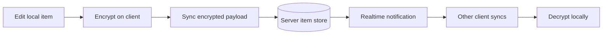

# Sync and Data Lifecycle

Standard Red Notes is local-first: a client maintains local state, encrypts
account items before transmission, and reconciles them through the sync
service. WebSocket delivery reduces latency, but the sync protocol remains the
source of truth.



## Data classes

| Data class | Local behavior | Server behavior |
| --- | --- | --- |
| Notes, tags, preferences, and vault metadata | Stored in the client database and decrypted for use | Encrypted item payloads are synchronized |
| Files | Encrypted/decrypted at the client boundary; temporary previews may exist on the device | Encrypted file bytes and transfer metadata are handled by the files service |
| Sessions and feature settings | Tokens or keys use platform-appropriate secure storage where available | Authentication, revocation, roles, limits, and gates are server-side |
| Revisions | Requested and decrypted by an authorized client | Historical encrypted item revisions are retained according to server policy |
| Local-only items | Exist only in the local client profile when marked before first upload | No server copy; the app refuses to newly mark an already-synced item local-only because suppressing future uploads cannot retract existing ciphertext |

## Local-only is a pre-upload boundary

Selective sync is safe only when chosen before an item first uploads. The
client enforces that boundary in the item mutator and in note, tag, folder, and
sync-preferences controls. Clearing local-only is always allowed and uploads the
item on the next sync.

Older clients may have allowed an already-synced item to be flagged local-only.
That stops later versions from uploading, but it does not erase the server copy
that already exists. Re-enable sync or treat that server copy according to the
server's normal deletion and retention policy; do not assume changing a local
flag remotely purged it.

## Normal sync cycle

1. A local edit marks an item dirty.
2. The client serializes and encrypts the item.
3. The sync request sends encrypted changes and a cursor/token describing the
   client’s last known server state.
4. The server validates authorization and shared-vault rules, stores accepted
   changes, and returns remote changes.
5. The client decrypts, validates, and persists the reconciled result.
6. Other connected clients receive a realtime hint and start their own sync.

Realtime is an accelerator. If WebSockets are unavailable or disabled for a
user, manual and periodic sync still work.

## Offline work

Edits can remain local while the network or server is unavailable. Before
signing out, deleting a browser profile, uninstalling a client, or replacing a
device:

1. Reconnect to the intended server.
2. Wait for sync to become idle and healthy.
3. Open several recently edited notes on another client.
4. Create an encrypted export.

Never assume that a visible local edit has reached the server merely because
the editor accepted it.

## Conflicts

Concurrent edits can produce a conflict when the client cannot safely merge
two versions. Preserve both versions until the intended content is confirmed.
A safe resolution sequence is:

1. Stop editing the note on other clients.
2. Copy both variants into temporary notes or an external encrypted workspace.
3. Compare them and create one authoritative version.
4. Sync that version, then confirm it on a second client.
5. Remove conflict copies only after verification.

Repeated conflicts usually point to a client that is offline for long periods,
an unstable connection, a stale session, or incompatible client versions.

## Shared vault sync

Shared-vault items carry a vault association. Server save rules enforce the
member’s `read`, `write`, or `admin` permission before accepting changes. A
client-side button is not the security boundary.

Membership changes can make locally cached content inaccessible. Removing a
member prevents future authorized sync, but it cannot make a recipient forget
plaintext they already saw or copied. See [Sharing and
Collaboration](sharing-and-collaboration.md).

## Revisions, trash, and deletion

These are separate recovery layers:

- **Revision history** preserves prior encrypted versions according to server
  policy and account entitlements.
- **Trash** is an application state that allows normal restoration before
  permanent deletion.
- **Permanent deletion** emits a deletion through sync so other clients remove
  the item.
- **Backups** are independent copies and may retain data after deletion from
  the live account.

Deletion from the live account does not automatically erase desktop backup
folders, exports, database dumps, email attachments, Nextcloud copies, recipient
devices, or logs that intentionally contain metadata. Retention must be handled
at every layer.

## Files

Files use dedicated upload/download flows rather than being embedded in a note
sync payload. When diagnosing a file problem, separate:

- the note or file metadata item;
- the encrypted blob in the file store;
- a temporary client-side decrypted preview; and
- a desktop file-backup copy.

A synchronized file reference with a missing blob is not a complete backup.
Recovery drills should include opening representative attachments.

## Sync health checks

- In a graphical client, inspect sync status and retry after confirming the
  server URL and network.
- In MCP, call `standard_red_notes_status`; it reports sign-in state,
  background-sync failures, and the last sync error.
- For the server edge, run `srn-server health --url <base-url>`.
- For internal service dependencies, use `srn-admin status` or the Admin
  **Server** tab; readiness can distinguish a running process from a service
  that cannot reach Redis or its database.

For incident diagnosis, see [Monitoring and
Troubleshooting](monitoring-and-troubleshooting.md). For independent copies,
see [Backups and Recovery](backups-and-recovery.md).
