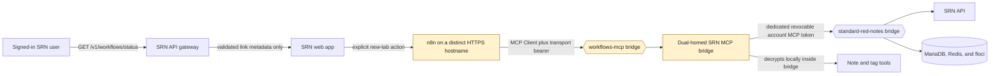

# Workflows with n8n



Standard Red Notes can reveal a validated link to an operator-managed n8n
instance. It does not embed n8n, proxy n8n traffic, create n8n users, or sign a
Standard Red Notes user in to n8n.



## What is implemented

| Capability | Current behavior |
| --- | --- |
| Discover n8n | `GET /v1/workflows/status` returns a validated public URL only when the operator and per-user gates are both on. |
| Open n8n | The web app asks for confirmation, then opens a new tab with `noopener,noreferrer`. |
| Authenticate to n8n | n8n owns the login and session. Standard Red Notes sends no cookie, bearer token, user identity, or pairing assertion. |
| Provision users or projects | Not performed by Standard Red Notes. Configure accounts, roles, projects, and sharing in n8n. |
| Connect n8n to notes | Manually connect n8n's MCP Client to the authenticated Standard Red Notes MCP bridge over its dedicated Compose network. |
| Revoke note access | Revoke the dedicated Standard Red Notes MCP credential, stop/restart the bridge to end its current session, and rotate the MCP transport bearer. |



The network boundary is intentional. The bundled n8n service joins only
`workflows-mcp`; it has no direct service-network route and cannot address
`server`, `db`, `cache`, or `floci` by Compose DNS. Like any external client, a
workflow can still call an endpoint intentionally exposed on the host or public
network. The MCP bridge is the only dual-homed service: it accepts authenticated
MCP calls on `workflows-mcp` and uses `standard-red-notes` to reach the API.
Core services never join `workflows-mcp`.

The two authentication layers in the diagram are intentionally different:

- `MCP_HTTP_TOKEN` protects the Streamable HTTP transport between n8n and the
  bridge.
- `STANDARD_RED_NOTES_MCP_TOKEN` authenticates the bridge to the notes account
  and carries its read or write scope.

Never reuse one value for both layers.

## Access model

Two Standard Red Notes gates control link discovery:

1. the operator sets `WORKFLOWS_ENABLED=true`; and
2. an administrator grants the user `WORKFLOWS_ENABLED`.

The gateway checks both on every status request. Turning either gate off hides
the link, but it does not terminate an n8n session or change an n8n account.
Perform those actions in n8n.

Treat the bundled n8n instance as shared and operator-managed unless your n8n
edition and configuration provide the project and sharing isolation you need.
n8n documents workflow sharing as an edition-dependent feature; review its
[current sharing availability and credential behavior](https://docs.n8n.io/workflows/sharing/)
before inviting users. In particular, a workflow's credential access can be
broader than its visible nodes suggest.

## Public URL rules

Set the canonical app origin and the n8n origin independently:

```dotenv
PUBLIC_URL=https://notes.example.com
WORKFLOWS_ENABLED=true
WORKFLOWS_PUBLIC_URL=https://automation.example.net
```

The gateway withholds the link when any of these checks fail:

- the n8n URL is missing, relative, over 2,048 characters, or contains
  surrounding whitespace, control characters, or a backslash;
- its authority is encoded or deceptive;
- it contains a username, password, query string, or fragment;
- it uses a scheme other than HTTP or HTTPS;
- it uses HTTP outside explicit `localhost`, `127.0.0.0/8`, or `[::1]`
  development;
- it has the same hostname as `PUBLIC_URL`, even on a different port; or
- its hostname is equal to or below the configured `COOKIE_DOMAIN`.

Hostname isolation is deliberate because cookies do not use ports as a security
boundary. For example, `https://notes.example.com:8443` is not an acceptable
n8n target for `https://notes.example.com`.

The browser repeats the same checks against both its actual page origin and the
configured API host before it enables the button.

## Local setup

The optional Compose service binds n8n to host loopback by default:

```bash
docker compose --profile workflows up -d n8n
```

Use these development values:

```dotenv
PUBLIC_URL=http://localhost:3001
WORKFLOWS_ENABLED=true
WORKFLOWS_PUBLIC_URL=http://127.0.0.1:5678
N8N_PUBLIC_URL=http://127.0.0.1:5678
N8N_HOST=127.0.0.1
N8N_PROTOCOL=http
N8N_PROXY_HOPS=0
N8N_SECURE_COOKIE=false
N8N_LISTEN_ADDRESS=0.0.0.0
# Optional for a first local launch; see "Encryption key lifecycle" below.
N8N_ENCRYPTION_KEY=
```

`localhost` and `127.0.0.1` are intentionally different hostnames so the
host-only Standard Red Notes development cookie is not sent to n8n. Complete
n8n's owner setup at `http://127.0.0.1:5678` before enabling the discovery
link.

## Production setup

Use a separate hostname and route it directly to n8n, not through the Standard
Red Notes app or API gateway:

```text
notes.example.com       -> SRN app front door :8080
automation.example.net  -> n8n :5678
```

Set:

```dotenv
PUBLIC_URL=https://notes.example.com
COOKIE_DOMAIN=notes.example.com
COOKIE_SECURE=true

WORKFLOWS_ENABLED=true
WORKFLOWS_PUBLIC_URL=https://automation.example.net

N8N_PUBLIC_URL=https://automation.example.net
N8N_HOST=automation.example.net
N8N_PROTOCOL=https
N8N_PROXY_HOPS=1
N8N_SECURE_COOKIE=true
N8N_LISTEN_ADDRESS=0.0.0.0
N8N_ENCRYPTION_KEY=<stable-random-secret>
```

Remove the loopback `ports` mapping from your production Compose override,
retain `workflows-mcp`, and attach n8n to the reverse proxy's private network.
Never attach n8n to `standard-red-notes`. Terminate TLS at that dedicated
router. n8n's official guidance
[recommends a reverse proxy for TLS](https://docs.n8n.io/hosting/securing/set-up-ssl/);
its reverse-proxy guidance also explains
[`WEBHOOK_URL` and trusted proxy hops](https://docs.n8n.io/hosting/configuration/configuration-examples/webhook-url/).

### Container hardening defaults

The optional Compose profile applies these n8n 2.x defaults:

```dotenv
N8N_ENFORCE_SETTINGS_FILE_PERMISSIONS=true
N8N_BLOCK_ENV_ACCESS_IN_NODE=true
N8N_BLOCK_FILE_ACCESS_TO_N8N_FILES=true
N8N_RESTRICT_FILE_ACCESS_TO=/home/node/.n8n-files
N8N_DIAGNOSTICS_ENABLED=false
N8N_PERSONALIZATION_ENABLED=false
N8N_COMMUNITY_PACKAGES_ENABLED=false
N8N_UNVERIFIED_PACKAGES_ENABLED=false
N8N_PUBLIC_API_DISABLED=true
N8N_PUBLIC_API_SWAGGERUI_DISABLED=true
```

These settings keep the n8n settings file owner-only, stop expressions and Code
nodes reading container environment variables, block n8n's internal files,
constrain file nodes to a dedicated empty-by-default directory, disable
telemetry and onboarding personalization, and turn off package installation and
the management API. They do not disable n8n's built-in **MCP Client** or **MCP
Client Tool**.

The defaults follow n8n's current
[security environment variables](https://docs.n8n.io/hosting/configuration/environment-variables/security/),
[deployment environment variables](https://docs.n8n.io/hosting/configuration/environment-variables/deployment/),
and [node environment variables](https://docs.n8n.io/hosting/configuration/environment-variables/nodes/)
references.

Only relax a control for a reviewed workflow requirement. In particular,
allowing Code nodes to read the environment can expose every secret passed to
the container, and community packages execute code inside the n8n trust
boundary. Disabling diagnostics also disables n8n's Code-node Ask AI feature;
that is an intentional privacy tradeoff and does not affect MCP.

Workflow and Code nodes are arbitrary code, so environment hardening is not a
sandbox. Compose additionally isolates n8n on `workflows-mcp`; only the
authenticated, dual-homed MCP bridge shares that network. MariaDB, Redis, floci,
the app, and the server stay exclusively on the core network. This removes
direct east-west reachability but does not restrict n8n's Internet egress or
protect a deliberately mounted host path. Apply an outbound policy and avoid
extra mounts when the deployment requires those controls.

`N8N_LISTEN_ADDRESS=0.0.0.0` is the address inside the container, so the Docker
network and health check can reach the service. It does not make the host port
public: `N8N_BIND_ADDRESS=127.0.0.1` controls the local host publication, and
production should remove the publication entirely.

### Encryption key lifecycle

An empty `N8N_ENCRYPTION_KEY` is supported for the first local launch. n8n 2.x
treats it as absent, generates a random key, and saves that key in
`/home/node/.n8n/config` on the persistent `n8n-data` volume. This keeps local
first-run usable; it does not make an ephemeral container safe for production.

Before the first production launch, generate a stable random value, store it in
your secret manager, set `N8N_ENCRYPTION_KEY`, and back it up with the
`n8n-data` volume. If the instance already contains credentials, do not replace
the key with a new random value. Preserve the generated key from the settings
file or follow n8n's supported rotation procedure. Without the matching key,
stored credentials cannot be decrypted. See n8n's
[custom encryption-key guidance](https://docs.n8n.io/hosting/configuration/configuration-examples/encryption-key/).

## Connect n8n to the MCP bridge

This is an operator-performed credential exchange. Standard Red Notes never
places the credential into n8n automatically.

### 1. Create a dedicated account credential

In Standard Red Notes, create a dedicated MCP token under **Preferences →
Security → Access / MCP Tokens**:

- prefer `read` scope;
- use a label that names the n8n instance and purpose;
- do not treat selected-tag scope as cryptographic isolation; and
- use a separate automation account if the workflow should not see your full
  personal account.

Copy the token once into a secret manager. Do not put it in `.env` committed to
Git, a workflow export, a URL, node source, pinned data, or an execution note.

### 2. Start the authenticated bridge

Set two independent secrets:

```dotenv
STANDARD_RED_NOTES_MCP_TOKEN=<dedicated-revocable-account-token>
STANDARD_RED_NOTES_ALLOW_WRITES=0
MCP_HTTP_TOKEN=<different-random-value-at-least-32-bytes>
```

Then start both optional profiles:

```bash
docker compose --profile mcp --profile workflows up -d mcp n8n
```

On the dedicated `workflows-mcp` Compose network, the bridge endpoint is:

```text
http://mcp:3010/mcp
```

It is not published to the host. The bridge refuses remote HTTP mode when the
transport bearer is missing or too short.

### 3. Create the n8n credential and node

In n8n:

1. create an HTTP-header or bearer credential whose value is
   `Authorization: Bearer <MCP_HTTP_TOKEN>`;
2. add an **MCP Client** node for explicit list/call operations, or an
   **MCP Client Tool** under an AI Agent;
3. set the endpoint to `http://mcp:3010/mcp`;
4. select only the tools the workflow needs; and
5. first call `standard_red_notes_status`, then a read operation such as
   `notes.search`.

n8n's official MCP overview distinguishes the MCP Client Tool direction: an n8n
workflow acts as a client of an external MCP server. See
[Build with MCP](https://docs.n8n.io/build/ways-of-building-workflows/connect-to-n8n-mcp-server)
and the [upstream node catalog](https://github.com/n8n-io/n8n/blob/master/packages/%40n8n/nodes-langchain/package.json).

Enable `STANDARD_RED_NOTES_ALLOW_WRITES=1` only after reviewing the exact
workflow, the account token's write scope, n8n execution retention, and every
downstream node. Both the bridge flag and token scope must permit a write.

## Credential and data boundaries

| Data or credential | Owner | Must not cross |
| --- | --- | --- |
| SRN session cookie/access token | Standard Red Notes browser | Never sent to n8n or the MCP bridge |
| n8n login/session | n8n | Never accepted by SRN as identity |
| `MCP_HTTP_TOKEN` | MCP transport | Never reused as the SRN account token |
| `STANDARD_RED_NOTES_MCP_TOKEN` | Dedicated SRN automation account | Never placed in workflow source, URL, logs, or pinned samples |
| Decrypted note content | MCP bridge and chosen workflow nodes | Leaves the encrypted-client boundary when a workflow uses it |
| n8n credentials | n8n credential store | Back up only with the matching `N8N_ENCRYPTION_KEY` |

When n8n calls a note tool, plaintext can enter n8n execution data and any
downstream service. Configure n8n retention and redaction for the actual data
classification. Avoid saving manual execution samples that contain note text.

## Revoke and respond

If either MCP secret may be exposed:

1. disable the affected n8n workflow;
2. delete the dedicated Standard Red Notes MCP token;
3. restart the MCP bridge so its current account session ends;
4. rotate `MCP_HTTP_TOKEN` and update the n8n credential;
5. inspect n8n executions, credential access, and outbound nodes;
6. run n8n's [security audit](https://docs.n8n.io/hosting/securing/security-audit/);
   and
7. preserve bounded logs without copying secrets into an incident ticket.

Removing the Standard Red Notes Workflows entitlement only hides the link. It
is not a revocation action for n8n or the bridge.

## Upgrade from the retired embedded configuration

These old fields are accepted only so an existing settings file can still be
read:

- `WORKFLOWS_N8N_URL`;
- `workflows.n8nUrl`;
- `workflows.uiBasePath`; and
- `workflows.uiTokenTtlSeconds`.

They are ignored and never converted into a public URL. Save
`workflows.publicUrl` in the Admin Server tab or run:

```bash
docker compose exec server srn-admin workflows set-public-url https://automation.example.net
```

That write removes the obsolete persisted fields. Remove the obsolete
environment variables from deployment secrets separately. Requests to the old
`/workflows-ui`, `/v1/workflows/pair`, and `/v1/workflows/unpair` paths return
404.

## Troubleshooting

| Symptom | Check |
| --- | --- |
| Workflows is absent | Confirm both the operator switch and the user's feature flag. Sign in again if the user's cross-service token predates the flag change. |
| Workflows says misconfigured | Check `PUBLIC_URL`, `WORKFLOWS_PUBLIC_URL`, scheme, host separation, and `COOKIE_DOMAIN`. Query strings and credentials are rejected. |
| The new tab opens but asks for login | Expected. Sign in with an n8n account; SRN does not federate identity. |
| n8n cannot reach the bridge | Confirm n8n and MCP both join `workflows-mcp`, MCP also joins `standard-red-notes`, the URL is `http://mcp:3010/mcp`, and the transport bearer is correct. |
| Tools list but notes do not appear | Call `standard_red_notes_status`; verify the dedicated account token, server URL, background sync, and account contents. |
| Writes are refused | Keep this as the safe default, or verify both the account token has write scope and `STANDARD_RED_NOTES_ALLOW_WRITES=1`. |
| A user can still use n8n after losing SRN entitlement | Expected boundary behavior. Disable or remove the user/session in n8n. |

Validate the deployment after changing the boundary:

```bash
docker compose config
docker compose ps
docker compose exec server srn-admin workflows show
curl -fsS https://notes.example.com/healthcheck
curl -fsS https://automation.example.net/healthz
```

Continue with [MCP Bridge](mcp-bridge.md) for token scope and transport details,
and [Security and Account](security-and-account.md) for the broader credential
model.
