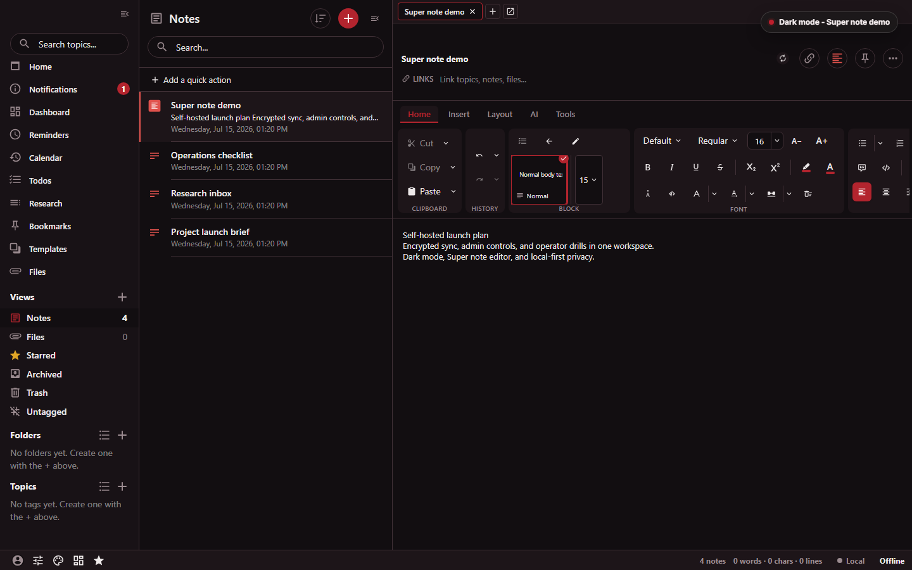

# Standard Red Notes

> Private, end-to-end encrypted notes with rich editing tools and a server you
> control.

[](https://github.com/supermarsx/standard-red-notes/issues)
[](https://github.com/supermarsx/standard-red-notes/actions/workflows/docs-pages.yml?query=branch%3Amain)
[](docs/validation.md)
[](https://supermarsx.github.io/standard-red-notes/)
[](license.md)

Standard Red Notes is an open, AGPL-3.0-licensed, self-hosted fork of
[Standard Notes](https://standardnotes.com). The fork is
**fully featured by default**, without subscription provisioning. Optional
integrations and operator or administrator capabilities still require server
configuration or the appropriate account role.

This is an independent project. It is **not affiliated with, sponsored by, or
endorsed by Standard Notes**. Upstream copyright and attribution are preserved.



**Choose your path:** [use locally without an account](docs/app-guide.md#getting-started-no-account) |
[set up a synced account](docs/onboarding.md) |
[run your own server](#docker-quickstart) |
[download a published tool](#downloads-and-tools) |
[browse the documentation](https://supermarsx.github.io/standard-red-notes/) |
[contribute](#contributing)

## Contents

- [Docker quickstart](#docker-quickstart)
- [Feature highlights](#feature-highlights)
- [Downloads and tools](#downloads-and-tools)
- [API](#api)
- [Security and data ownership](#security-and-data-ownership)
- [Choose by fit](#choose-by-fit)
- [Documentation and architecture](#documentation-and-architecture)
- [Build, test, and operate](#build-test-and-operate)
- [Contributing](#contributing)
- [License](#license)

## Docker quickstart

You need Docker with the Compose v2 plugin. On macOS or Linux:

```bash
git clone https://github.com/supermarsx/standard-red-notes.git
cd standard-red-notes
./scripts/setup.sh --up
```

On Windows PowerShell:

```powershell
git clone https://github.com/supermarsx/standard-red-notes.git
Set-Location standard-red-notes
./scripts/setup.ps1 -Up
```

The setup script writes a complete `.env` with generated secrets and starts the
Docker Compose stack. When the services are healthy, open
<http://localhost:3001> and register an account.

For domains, TLS termination, reverse proxies, upgrades, storage, and backups,
continue with the [self-hosting guide](docs/self-hosting.md). The repository also
documents [multi-container, single-container, and LXC deployment
profiles](docs/DEPLOYMENT.md).

## Feature highlights

| Area                      | Included capabilities                                                                                                                                                                      |
| ------------------------- | ------------------------------------------------------------------------------------------------------------------------------------------------------------------------------------------ |
| **Write and create**      | Plain text, Markdown, code, spreadsheet, and Super block editing, plus Canvas, Bases, Calendar, Kanban, Timeline, and sandbox note types.                                                  |
| **Organize and retrieve** | Tags and nested folders, smart views, links and backlinks, graph navigation, full-text search, reminders, files, and import/export workflows.                                              |
| **Sync and collaborate**  | End-to-end encrypted multi-device sync, offline use, revisions and backups, shared vaults, contacts, and experimental realtime co-editing, which is off by default.                        |
| **Assist and automate**   | An optional, operator-configured AI assistant; an HTTP API; encrypted client and operator CLIs; and, where configured and authorized, app passwords, scoped MCP tokens, and an MCP bridge. |
| **Run it yourself**       | Docker deployment profiles, same-origin routing, reverse-proxy guidance, operator-configured registration controls, administrator-only controls, diagnostics, and backup/restore drills.   |

For the detailed product surface, use the [in-app guide](docs/app-guide.md) and
the maintained [fork improvements](docs/improvements.md) overview. Those pages
are the source of detail rather than an ever-growing feature count here.

## Downloads and tools

### Published binaries

These pinned tags are the current published releases for the published tools:

[](https://github.com/supermarsx/standard-red-notes/releases/tag/srn-client-v26.2)
[](https://github.com/supermarsx/standard-red-notes/releases/tag/srn-server-v26.2)
[](https://github.com/supermarsx/standard-red-notes/releases/tag/srn-home-server-v26.1)
[](https://github.com/supermarsx/standard-red-notes/releases)

| Artifact                                                                 | Purpose                                                                              | Delivery                                                           |
| ------------------------------------------------------------------------ | ------------------------------------------------------------------------------------ | ------------------------------------------------------------------ |
| [`srn-client`](cli/srn-client/README.md)                                 | End-to-end encrypted note operations from a terminal.                                | Native Windows, macOS, and Linux executables with checksums.       |
| [`srn-server`](cli/srn-server/README.md)                                 | Health, status, logs, configuration validation, and Docker Compose operator helpers. | Native Windows, macOS, and Linux executables with checksums.       |
| [`srn-home-server`](docs/self-hosting.md#standalone-home-server-release) | All-in-one backend for a MySQL deployment.                                           | Native executables, checksums, and the required migrations bundle. |

Download the asset for your operating system and architecture, then verify it
against the release's `SHA256SUMS.txt` before running it. The
[all releases](https://github.com/supermarsx/standard-red-notes/releases) page
contains later tags and release notes when available.

Standalone home-server users should follow the
[binary-specific configuration, migration, and invocation path](docs/self-hosting.md#standalone-home-server-release).
That release is a backend-only MySQL deployment; the Docker quickstart remains
the supported path for the complete web app and service stack.

### Source and stack tools

Desktop and MCP are source/stack tools in this guide, not entries in the
published-binary list above.

| Tool                      | Where it lives                                   | How it is used                                                                                   |
| ------------------------- | ------------------------------------------------ | ------------------------------------------------------------------------------------------------ |
| Web app and service stack | [`app/`](app/) and [`server/`](server/)          | Built and run through the repository's Docker or workspace commands.                             |
| Desktop client            | [`app/packages/desktop/`](app/packages/desktop/) | Built from the app workspace source.                                                             |
| MCP bridge                | [`mcp/`](mcp/)                                   | Build with `yarn build:mcp`, start with `yarn start:mcp`, or run the Compose `mcp` profile.      |
| `srn-admin`               | Server image                                     | Run administrative operations inside the stack with `docker compose exec server srn-admin help`. |

## API

The self-hosted gateway exposes versioned HTTP endpoints for authentication,
sync, files, settings, sessions, collaboration, and configured integrations.
See the [HTTP API reference](docs/API.md) for base URLs, authentication, a curl
walkthrough, and the endpoint catalog. Account and administrator endpoints
require the corresponding credentials or role, and optional integration
endpoints operate only when the server operator enables them.

## Security and data ownership

Self-hosting moves the service and its operational metadata onto infrastructure
you control. It does not remove the need to understand the encryption and
integration boundaries.

| Boundary                     | What it means                                                                                                                                                              |
| ---------------------------- | -------------------------------------------------------------------------------------------------------------------------------------------------------------------------- |
| **Notes and files**          | Contents are encrypted on the client before sync. The server stores and relays ciphertext.                                                                                 |
| **Visible metadata**         | The server can see account email, item existence and timestamps, encrypted item/file sizes, IP addresses, and session/device information needed to operate the service.    |
| **Password and recovery**    | Encryption keys are derived locally. A lost password can make encrypted data unrecoverable, so keep current encrypted backups.                                             |
| **Exports and integrations** | Decrypted exports are plaintext. A hosted AI provider receives the prompts and note content you choose to send; a local provider can keep that processing on your machine. |
| **Operator responsibility**  | You are responsible for access control, TLS, updates, monitoring, storage capacity, and tested backups on your deployment.                                                 |

Read [what leaves your device](docs/onboarding.md#security-what-leaves-your-device),
[where server data lives](docs/self-hosting.md#where-your-data-lives), and the
[backup and restore guide](docs/self-hosting.md#backup-and-restore) before using
the service for important data.

## Choose by fit

Standard Red Notes is a strong fit when you want Standard Notes-style
client-side encryption, a rich browser app, and a server you are prepared to
operate. It also fits teams and individuals who want the repository's included
features, API, CLI, and automation surfaces on their own infrastructure.

Another tool may fit better when you want a managed service with no server
operations, plain Markdown files as the primary storage format, a plugin-first
local knowledge base, or a team wiki/database workspace rather than a
zero-knowledge notes model.

See the [fit-based comparison](docs/comparison.md) for a source-linked look at
Standard Notes, Obsidian, Joplin, Trilium Notes, Notesnook, Notion, and adjacent
tools. It is a guide to trade-offs, not a ranking.

## Documentation and architecture

### Start by audience

| Audience                       | Documentation                                                                                                                                                                 |
| ------------------------------ | ----------------------------------------------------------------------------------------------------------------------------------------------------------------------------- |
| **App users**                  | [Onboarding](docs/onboarding.md), the comprehensive [in-app guide](docs/app-guide.md), and its privacy, editor, files, sync, backup, assistant, and troubleshooting sections. |
| **Server operators**           | [Self-hosting](docs/self-hosting.md), [deployment profiles](docs/DEPLOYMENT.md), and [operations hardening](docs/operations-hardening.md).                                    |
| **Integrators**                | The [HTTP API reference](docs/API.md), [`srn-client` guide](cli/srn-client/README.md), and architecture boundaries below.                                                     |
| **Evaluators and maintainers** | [Standard Notes base](docs/standard-notes-base.md), [improvements](docs/improvements.md), [comparison](docs/comparison.md), and [validation](docs/validation.md).             |

The complete documentation is also published as a
[GitHub Pages site](https://supermarsx.github.io/standard-red-notes/) with
persistent navigation.

### Runtime map

| Path                                | Responsibility                                                                                             |
| ----------------------------------- | ---------------------------------------------------------------------------------------------------------- |
| [`app/`](app/)                      | Web, desktop, mobile, shared client packages, local encryption/decryption, editors, and settings.          |
| [`server/`](server/)                | Authentication, sync, files, revisions, API gateway, websocket relay, scheduled jobs, and admin endpoints. |
| [`cli/`](cli/)                      | The encrypted user CLI and Docker operator CLI.                                                            |
| [`mcp/`](mcp/)                      | Stdio bridge for MCP-capable clients using scoped credentials.                                             |
| [`docs/`](docs/) and [`e2e/`](e2e/) | User/operator documentation, API documentation, browser validation, load drills, and screenshot capture.   |

Use the full [architecture guide](docs/architecture.md) for request flow,
encryption boundaries, deployment profiles, and validation layers.

## Build, test, and operate

The root package requires Node.js 22 or newer. The root, app, and server are
three independent Yarn projects, so install all three from a clean checkout
before running the coordinated build or check commands:

```bash
git clone https://github.com/supermarsx/standard-red-notes.git
cd standard-red-notes
corepack enable
yarn install --immutable
cd app
yarn install --immutable
cd ../server
yarn install --immutable
cd ..
```

Then use the matching repository command from the repository root:

| Goal                                                    | Command                   |
| ------------------------------------------------------- | ------------------------- |
| Build the coordinated project                           | `yarn build`              |
| Run the coordinated type, lint, format, and test checks | `yarn check`              |
| Validate the default Compose configuration              | `yarn docker:config`      |
| Exercise the MariaDB backup/restore path                | `yarn ops:backup-restore` |
| Run the browser and Redis operations load drill         | `yarn ops:load`           |
| Refresh the live-app README screenshot                  | `yarn screenshot:readme`  |

Validation is intentionally layered. The coverage badge reports **normalized
Jest-instrumented JS/TS coverage generated by CI**. It can include
Jest integration and live specs in addition to other Jest specs. Named non-Jest
suites excluded from the metric include Playwright end-to-end flows, desktop AVA
tests, `sncrypto-web` browser tests, the `websocket-gateway` Vitest suite, MCP and
OpenClaw tests, native/mobile code, and Docker integration and operations drills.
See [Validation](docs/validation.md) for the exact scope and the required runtime
setup for separate checks.

For routine operation:

```bash
docker compose ps
docker compose logs -f
docker compose pull
docker compose up -d --build
```

The [self-hosting guide](docs/self-hosting.md#start-stop-and-upgrade) covers safe
updates and shutdown, and [operations hardening](docs/operations-hardening.md)
covers database resilience, safety limits, and runtime hardening.

## Contributing

Issues and focused pull requests are welcome. Use the repository's existing
package boundaries, add or update tests close to the behavior you change, and
run the relevant checks from [Validation](docs/validation.md). For broad product
or architecture changes, start with a
[GitHub issue](https://github.com/supermarsx/standard-red-notes/issues) so the
scope and compatibility impact are explicit before implementation.

Before opening a pull request, run `git diff --check`, confirm the affected
build/tests, and update user or operator documentation when behavior changes.

## License

Standard Red Notes is licensed under the GNU Affero General Public License v3.0
(`AGPL-3.0-only`). See [license.md](license.md) for the full text. If you modify
the software and make it available to others over a network, the AGPL requires
you to offer those users the corresponding source.

The project remains an independent fork of
[Standard Notes](https://standardnotes.com), with upstream copyright and
attribution notices preserved.
